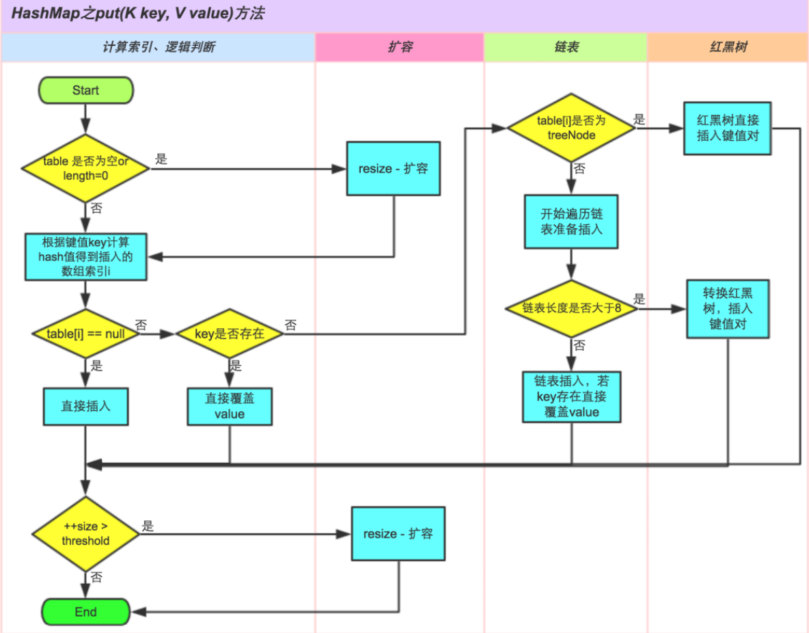
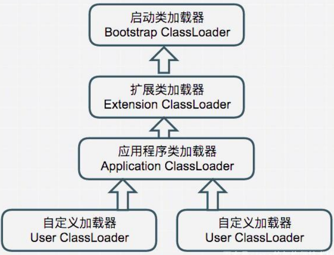
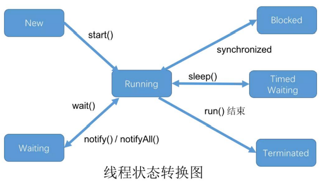

# 知识点拾遗
## Java
### Collections
#### HashMap
key-value结构，允许null值，线程不安全，非有序非同步，底层数组+链表+红黑树(JDK1.8)，负载因子loadFactor(0.75)，阈值(threshold)=容器容量(capacity)*负载因子(load factor)

通过扰动函数得到hash值，再通过hash&(length-1)代替取模的方式进行元素定位

底层**数组**，哈希表元素`Node<k, v> table`数据结构包含
1. 哈希值`final int hash`
2. 数据键`final K key`
3. 数据值`V value`
4. 元素节点`Node<K, V> next`：单链表结构用于解决hash冲突，数据量大于8时转为红黑树

哈希冲突
(当前元素hash值)%(hash表长度得到存储位置)，解决Hash冲突的方法有：开放定址法，再散列法，链地址法，公共溢出区法，HashMap使用的是**链地址法**，优化方面：Java7需要做4次16位右位移异或混合，Java8中做了简化，只需要做一次16位右位移异或混合即可

只有length的长度是2的n次方时，h&(length-1)才等价于h%length，且碰撞的几率较小

负载因子
表示哈希表空间的使用程度(哈希表空间的利用率)

常用操作底层实现原理  
put  


get  


remove  


replace  


多线程操作HashMap存在的问题：
1. 数据不一致/数据污染：多线程操作导致已修改数据被旧数据重新覆盖
2. 自动扩容机制在多线程条件下构成死循环

使用不可变对象作为Key，如String，Integer等

#### HashTable
线程安全每个操作方法前都有synchronized修饰，但不推荐使用，读写全局加锁效率低下，使用CurrentHashMap代替
Key，value均不可为null，初始容量为11，扩容方式为2倍再加1

#### ArrayList
非线程安全，在向一个ArrayList中添加大量元素前，可以使用ensureCapacity方法来增加ArrayList的容量。添加n个元素需要的时间为O(n)。结构型修改时必须在外部做同步，使用Collections.synchronizedList方法来包装

#### LinkedList
双向链表，同样需要Collections.synchronizedList方法来包装同步，插入及删除操作的时间复杂度为O(1)，可以动态改变大小，链表主要的缺点是：由于其链式存储的特性，链表不具备良好的空间局部性，也就是说，链表是一种缓存不友好的数据结构。

#### HashSet
HashSet非线程安全，是一个value=PERSENT的HashMap，并且没有get方法（无序不重复的散列集，get无意义）

### Java内存模型(Java Memory Model, JMM)
通过定义程序中各个变量的访问规则，即在虚拟机中将变量存储到内存和从内存中取出变量的底层细节，**屏蔽各种硬件和操作系统的内存访问差异**，以实现在各个平台内存访问都能达到一致性。是**在特定操作协议下，对特定的内存或高速缓存进行读写访问的过程抽象**。
目标解决问题：
1. 工作内存数据一致性
2. 指令重排优化，分为编译期重排序和运行期重排序

Java内存交互操作流程
线程对变量的所有操作(读取，赋值)都必须在**工作内存**中进行。不同线程之间也无法直接访问对方工作内存中的变量，线程间变量值的传递均需要**通过主内存**来完成，**实现**各个线程提供**共享变量的可见性**。

内存交互的基本操作(原子性)
1. lock (锁定) 作用于**主内存**的变量，它把一个变量标识为一条线程独占的状态。
2. unlock (解锁) 作用于**主内存**的变量，它把一个处于锁定状态的变量释放出来，释放后的变量才可以被其他线程锁定。
3. read (读取) 作用于**主内存**的变量，它把一个变量的值从主内存传输到线程的工作内存中，以便随后的load动作使用。
4. load (载入) 作用于**工作内存**的变量，它把read操作从主内存中得到的变量值放入工作内存的变量副本中。
5. use (使用) 作用于**工作内存**的变量，它把工作内存中一个变量的值传递给执行引擎，每当虚拟机遇到一个需要使用到变量的值得字节码指令时就会执行这个操作。
6. assign (赋值) 作用于**工作内存**的变量，它把一个从执行引擎接收到的值赋给工作内存的变量，每当虚拟机遇到一个给变量赋值的字节码指令时执行这个操作。
7. store (存储) 作用于**工作内存**的变量，它把工作内存中一个变量的值传送到主内存中，以便随后write操作使用。
8. write (写入) 作用于**主内存**的变量，它把store操作从工作内存中得到的变量的值放入主内存的变量中。

内存操作的3个特性：都是为了保证数据一致性
原子性(Atomicity)：底层基本操作read、load、assign、use、store和write为原子性操作，lock/unlock保证多条操作的原子性，synchronize通过monitorenter/monitorexit来隐式操作
可见性(Visibility)：实现可见性可以使用volatile，synchronize，final实现。
有序性(Ordering)：如果在线程内观察，所有操作都是有序的；如果在一个线程中观察另一个线程，所有操作都是无序的。volatile，synchronize

判断线程是否安全的原则：**happens-before原则**

引用逃逸和逃逸分析
Java 分配在堆上的对象都是靠引用来操作的,当对象在某个方法中都定义之后, 把它的引用作为其他方法的参数传递过去, 这样就叫做对象的引用逃逸。
this引用逃逸，在构造函数返回之前, 其他线程就通过this引用访问到了"未完成初始化"的对象, 而调用尚未构造完全的对象就会不可预知的问题, 因此this引用逃逸引发的问题是线程安全问题。主要发生场景是在构造函数启动线程,或者注册监听。
逃逸分析
JVM就使用利用它来为其他优化技术如栈上分配, 标量替换和同步消除等提供是否优化的判断依据
标量替换优化：标量是指一个无法再分解成其他更小数据的数据,比如Java中基本数据类型和Reference类型.对应的就是聚合量,可以继续分解其数据,如Java的对象.而标量替换就是把Java对象访问导的成员变量作为局部变量直接使用,而不再创建对象.
栈上分配优化：让这个没有逃逸出方法的对象在栈上分配内存空间,并且随着栈帧出栈而销毁.当应用存在大量不会逃逸的局部对象时,如果使用栈上分配技术,那么大量对象就可以随着方法结束而销毁,从而减轻了垃圾收集器的工作. 但Hotspot并没有实现真正意义上的栈上分配，实际上是标量替换.
同步消除优化：在能确定一个变量不会被其他线程访问,即不存在读写竞争的情况下,JVM就会对这个变量消除掉原有对这个变量的同步操作

内存屏障
Java底层通过**内存屏障**来保证**有序性**和**可见性**，常通过volatile，synchronized和Unsafe类使用

**lock、unlock成对出现，read后即为load，store后即为write不可缺失，工作内存中的共享变量必须从主内存诞生，工作内存未更新不允许无原因更新主内存**

LoadLoad屏障：load操作对后续可见
StoreStore屏障：store操作对后续可见
LoadStore屏障：后续store前load已经结束
StoreLoad屏障：开销最大(冲刷写缓冲器，清空无效队列)，大多数处理器实现中为万能屏障，兼具上述三种屏障功能

volatile变量内存屏障插入策略(因此推荐使用场景为：一次(单一线程)写入，到处(多线程)读取，如标志位更新，观察者模型变量值发布)
StoreStore屏障 -> 变量写 -> StoreLoad屏障
LoadLoad屏障 -> 变量读 -> LoadStore屏障

final变量再初始化完成后会立刻会写到主内存，且后期不能修改，因此保证了多线程下的可见性

synchronized读数据只能在主内存操作，写数据操作离开同步区时就刷新回主内存了

### Java对象
#### Java对象基础
HotSpot虚拟机中Java对象的创建过程
1. 检查指令参数是否能在常量池中定位到一个类的符号引用
2. 检查符号引用代表的类是否已经加载，解析，初始化
3. 为新对象分配内存(空闲堆内存，"指针碰撞-内存规整"或"空闲列表-内存交错"的分配方式)
4. 初始化并填充对象头

HotSpot虚拟机中Java对象的内存布局
1. 对象头(Header)：包含两部分，第一部分用于存储对象自身的运行时数据，如哈希码、GC分代年龄、锁状态标志、线程持有的锁、偏向线程ID、偏向时间戳等，32位虚拟机占32bit，64位虚拟机占64bit。官方称为**Mark Word**。第二部分是类型指针，即对象指向它的类的元数据指针，虚拟机通过这个指针确定这个对象是哪个类的实例。另外，如果是Java数组，对象头中还必须有一块用于记录数组长度的数据，因为普通对象可以通过Java对象元数据确定大小，而数组对象不可以。
2. 实例数据(Instance Data)
3. 对齐填充(Padding)

Java类的生命周期
加载Loading - 验证Verification - 准备Preparation - 解析Resolution - 初始化Initialization - 使用Using - 卸载Unloading

加载：
通过全限定名(包名+类名)获取定义此类的**二进制流**，
将这个字节流所代表的**静态存储结构**转化为方法区的**运行时数据结构**，
在堆内存中生成一个Class对象作为方法区数据的访问入口
**数组类本身不通过类加载器创建，是由Java虚拟机直接创建的。**但数组类的元素类型是要靠类加载器创建的，**数组元素类型是引用类型，采用递归加载引用类，不是引用类型，Java虚拟机会标记数组为引导类加载器关联**，加载和连接是交叉进行的，但开始时间保持先后顺序

验证：确保Class文件的字节流中包含的信息符合当前虚拟机要求。
**文件格式**验证(魔数0xCAFEBABE开头，主次版本号是否在虚拟机处理范围内，常量池的常量是否都支持，指向常量的索引值中是否指向不存在或不符合类型的常量，数据编码是否符合文件编码类型，**Class文件**各个部分是否有被删除的其他信息等，通过文件验证后，字节流才能进入内存方法区，后续验证也是针对方法区验证不再直接操作字节流)，
**元数据**验证(对类的元数据信息进行语义校验，保证不存在不符合Java语言规范的元数据信息。如继承了final类，未实现父类抽象方法，**继承关系**)，
**字节码**验证(通过数据流和控制流分析，确定程序语义是合法的、符合逻辑的。这个阶段对类的方法体进行校验分析，保证校验类的方法在运行时不会做出危害虚拟机安全的事件。**检查类型转换**)，
**符号引用**验证(引用是否正确，方法的访问性检查private\protected\public\default，发生在即将将符号引用转换为直接引用)

准备：**为类分配内存并设置类变量初始值**
（1）类变量（static）会分配内存，但是实例变量不会，实例变量主要随着对象
的实例化一块分配到 java 堆中，
（2）这里的初始值指的是数据类型默认值，而不是代码中被显示赋予的值。

解析：是虚拟机将常量池内的符号引用替换为直接引用的过程。
解析动作主要针对**类或接口、字段、类方法、接口方法、方法类型、方法句柄和调用点限定符**7类符号引用进行

初始化：前面过程都是以虚拟机主导，而初始化阶段开始执行类构造器`<clinit>()`方法，并主要为类的静态变量赋予正确的初始值，JVM 负责对类进行初始化，主要对类变量进行初始化。
对类变量进行初始值设定有两种方式：
1. 声明类变量是指定初始值
2. 使用静态代码块为类变量指定初始值

**只有当对类的主动使用的时候才会导致类的初始化**，类的主动使用包括以下六种：

类加载器(classloader)：
遇到**new(使用new关键字实例化对象)、getstatic(读取一个类的静态字段(被final修饰-已在编译期把结果放入常量池的静态字段除外)、putstatic(调用一个类的静态方法)或invokestatic(使用java.lang.reflect包的方法对类进行反射调用)**这4条字节码指令时，未初始化的类触发初始化，如果有父类，且父类没有初始化则先触发父类初始化。


BootstrapClassLoader: 启动类加载器
ExtentionClassLoader: 扩展类加载器
AppclassLoader： 应用类加载器

类加载的三种方式：
（1）通过命令行启动应用时由 JVM 初始化加载含有 main()方法的主类。
（2）通过`Class.forName()`方法动态加载，会默认执行初始化块`static{}`，但是`Class.forName(name,initialize,loader)`中的 initialze可指定是否要执行初始化块。
（3）通过`ClassLoader.loadClass()`方法动态加载，不会执行初始化块。

双亲委派机制
避免重复加载，安全性，
违反双亲委派机制
继承ClassLoader重写loadClass方法


```java
public class SuperClass {
    static {
        System.out.println("SuperClass init!");
    }
    public static int value = 1127;
}
public class SubClass extends SuperClass {
    static {
        System.out.println("SubClass init!");
    }
}
public class ConstClass {
    static {
        System.out.println("ConstClass init!");
    }
    public static final String HELLOWORLD = "hello world!"
}
public class NotInitialization {
    public static void main(String[] args) {
        System.out.println(SubClass.value);
        /**
        * output : SuperClass init!
        * 
        * 通过子类引用父类的静态对象不会导致子类的初始化，只有直接定义这个字段的类才会被初始化
        */
        SuperClass[] sca = new SuperClass[10];
        /**
        * output : 
        * 
        * 通过数组定义来引用类不会触发此类的初始化，虚拟机在运行时动态创建了一个数组类
        */
        System.out.println(ConstClass.HELLOWORLD);
        /**
        * output : 
        * 
        * 常量在编译阶段会存入调用类的常量池当中，本质上并没有直接引用到定义类常量的类，因此不会触发定义常量的类的初始化。
        * “hello world” 在编译期常量传播优化时已经存储到 NotInitialization 常量池中了。
        */
    }
}
```
对象访问定位
通过reference句柄访问：对频繁GC对象友好
直接指针访问对象：对频繁访问对象友好

#### Java虚拟机运行时数据区
程序计数器：记录字节码指令运行位置
虚拟机栈：记录Java方法调用过程，按执行顺序依次入栈出栈，栈帧：局部变量表，操作数栈，动态链接，方法出口等
本地方法栈：为Native提供服务记录Native方法
方法区：属于共享内存区域，存储已经被虚拟机加载的类信息、常量、静态变量、即时编译器编译后的代码等数据
堆：GC管理的主要空间，线程共享，存放对象实例和数组，内部存在多个线程私有的分配缓冲区（TLAB）


### 垃圾回收
#### 垃圾定位方法
引用计数法：无法解决循环引用的问题

可达性分析法：GC Root对象 -> 虚拟机栈(栈帧中的本地变量表)中引用的对象，方法区中类静态属性引用的对象，方法区中常量引用的对象，本地方法栈JNI引用的对象
一个对象的真正死亡至少要经历两次标记过程：1. 没有与GC Root相连接的引用链， 2. 是否有必要执行finalize()方法。将对象存放在F-Queue队列中由虚拟机创建的低优先级的Finalizer线程触发执行finalize()方法且并不承诺或等待他运行结束。finalize()方法只会被系统自动调用一次。

#### 垃圾回收算法
算法 | 执行思路 | 不足
--- | --- | ---
标记-清除算法 | 直接标记清除 | 效率低，会产生大量内存碎片
复制算法 | 内存空间**1:1**平分，每次只对其中一块执行GC，存活对象复制到另一部分空间上或**8:1:1**分配，浪费10%，但需要分配担保 | 内存空间浪费
标记-整理算法 | 将存活对象移动到内存的一端 |
分代回收算法 | 新生代使用复制算法8:1:1提高回收速度，老年代使用标记-整理减少内存碎片

收集算法是内存回收的理论，而垃圾回收器是内存回收的实践。

#### 新生代GC与老年代GC
新生代GC：Minor GC，频繁，速度快。
老年代GC：Major GC/Full GC

#### 垃圾回收器（了解）
Serial收集器：单线程收集器，只使用一个CPU或一条收集线程去完成收集工作，并且在进行垃圾回收时必须暂停其它所有的工作线程直到收集结束
ParNew收集器：Serial收集器的多线程版本
Parallel Scavenge收集器：的目的是达到一个可控制的吞吐量(Throughput = 运行用户代码时间 / (运行用户代码时间 + 垃圾收集时间))。
CMS(Concurrent Mark Sweep)收集器，初始标记->并发标记->重新标记->并发清除，对CPU资源敏感、无法收集浮动垃圾、带来的空间碎片
G1收集器：面向服务端的垃圾回收器，并行与并发、分代收集、空间整合、可预测停顿。初始标记->并发标记->最终标记->筛选回收

#### 引用分类
强引用：Object obj = new Object() 只要强引用在就不回收
软引用：SoftReference，系统发生内存溢出前回收
弱引用：WeakReference，对象只能生存到下一次垃圾回收之前，无论内存是否足够都会回收只被弱引用引用的对象
虚引用：PhantomReference，为对象被收集器回收时收到一个系统通知，不能通过该引用获取对象实例


### Java线程
#### 线程的实现
1. 使用内核线程实现：直接由操作系统内核支持的线程，由内核完成切换。程序一般不会直接使用内核线程，而是通过内核线程的一种高级接口————轻量级进程(LWP)。每个轻量级进程都有一个内核级线程支持。
2. 使用用户线程实现
3. 使用用户线程夹加轻量级进程混合实现

Java内平台不同实现方式也有差异，但可以认为时一条Java线程映射到一条轻量级进程

#### Java线程调度
协同式线程调度
线程执行时间由线程自身控制，实现简单，切换线程自己可感知，基本没有线程同步问题。坏处时执行之间不可控，容易阻塞

抢占式线程调度
每个线程由系统来分配执行时间

#### 线程状态转换
1. 新建(New)：创建后未启动的线程
2. 运行(Runnable)：包含了Running和Ready，处于此状态下的线程有可能正在执行，也有可能正在等待CPU分配时间
3. 无限等待(Waiting)：不会被CPU分配时间，等待其他线程显式唤醒，执行了Object.wait()，Thread.join()或LookSupport.park()方法进入该状态
4. 限期等待(TimedWaiting)：线程不会被分配时间，但在一定时间后由系统自动唤醒，执行力Thread.sleep(timeout)，Object.wait(timeout)，Thread.join(timeout)，LockSupport.parkNanos()和LockSupport.parkUntil()方法进入该状态
5. 阻塞(Blocked)：程序进入同步区域，线程未获取到同步锁时进入阻塞状态。“阻塞状态”在等待着获取一个排他锁，这个时间将在另外一个线程放弃这个锁的时候发生；而“等待状态”则是在等待一段时间，或者唤醒动作的发生。
6. 结束(Terminated)：已终止的线程的线程状态



