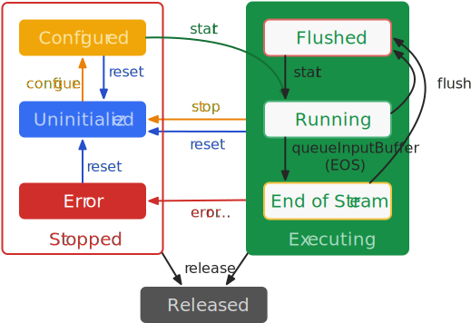

# Mediacodec

## State状态
同步模式

异步模式

### 状态详解
Stop：configured，uninitialized，error   
Executing：flushed，running，end-of-stream   
Released

MediaCodec状态流转
1. 创建执行MediaCodec.createEncoderByType()后Codec进入uninitialized状态
2. uninitialized状态下的Codec需要执行configure()进入configured状态后才能执行start()方法
3. 执行start()方法进入Executeing状态，Executeing包含三个子状态：flushed，running，end-of-stream
4. 调用start()后，Codec立即进入flushed状态并持有所有buffer
5. 执行dequeueInputBuffer()拿到第一个输入buffer时，Codec进入running状态（Codec整个生命周期中大部分时间都处在该状态）
6. 当输入buffer为end-of-stream标识时，Codec切换至end-of-stream状态，该状态不再接收输入，但任然会有输出buffer，直到输出buffer遇到end-of-stream
7. Executiing状态下可随时通过flush()方法，使Codec切换至flushed状态
8. 当调用stop()方法后，Codec返回到uninitialized状态，可再次configure
9. 使用结束后必须调用release()方法释放Codec资源
10. error状态Codec处理：使用reset()方法使Codec恢复至uninitalized状态，或者使用release()方法释放

## Mediacodec使用
```
val MIME_TYPE = "video/avc"
val VIDEO_WIDTH = 1280
val VIDEO_HEIGHT = 720

// 创建MediaCodec
val mMediaCodec = MediaCodec.createEncoderByType(MIME_TYPE)
// 创建视频Format参数
val format = MediaFormat.createVideoFormat(MIME_TYPE, VIDEO_WIDTH, VIDEO_HEIGHT)
format.setInteger(MediaFormat.KEY_COLOR_FORMAT, MediaCodecInfo.CodecCapabilities.COLOR_FormatSurface)
format.setInteger(MediaFormat.KEY_BIT_RATE, Constant.VIDEO_BITRATE)// 比特率
format.setInteger(MediaFormat.KEY_FRAME_RATE, Constant.VIDEO_FRAME_RATE)// 帧率
format.setInteger(MediaFormat.KEY_I_FRAME_INTERVAL, Constant.VIDEO_IFRAME_INTER)// K帧间隔时间 单位s
format.setLong(MediaFormat.KEY_REPEAT_PREVIOUS_FRAME_AFTER, Constant.VIDEO_BITRATE / Constant.VIDEO_FRAME_RATE); // 当画面静止时,重复最后一帧
format.setInteger(MediaFormat.KEY_BITRATE_MODE, MediaCodecInfo.EncoderCapabilities.BITRATE_MODE_VBR); // 动态帧率
format.setInteger(MediaFormat.KEY_COMPLEXITY, MediaCodecInfo.EncoderCapabilities.BITRATE_MODE_CBR); // 固定帧率
format.setInteger(MediaFormat.KEY_PROFILE, MediaCodecInfo.CodecProfileLevel.AVCProfileBaseline); // Profile HIGH　or Baseline
if (Build.VERSION.SDK_INT >= Build.VERSION_CODES.M) {
    format.setInteger(MediaFormat.KEY_LEVEL, MediaCodecInfo.CodecProfileLevel.AVCLevel31); // Level 3.1
}
mMediaCodec.configure(format, null, null, MediaCodec.CONFIGURE_FLAG_ENCODE)

```

## MediaCodec填坑记录
### config设置崩溃
> 格式不支持，宽高不支持，编解码器数量限制

System.err: android.media.MediaCodec$CodecException: Failed to initialize OMX.qcom.video.encoder.avc, error 0xfffffff4   
错误原因： 创建MC示例超限；

ACodec: [OMX.allwinner.video.encoder.avc] ERROR(0x80001009)   
错误原因：塞了错误的数据   
入队Frame数据时用了flag（BUFFER_FLAG_CODEC_CONFIG），但是入队的数据中没带sps，pps。或者相反，没用这个flag，数据中带了sps，pps   

Failed to initialize video/avc, error 0xfffffff4   
错误原因：MediaCodec没有调用release方法

Failed to initialize video/avc, error 0xfffffffe   
错误原因：MediaCodec.createByCodecName 只能传详细的编解码器名称(如：OMX.qcom.video.encoder.avc);不能传类型如：video/avc

ACodec: [OMX.rk.video_encoder.avc] stopping checking profiles after 32: 8/1   
ACodec: [OMX.rk.video_encoder.avc] configureCodec returning error -1010   
android.media.MediaCodec$CodecException: Error 0xfffffc0e   
错误原因：创建编码器时，不支持hightProfile属性；

ACodec: [OMX.rk.video_encoder.avc] configureCodec returning error -38   
android.media.MediaCodec$CodecException: Error 0x80001001   
错误原因：MediaFormat.KEY_BITRATE_MODE设置的值，当前设备不支持   

`cat`命令查看设备文件`/system/etc/media_codecs.xml`，依据设备编解码能力设置，多路大码流也会引起config失败问题，解决方式：1.尽量避免 2.引入软解 3.降低至720p或更低分辨率
```
<MediaCodecs>
    <Include href="media_codecs_google_audio.xml" />
    <Decoders>
        <MediaCodec name="OMX.rk.video_decoder.avc" type="video/avc">
            <Limit name="size" max="4096x2160" min="176x144"/>
            <Limit name="alignment" value="8x8"/>
            <Limit name="block-size" value="16x16"/>
            <Limit name="blocks-per-second" max="244800" min="1"/>
            <Limit name="bitrate" range="1-10000000"/>
            <Feature name="adaptive-playback"/>
        </MediaCodec>
        <MediaCodec name="OMX.rk.video_decoder.m2v" type="video/mpeg2">
            <Limit name="size" max="1920x1088" min="176x144"/>
            <Limit name="alignment" value="8x8"/>
            <Limit name="block-size" value="16x8"/>
            <Limit name="blocks-per-second" max="244800" min="1"/>
            <Limit name="bitrate" range="1-10000000"/>
            <Feature name="adaptive-playback"/>
        </MediaCodec>
        <MediaCodec name="OMX.rk.video_decoder.vp8" type="video/x-vnd.on2.vp8">
            <Limit name="size" max="1920x1088" min="176x144"/>
            <Limit name="alignment" value="8x8"/>
            <Limit name="block-size" value="16x16"/>
            <Limit name="blocks-per-second" max="244800" min="1"/>
            <Limit name="bitrate" range="1-10000000"/>
            <Feature name="adaptive-playback"/>
        </MediaCodec>
        <MediaCodec name="OMX.google.vp9.decoder" type="video/x-vnd.on2.vp9">
            <Limit name="size" min="2x2" max="1280x720" />
            <Limit name="alignment" value="2x2" />
            <Limit name="block-size" value="16x16" />
            <Limit name="blocks-per-second" range="1-983040" />
            <Limit name="bitrate" range="1-40000000" />
            <Feature name="adaptive-playback" />
        </MediaCodec>
        <MediaCodec name="OMX.rk.video_decoder.h263" type="video/3gpp">
            <Limit name="size" max="1920x1088" min="176x144"/>
            <Limit name="alignment" value="8x8"/>
            <Limit name="block-size" value="16x16"/>
            <Limit name="blocks-per-second" max="244800" min="1"/>
            <Limit name="bitrate" range="1-10000000"/>
            <Feature name="adaptive-playback"/>
        </MediaCodec>
        <MediaCodec name="OMX.rk.video_decoder.m4v" type="video/mp4v-es">
            <Limit name="size" max="1920x1088" min="176x144"/>
            <Limit name="alignment" value="8x8"/>
            <Limit name="block-size" value="16x16"/>
            <Limit name="blocks-per-second" max="244800" min="1"/>
            <Limit name="bitrate" range="1-10000000"/>
            <Feature name="adaptive-playback"/>
        </MediaCodec>
        <MediaCodec name="OMX.rk.video_decoder.flv1" type="video/flv">
            <Limit name="size" max="1920x1088" min="176x144"/>
            <Limit name="alignment" value="8x8"/>
            <Limit name="block-size" value="16x16"/>
            <Limit name="blocks-per-second" max="244800" min="1"/>
            <Limit name="bitrate" range="1-10000000"/>
            <Feature name="adaptive-playback"/>
        </MediaCodec>
        <MediaCodec name="OMX.rk.video_decoder.mjpeg" type="video/mjpeg">
            <Limit name="size" max="1920x1088" min="176x144"/>
            <Limit name="alignment" value="8x8"/>
            <Limit name="block-size" value="16x16"/>
            <Limit name="blocks-per-second" max="244800" min="1"/>
            <Limit name="bitrate" range="1-10000000"/>
            <Feature name="adaptive-playback"/>
        </MediaCodec>
        <MediaCodec name="OMX.rk.video_decoder.hevc" type="video/hevc">
                <Limit name="size" max="4096x2160" min="176x144"/>
                <Limit name="alignment" value="8x8"/>
                <Limit name="block-size" value="16x16"/>
                <Limit name="blocks-per-second" max="244800" min="1"/>
                <Limit name="bitrate" range="1-10000000"/>
                <Feature name="adaptive-playback"/>
        </MediaCodec>
    </Decoders>

    <Encoders>
        <MediaCodec name="OMX.rk.video_encoder.avc" type="video/avc" >
            <Limit name="size" min="176x144" max="1920x1088" />
            <Limit name="alignment" value="16x8" />
            <Limit name="bitrate" range="1-40000000" />
            <Feature name="bitrate-modes" value="VBR,CBR" />
        </MediaCodec>
    </Encoders>
    <Include href="media_codecs_rk_vpu.xml" />
    <Include href="media_codecs_google_video.xml" />
</MediaCodecs>
```

### 解码视频花屏
> 绿屏，马赛克，花屏都是花屏范畴

1. 加速解码的丢帧处理，如果丢弃的是关键帧，那么直到下一个关键帧来临之前，全是花屏
2. MediaCodec解码到ByteBuffer中，然后再拿出来渲染，如果stride和width不匹配，色值空间不正确都会导致渲染异常引起的花屏


### 解码音频音频无数据

### 解码音频不是从0开始