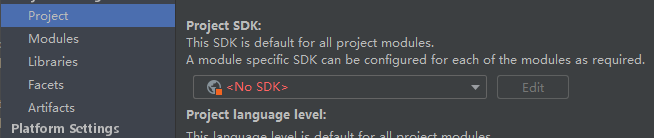
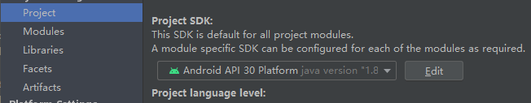

# Flutter环境配置
安装git工具：   
https://git-scm.com/book/zh/v2/%E8%B5%B7%E6%AD%A5-%E5%AE%89%E8%A3%85-Git
## 安装Dart SDK
选择下载对应平台的最新版本SDK：https://dart.dev/tools/sdk/archive
### macOS
安装Homebrew
```
/bin/bash -c "$(curl -fsSL https://raw.githubusercontent.com/Homebrew/install/HEAD/install.sh)"
```
通过brew安装dart
```
brew tap dart-lang/dart
brew install dart
```
添加dart在PATH路径
```
export PATH="$PATH:/usr/lib/dart/bin"
```
更新/切换dart版本，注：`brew switch`仅支持v2.6以后版本
```
brew upgrade dart
cd /usr/local/Homebrew && git checkout 2.6.2
brew switch dart <version>
```
查看已安装版本
```
brew info dart
```
### Linux
添加apt-key
```
sudo apt-get update
sudo apt-get install apt-transport-https
sudo sh -c 'wget -qO- https://dl-ssl.google.com/linux/linux_signing_key.pub | apt-key add -'
sudo sh -c 'wget -qO- https://storage.googleapis.com/download.dartlang.org/linux/debian/dart_stable.list > /etc/apt/sources.list.d/dart_stable.list'
```
安装
```
sudo apt-get update
sudo apt-get install dart
```
添加PATH路径
```
export PATH="$PATH:/usr/lib/dart/bin"
echo 'export PATH="$PATH:/usr/lib/dart/bin"' >> ~/.profile
```
### Windows
安装chocolatey，“以管理员身份运行”即可打开”管理员:命令提示符”窗口
```
@powershell -NoProfile -ExecutionPolicy Bypass -Command "iex ((new-object net.webclient).DownloadString('https://chocolatey.org/install.ps1'))" && SET PATH=%PATH%;%ALLUSERSPROFILE%\chocolatey\bin
```
输入`choco`，展示出版本号即为成功
安装并更新最新Dart
```
choco install dart-sdk
choco upgrade dart-sdk
```

## 安装Flutter SDK
https://flutter.dev/docs/get-started/install    
查看已安装FlutterSDK安装地址
```
flutter sdk-path
```
### macOS
[下载最新稳定版SDK](https://storage.googleapis.com/flutter_infra_release/releases/stable/macos/flutter_macos_2.2.3-stable.zip)，并执行
```
cd ~/development
unzip ~/Downloads/flutter_macos_2.2.3-stable.zip
```
添加PATH路径
```
export PATH="$PATH:`pwd`/flutter/bin"
```
升级flutter
```
flutter upgrade
```
升级flutter下安装的package包
```
flutter pub upgrade
```
执行Flutter Doctor检查，并修复提示的问题
```
flutter doctor
```
开启[桌面支持](https://flutter.dev/desktop)（可选）
```
flutter config --enable-macos-desktop
```
### Linux
下载安装依赖工具
```
sudo apt-get install clang cmake ninja-build pkg-config libgtk-3-dev
```
[下载最新稳定版SDK](https://storage.googleapis.com/flutter_infra_release/releases/stable/linux/flutter_linux_2.2.3-stable.tar.xz)，并执行
```
cd ~/development
tar xf ~/Downloads/flutter_linux_2.2.3-stable.tar.xz
```
添加PATH路径
```
export PATH="$PATH:`pwd`/flutter/bin"
```
下载precache（可选）
```
flutter precache
```
执行Flutter Doctor检查，并修复提示的问题
```
flutter doctor
```

使用`flutter config`关闭向Google的report（可选）
```
flutter config --no-analytics
```
开启[桌面支持](https://flutter.dev/desktop)（可选）
```
flutter config --enable-linux-desktop
```
### Windows
1. [下载最新稳定版SDK](https://storage.googleapis.com/flutter_infra_release/releases/stable/windows/flutter_windows_2.2.3-stable.zip)，并执行
2. 解压并添加PATH路径
3. 执行`flutter doctor`并修复错误
4. 开启[桌面支持](https://flutter.dev/desktop)（可选）
```
flutter config --enable-windows-desktop
```
5. `flutter doctor`报错AndroidStudio(not installed)
```
flutter config --android-studio-dir <directory>
```
安装路径中包含有空格，如Android Studio时，路径需要使用双引号包裹   
6. `flutter doctor`报错: NoClassDefFoundError(XmlSchema)
```
Exception in thread "main" java.lang.NoClassDefFoundError: javax/xml/bind/annotation/XmlSchema
        at com.android.repository.api.SchemaModule$SchemaModuleVersion.<init>(SchemaModule.java:156)
        at com.android.repository.api.SchemaModule.<init>(SchemaModule.java:75)
        at com.android.sdklib.repository.AndroidSdkHandler.<clinit>(AndroidSdkHandler.java:81)
        at com.android.sdklib.tool.sdkmanager.SdkManagerCli.main(SdkManagerCli.java:73)
        at com.android.sdklib.tool.sdkmanager.SdkManagerCli.main(SdkManagerCli.java:48)
Caused by: java.lang.ClassNotFoundException: javax.xml.bind.annotation.XmlSchema
        at java.base/jdk.internal.loader.BuiltinClassLoader.loadClass(BuiltinClassLoader.java:581)
        at java.base/jdk.internal.loader.ClassLoaders$AppClassLoader.loadClass(ClassLoaders.java:178)
        at java.base/java.lang.ClassLoader.loadClass(ClassLoader.java:522)
        ... 5 more
```
通过AndroidStudio下的SDK Manager安装**Android SDK Command-line Tools**即可解决

### Chrome OS
可参考Linux平台安装过程


## 开发平台配置
### iOS
安装Xcode：应用商店或官网下载指定版本Xcode软件
```
sudo xcode-select --switch /Applications/Xcode.app/Contents/Developer
sudo xcodebuild -runFirstLaunch
```
创建iOS模拟器
```
open -a Simulator
```
### Android
安装JDK8（建议）并配置JAVA_HOME   
[Oracle JDK](https://www.oracle.com/java/technologies/javase/javase-jdk8-downloads.html)或[Open JDK](https://jdk.java.net/java-se-ri/8-MR3)
：https://www.openlogic.com/openjdk-downloads


安装AndroidStudio：https://developer.android.com/studio   
官网下载最新版本安装即可   
许可licenses
```
flutter doctor --android-licenses
```

启动模拟器报错`[Android Studio]AVD Manager Unable to locate adb`
https://stackoverflow.com/questions/62129354/android-studio-unable-to-locate-adb
依次检查**Tools->Android SDK**的配置和**File->Project Structure**中的**Project SDK**的配置有没有正确配置
  
只需要选择**Android API ** Platform**即可。
   
### Chrome OS
```
flutter pub global run devtools -p 8000
cd path/to/your/app
flutter run --observatory-port=8080
```
执行完打开地址：http://127.0.0.1:8080/auth_code=/ 体验效果   
Flutter lint analyze
```
flutter analyze
```
## Hello World
创建并执行第一个Flutter程序
```
flutter create my_app
cd my_app
flutter run
```