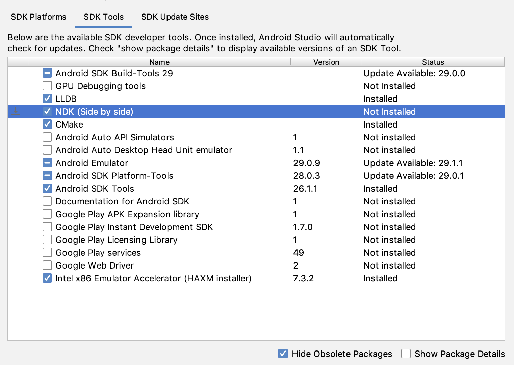

## JNI与NDK简介
JNI（Java Native Interface）Java本地接口，Java调用Native语言的一种特性。
NDK（Native Development Kit）本地开发套件，以原生代码实现部分应用的工具集。

即：JNI使Java代码有了调用本地native方法的能力，NDK是帮助开发者使用C/C++开发运行在Android平台上应用的一系列工具

## Enviroment
官方教程：https://developer.android.com/studio/projects/install-ndk


### Why：为什么需要进行NDK开发
进一步提升设备性能，以降低延迟或运行游戏或物理模拟等计算密集型应用。
重复使用您自己或其他开发者的 C 或 C++ 库。
跨平台开发及代码保护

### How：NDK开发需要什么
Android 原生开发套件 (NDK)：这套工具使您能在 Android 应用中使用 C 和 C++ 代码。
CMake：一款外部构建工具，可与 Gradle 搭配使用来构建原生库。如果您只计划使用 ndk-build，则不需要此组件。
LLDB：Android Studio 用于调试原生代码的调试程序。

### What：怎么做
在AndroidStudio下安装CMake和默认NDK，`Tools -> SDK Manager`

一路下一步，生活更轻松

## 错误排查
每个Gradle插件版本在不指定使用NDK版本时的默认值
Gradle版本 | 7.0 | 4.2 | 4.1 | 4.0 | 3.6 | 3.5及以下 
--- | --- | --- | --- | --- | --- | ---
NDK默认值 | 21.4.7075529 | 21.4.7075529 | 21.1.6352462 | 21.0.6113669 | 20.0.5594570 | 未指定

配置项目使用特定NDK版本
```
android {
    ndkVersion "major.minor.build" // e.g.,  ndkVersion "21.3.6528147"
    ndkPath "/Users/ndkPath/ndk21"  // Point to your own NDK
}
```