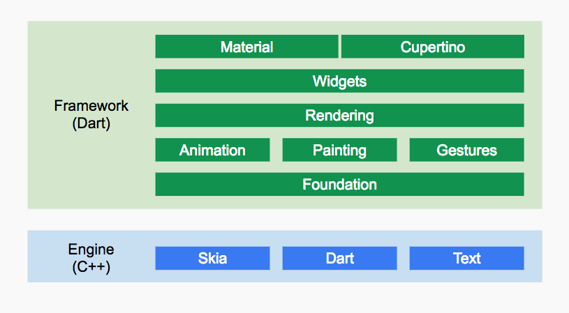

## Flutter简介
### Flutter特性
开发效率高
开发阶段：基于JIT模式避免每次改动都要进行编译，极大的节省了开发时间  
发布阶段：基于AOT模式，保证应用性能

类型安全
由于Dart是类型安全的语言，支持静态类型检测，所以可以在编译前发现一些类型的错误

### Framework

1. Engine：纯C++实现的SDK引擎，包含Skia引擎、Dart运行时、文字排版引擎等，实现界面渲染
2. Foundation和Animation、Painting、Gestures构成Dart UI层，对应`dart:ui`包，提供动画，绘制和手势能力
3. Rendering层依赖Dart UI层，抽象布局层，计算确定每个UI元素的位置，大小，坐标变换和绘制
4. Widgets层，是Flutter的基础组件库，
5. Material和Cupertino是Widget的两种视觉风格

## Flutter基础
### 变量声明
var、dynamic和Object、final和const  
var：用于变量定义可接收任何类型变量的**关键词**，但赋值后类型便确定，后期不能改变  

dynamic：用于声明变量的**关键词**，与var不同的是dynamic声明的变量可以在后期改变赋值类型，**dynamic与Object不同的是，dynamic声明的对象编译器会提供所有可能的组合，而Object声明的对象只能使用Object的属性和方法，否则编译报错**  
Object：是Dart所有对象的**根基类**（包括Function和Null），即任何类型的数据都可以赋值给Object声明的对象  

final：变量只能被赋值一次，第一次使用时初始化
const：定义编译期常量，编译时会被编译器优化替换

### 函数
函数式编程特征：函数作为一个Function类型的对象，可赋值给变量或作为参数传递给其他函数

Dart函数如果没有显示声明，默认返回dynamic类型，特别注意此时不做类型推断，及就是dynamic类型

只包含一个表达式的函数可使用 “ `=>` + 表达式 ” 来简写

函数可作为变量

函数可作为参数传递

可选的位置参数：使用`[]`标记单一可选参数，需放置在参数列表的最后面
可选的命名参数：使用`{param1, param2, ...}`标记一组可选参数，同样需要放置在参数列表的最后面
不能同时使用可选的位置参数和可选的命名参数

### 异步支持
异步函数：返回`Future`和`Stream`对象的函数。在执行异步函数时，函数会直接返回，并不等待至异步操作执行完成

使用`async`和`await`关键字等待异步返回结果，使得异步逻辑的书写与同步代码逻辑类似

#### Future
Future的所有API返回值任然是一个Future对象，可链式调用
api | 作用
--- | ---
Future.then | 执行成功，除正常返回参数外还有一个onError可选参数，用于捕获异常
Future.catchError | 执行失败
Future.whenComplete | 无论成功还是失败
Future.wait | 等待所有任务执行完毕返回，只要有一个任务失败，都执行错误回调中
Future.delayed | 创建延时任务
示例：
```
Future.wait([
//  Future.delayed(new Duration(seconds: 1),(){
//   //return "hi world!";
//   throw AssertionError("Error");
//  }),
  // 2秒后返回结果  
  Future.delayed(new Duration(seconds: 2), () {
    return "hello";
  }),
  // 4秒后返回结果  
  Future.delayed(new Duration(seconds: 4), () {
    return " world";
  })
]).then((data){
   // 执行成功会走到这里 
   print(data);
}).then((data){
   // 链式调用，解决异步多层回调至单层 
   print(data);
}).catchError((e){
   // 执行失败会走到这里   
   print(e);
}).whenComplete((){
   // 无论成功或失败都会走到这里
});
```

#### Async/await
解决异步任务嵌套异步任务引起的回调地狱（Callback Hell）问题
```
String result = task() async {
    try {
        String id = await task1();
        String msg = await task2(id);
        await task3(msg);
    } cache(e) {
        // 错误处理
        print(e)
    }
}
```
async用来表示函数是异步的，定义的函数会返回一个Future对象，可以使用then方法添加回调函数。
await 后面是一个Future，表示等待该异步任务完成，异步完成后才会往下走；await必须出现在 async 函数内部。

#### Stream
Stream 常用于会多次读取数据的异步任务场景，如网络内容下载、文件读写等
```
Stream.fromFutures([
  // 1秒后返回结果
  Future.delayed(new Duration(seconds: 1), () {
    return "hello 1";
  }),
  // 抛出一个异常
  Future.delayed(new Duration(seconds: 2),(){
    throw AssertionError("Error");
  }),
  // 3秒后返回结果
  Future.delayed(new Duration(seconds: 3), () {
    return "hello 3";
  })
]).listen((data){
   print(data);
}, onError: (e){
   print(e.message);
},onDone: (){
});
```

## Flutter单线程如何保证流畅性

Dart中是单isolate线程执行，包含两个事件队列，微任务事件队列和事件队列
微任务队列：包含Dart内部的微任务，主要由**scheduleMicrotask**调度，需要引入`import 'dart:async'`
事件队列：包含I/O，Timer，绘制事件等外部事件

事件执行优先级
mian > 微任务 > 事件任务

通过Isolate实现多线程`import 'dart:isolate'`，线程之间不共享内存，只能通过消息机制通信

## 基础组件


## 布局类组件


## 容器类组件

## 可滚动组件

## 功能型组件

## 事件处理与通知

## 动画

## 自定义组件

## 文件操作与网络请求

## 包与插件

## 国际化

## 核心原理

