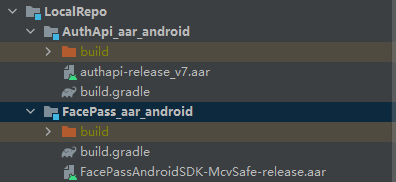

# 编译错误集锦
## 解决报错Direct local .aar file dependencies are not supported when building an AAR.
```
Direct local .aar file dependencies are not supported when building an AAR. The resulting AAR would be broken because the classes and Android resources from any local .aar file dependencies would not be packaged in the resulting AAR. Previous versions of the Android Gradle Plugin produce broken AARs in this case too (despite not throwing this error). 
```
修复步骤
1. 项目根目录新建LocalRepo文件夹
2. LocalRepo文件夹下添加XXX_aar_android目录，名字可按个人需要修改
3. 添加对应的aar文件在XXX_aar_android目录下，并新建build.gradle文件
4. 添加以下内容在新创建的build.gradle文件中
```
configurations.maybeCreate("default")
artifacts.add("default", file('authapi-release_v7.aar'))
```
5. 项目settings.gradle中添加
```
include ':LocalRepo:AuthApi_aar_android'
```
6. 添加需要依赖该aar文件的model下的build.gradle文件
```
api project(path: ':LocalRepo:AuthApi_aar_android')
```

项目结构如下


## 新建工程内libs依赖不自动添加
```
implementation fileTree(dir: 'libs', include: ['*.jar','*.aar'])
```
