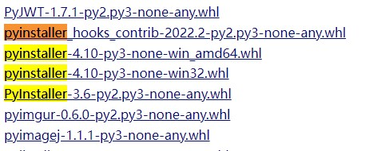
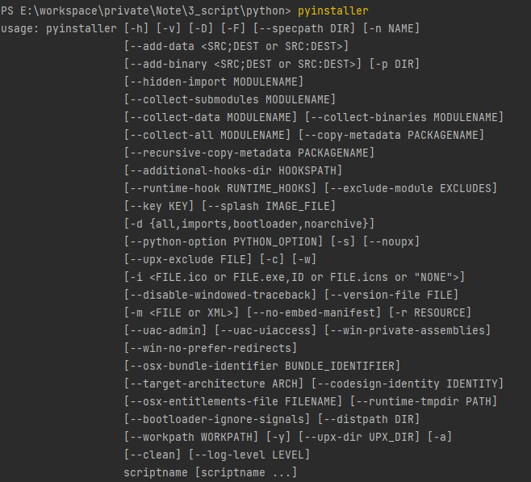

## PyInstaller简述
pyinstaller自身打包的流程：读取编写好的python脚本，分析其中调用的模块和库，然后收集这些文件的副本(包括Python的解释器)。最后把副本与脚本,可执行文件等放在一个文件夹中，或者可选的封装在一个可执行文件中。

## PyInstaller安装
```shell
pip install pyinstaller
```

若安装失败，可到：https://www.lfd.uci.edu/~gohlke/pythonlibs/  
下载编译好的whl文件：  


测试是否安装成功  


## PyInstaller相关参数

选项 | 作用
--- | ---
-F, –onefile | 打包一个单个文件，如果你的代码都写在一个.py文件的话，可以用这个，如果是多个.py文件就别用
-D, –onedir | 打包多个文件，在dist中生成很多依赖文件，适合以框架形式编写工具代码，我个人比较推荐这样，代码易于维护
-K, –tk | 在部署时包含 TCL/TK
-a, –ascii | 不包含编码.在支持Unicode的python版本上默认包含所有的编码.
-d, –debug | 产生debug版本的可执行文件
-w,–windowed,–noconsole | 使用Windows子系统执行.当程序启动的时候不会打开命令行(只对Windows有效)
-c,–nowindowed,–console | 使用控制台子系统执行(默认)(只对Windows有效)pyinstaller -c xxxx.pypyinstaller xxxx.py –console
-s,–strip | 可执行文件和共享库将run through strip.注意Cygwin的strip往往使普通的win32 Dll无法使用.
-X, –upx | 如果有UPX安装(执行Configure.py时检测),会压缩执行文件(Windows系统中的DLL也会)(参见note)
-o DIR, –out=DIR | 指定spec文件的生成目录,如果没有指定,而且当前目录是PyInstaller的根目录,会自动创建一个用于输出(spec和生成的可执行文件)的目录.如果没有指定,而当前目录不是PyInstaller的根目录,则会输出到当前的目录下.
-p DIR, –path=DIR | 设置导入路径(和使用PYTHONPATH效果相似).可以用路径分割符(Windows使用分号,Linux使用冒号)分割,指定多个目录.也可以使用多个-p参数来设置多个导入路径，让pyinstaller自己去找程序需要的资源
–icon=<FILE.ICO> | 将file.ico添加为可执行文件的资源(只对Windows系统有效)，改变程序的图标 pyinstaller -i ico路径 xxxxx.py
–icon=<FILE.EXE,N> | 将file.exe的第n个图标添加为可执行文件的资源(只对Windows系统有效)
-v FILE, –version=FILE | 将verfile作为可执行文件的版本资源(只对Windows系统有效)
-n NAME, –name=NAME | 可选的项目(产生的spec的)名字.如果省略,第一个脚本的主文件名将作为spec的名字


一、流程
pyinstaller作为python打包使用最多的库，其兼容性无疑是极佳的。但既然是外部包，肯定会存在与python版本甚至外部包的兼容问题和较严格的使用规范。

这里以一个QT+matplotlib实现的图形界面为例来讲解pyinstaller其中的坑

文件结构目录：（main.py为主入口程序）1539867547078

第一步：安装pyinstaller


第二步：打开命令行，进入要打包的主程序目录下

输入pyi-makespec -w main.py并回车（多文件GUI应用使用-w参数，建立spec文件，后面会讲解）

1539867804758

打开生成在当前目录下的main.spec文件

1539868505951

添加项目所需的属性（后面会说明添加的规范）

1539868726067

1539868755008

第三步：执行打包命令

pyinstaller main.spec
--这里加不加参数都可以，pyinstaller的参数本质就是spec里的配置属性
1539869310726

第四步：查看目录结构，执行测试

打包完成后目录多了bulid,dist目录，dist目录下存放着最终可发布的打包目录

1539869506562

双击main.exe执行

1539869571287

二、规范
2.1 打包参数的使用
--paths=C:\xxx		# 用于指定pyinstaller搜索包的路径，通常不需要指定
    				# 因为site-packages下的都会被搜索
--icon=C:\xxx # 用于设置exe程序的ico图标，亲测必须为ico且要求ico图片分辨率(建议64x64)
    
# 需要打包一个单独的.py文件时
-F	# 带控制台
-F -w	# 不带控制台，直接以Windows窗体打开
# 需要打包多py文件的项目时
-w或-D -w	# 不带控制台，直接以windows窗体打开

# 第一次打包时建议用-c模式，让程序以控制台子系统执行，方便调试，无错误后用-F或-w进行打包
2.2 Spec文件的使用
2.2.1 添加多文件打包

在打包多文件的项目中，需把每个py文件的路径添加到Analysis的第一个字段里

PS：和main.py同级目录下的py文件可以不用添加

1539870806724

2.2.2 添加外部dll文件及设置exe图标

pyd,dll文件放入到binaries元组中，第一个参数路径可以使用通配符，第二个参数为打包后的目录相对路径

1539871065751

把ico放入到main.py同级目录下，可直接用文件名，ico建议用64*64像素

图标资源可通过阿里巴巴矢量图库获取：http://www.iconfont.cn/

提供一个png,jpeg等图片格式转ico各种大小的网站：https://lvwenhan.com/convertico/

PS：离开了图标所在的文件夹可能会变回默认图标，刷新或操作后恢复

1539871302725

2.2.3 图片等资源文件的添加与封装

图片文件的添加有两种方式：

第一种：当程序中的图片地址为相对路径时，直接把图片目录放入打包后的文件中或通过spec配置。但当图片被用户删除或路径改变，程序就获取不到资源了！（不推荐）

1539871753093

第二种：把图片等资源封装到exe中，但前提要求是程序中的资源路径都得改为绝对路径，因为打包为单exe文件中，分析运行文件时利用Tree函数形成一个文件目录树，运行时将这些文件 释放至C:UsersUSERNAMEAppDataLocal下的一个临时文件夹XXXXX内。程序自身引用此目录的绝对路径来获得所需的文件。

第一步：先将程序中的相对路径更改为绝对路径

第二步：在Spec文件中添加参数，Tree函数将所有文件均添加为’DATA’型数据，其结构为：

[(‘解压后地址’, ‘文件地址’, ‘类型参数’)]
# 在打包完成后把第一个参数对应资源路径的文件删除即可
1539872210943

总结： 
1. 所有的路径都必须使用 “\\”作为分隔符，且路径不能带有中文
2. spec中可进行打包参数的编辑，在之后可以不用再加参数直接pyinstaller
3. 资源文件的打包建议使用2.2.3中第二种方式

三、问题
3.1 RecursionError: maximum recursion depth exceeded 

这是出现在pyinstaller打包时的问题，中文意思是超出最大递归深度
解决方法：退至低版本的python可以得到解决，原因是兼容性问题

3.2 双击程序`Failed to excute Script main`
本质上还是模块缺失了，建议使用-c模式重新打包调试，找到缺失的模块pip install即可解决

3.3 文件打包后过大的问题
这个问题本质上其实是没办法解决的，因为pyinstaller不是编译，而是将py程序与相应的库打包成可执行文件，大小和速度是和你调用的库的大小与速度成正比的，所以在写python程序的过程中尽量不要使用import，而是用from…import…来减少调用。如果是import的话，在打包的时候，会将整个包都打包到exe里面，没有意义的增大了工具的大小！

3.4 防止反编译的问题
按上述步骤打包的程序是容易被反编译为pyc然后破译出main入口的源码的，为了安全起见，可以通过工具把py转为pyd来调用后打包


四、更多
github:https://github.com/pyinstaller/pyinstaller
官方doc：https://pythonhosted.org/PyInstaller/requirements.html
Pyinstaller打包py文件简明教程：https://mp.weixin.qq.com/s/rL84_hBqH4CX-SmUXnjKAQ
链接：http://www.lizenghai.com/archives/898.html