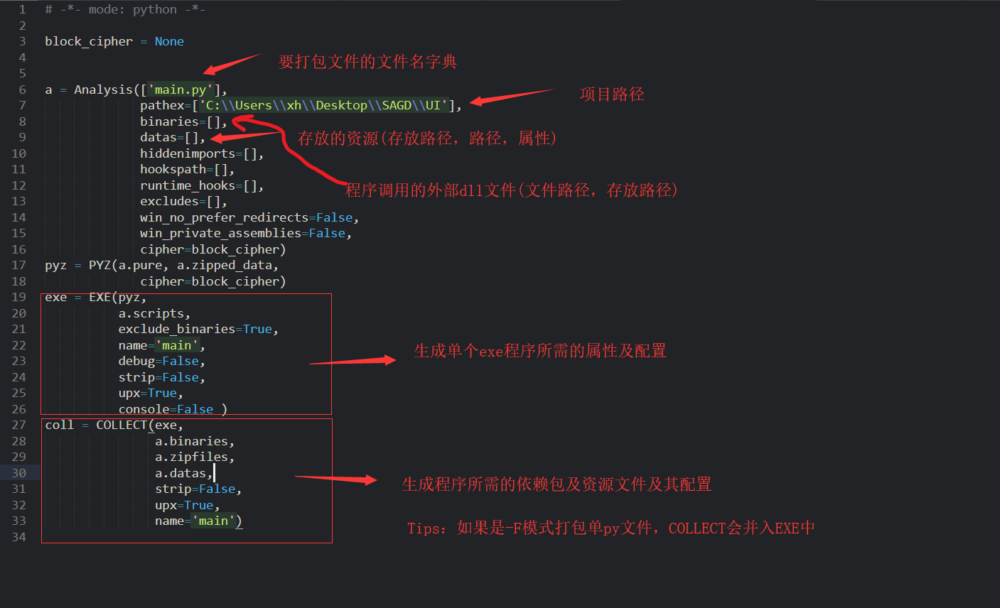
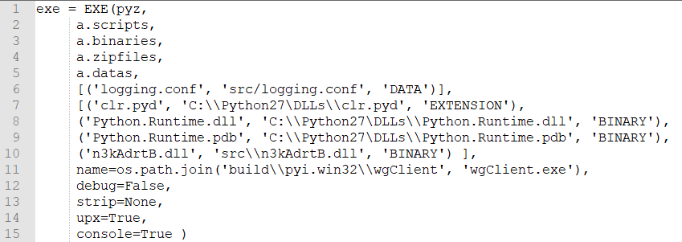

## PyInstaller简述
pyinstaller自身打包的流程：读取编写好的python脚本，分析其中调用的模块和库，然后收集这些文件的副本(包括Python的解释器)。最后把副本与脚本,可执行文件等放在一个文件夹中，或者可选的封装在一个可执行文件中，和编译成真正的机器码完全是两回事。打包后的好处是在运行者的机器上不用安装python和你的脚本依赖的库。在Linux操作系统下，它主要用的binutil工具包里面的ldd和objdump命令。pyinstaller作为python打包使用最多的库，其兼容性无疑是极佳的。但需要注意的是，PyInstaller打包的执行文件，只能在和打包机器系统同样的环境下。也就是说，不具备可移植性，若需要在不同系统上运行，就必须针对该平台进行打包。

## PyInstaller安装
```shell
pip install pyinstaller
```
或使用国内镜像
```shell
pip install pyinstaller -i https://pypi.douban.com/simple/
```

若安装失败，可到：https://www.lfd.uci.edu/~gohlke/pythonlibs/  
下载编译好的whl文件：  
  
然后执行安装`pip install PyInstaller-3.6-py2.py3-none-any.whl`

测试是否安装成功  


## PyInstaller相关参数
### 常用参数

选项 | 作用
--- | ---
-F, –onefile | 打包一个单个文件，如果你的代码都写在一个.py文件的话，可以用这个，如果是多个.py文件就尽量别用
-D, –onedir | （默认选项）打包多个文件，在dist中生成很多依赖文件，适合以框架形式编写工具代码，我个人比较推荐这样，代码易于维护
-K, –tk | 在部署时包含 TCL/TK
-a, –ascii | 不包含编码.在支持Unicode的python版本上默认包含所有的编码.
-d, –debug | 产生debug版本的可执行文件
-w, –windowed, –noconsole | 使用Windows子系统执行.当程序启动的时候不会打开命令行(只对Windows有效)
-c, –nowindowed, –console | （默认选项）使用控制台子系统执行(只对Windows有效)pyinstaller -c xxxx.pypyinstaller xxxx.py –console
-s, –strip | 可执行文件和共享库将run through strip.注意Cygwin的strip往往使普通的win32 Dll无法使用.
-X, –upx | 如果有UPX安装(执行Configure.py时检测),会压缩执行文件(Windows系统中的DLL也会)(参见note)
-o DIR, –out=DIR | 指定spec文件的生成目录,如果没有指定,而且当前目录是PyInstaller的根目录,会自动创建一个用于输出(spec和生成的可执行文件)的目录.如果没有指定,而当前目录不是PyInstaller的根目录,则会输出到当前的目录下.
-p DIR, –path=DIR | 设置导入路径(和使用PYTHONPATH效果相似).可以用路径分割符(Windows使用分号,Linux使用冒号)分割,指定多个目录.也可以使用多个-p参数来设置多个导入路径，让pyinstaller自己去找程序需要的资源
–icon=<FILE.ICO> | 将file.ico添加为可执行文件的资源(只对Windows系统有效)，改变程序的图标 pyinstaller -i ico路径 xxxxx.py
–icon=<FILE.EXE,N> | 将file.exe的第n个图标添加为可执行文件的资源(只对Windows系统有效)
-v FILE, –version=FILE | 将verfile作为可执行文件的版本资源(只对Windows系统有效)
-n NAME, –name=NAME | 可选的项目(产生的spec的)名字.如果省略,第一个脚本的主文件名将作为spec的名字

图标资源可通过阿里巴巴矢量图库获取：http://www.iconfont.cn/ ，提供一个png,jpeg等图片格式转ico各种大小的网站：https://lvwenhan.com/convertico/

### 详细参数
通过`pyinstaller -h`查看并整理说明

#### 1. 通用参数
参数名 | 描述 | 说明
--- | --- | ---
-h | 显示帮助 | 无
-v | 显示版本号 | 无
–distpath | 生成文件放在哪里 | 默认：当前目录的dist文件夹内
–workpath | 生成过程中的中间文件放在哪里 | 默认：当前目录的build文件夹内
-y | 如果dist文件夹内已经存在生成文件，则不询问用户，直接覆盖 | 默认：询问是否覆盖
–upx-dir UPX_DIR | 指定upx工具的目录 | 默认：execution path
-a | 不包含unicode支持 | 默认：尽可能支持unicode
–clean | 在本次编译开始时，清空上一次编译生成的各种文件 | 默认：不清除
–log-level LEVEL | 控制编译时pyi打印的信息 | 一共有6个等级，由低到高分别为TRACE DEBUG INFO(默认) WARN ERROR CRITICAL。也就是默认清空下，不打印TRACE和DEBUG信息

#### 2. 与生成结果有关的参数
参数名 | 描述 | 说明
--- | --- | ---
-D | 生成one-folder的程序（默认） | 生成结果是一个目录，各种第三方依赖、资源和exe同时存储在该目录
-F | 生成one-file的程序 | 生成结果是一个exe文件，所有的第三方依赖、资源和代码均被打包进该exe内
–specpath | 指定.spec文件的存储路径 | 默认：当前目录
-n | 生成的.exe文件和.spec的文件名 | 默认：用户脚本的名称，即main.py和main.spec

#### 3. 指定打包资源/代码
参数名 | 描述 | 说明
--- | --- | ---
–add-data | 打包额外资源 | 用法：pyinstaller main.py --add-data=src;dest。windows以`;`分割，linux以`:`分割
–add-binary | 打包额外的代码 | 用法：同–add-data。与–add-data不同的是，用binary添加的文件，pyi会分析它引用的文件并把它们一同添加进来
-p | 指定额外的import路径，类似于使用PYTHONPATH | 参见PYTHONPATH
–hidden-import | 打包额外py库 | pyi在分析过程中，有些import没有正确分析出来，运行时会报import error，这时可以使用该参数
–additional-hooks-dir | 指定用户的hook目录 | hook用法参见其他，系统hook在PyInstaller\hooks目录下
–runtime-hook | 指定用户runtime-hook | 如果设置了此参数，则runtime-hook会在运行main.py之前被运行
–exclude-module | 需要排除的module | pyi会分析出很多相互关联的库，但是某些库对用户来说是没用的，可以用这个参数排除这些库，有助于减少生成文件的大小
–key | pyi会存储字节码，指定加密字节码的key | 16位的字符串

#### 4. 生成参数
参数名 | 描述 | 说明
--- | --- | ---
-d | 执行生成的main.exe时，会输出pyi的一些log，有助于查错 | 默认：不输出pyi的log
-s | 优化符号表 | 原文明确表示不建议在windows上使用
–noupx | 强制不使用upx | 默认：尽可能使用。

#### 5. 其他
参数名 | 描述 | 说明
--- | --- | ---
–runtime-tmpdir | 指定运行时的临时目录 | 默认：使用系统临时目录

#### 6. Windows和Mac特有的参数
参数名 | 描述 | 说明
--- | --- | ---
-c | 显示命令行窗口 | 与-w相反，默认含有此参数
-w | 不显示命令行窗口 | 编写GUI程序时使用此参数有用。
-i | 为main.exe指定图标 | pyinstaller -i beauty.ico main.py

#### 7. Windows特有的参数
参数名 | 描述 | 说明
--- | --- | ---
–version-file | 添加版本信息文件 | pyinstaller --version-file ver.txt
-m, --manifest | 添加manifest文件 | pyinstaller -m main.manifest
-r RESOURCE | 请参考原文 |  
–uac-admin | 请参考原文 |  
–uac-uiaccess | 请参考原文 |  

## PyInstaller打包流程
### 基本使用
若需将xxx.py文件打包，只需在终端执行：
```shell
pyinstaller xxx.py
```

需要打包一个单独的.py文件时  
```shell
pyinstaller -F main.py |  | # 带控制台  
pyinstaller -w -F main.py | # 不带控制台，直接以Windows窗体打开  
pyinstaller -w -F main.py -i hello.ico --version-file version_info.txt # 添加图标和版本信息
```

需要打包多py文件的项目时  
```shell
pyinstaller -w -D main.py | # 不带控制台，直接以windows窗体打开
```
注：终端需切换至xxx.py文件所在目录下。
### 高级操作
#### 1. 生成spec文件  
输入`pyi-makespec -w main.py`回车，`-w` 是为了关闭命令提示窗  
打开生成在当前目录下的main.spec文件


#### 2. 添加项目配置信息   

| 父字段 | 子字段 | 说明
| --- | --- | ---
| Analysis || 用于定义python源文件，包括搜索路径和源文件名等。
|| [] | 在打包多文件的项目中，需把每个py文件的路径添加到Analysis的第一个字段里，PS：和main.py同级目录下的py文件可以不用添加
|| pathex | 项目根路径；
|| binaries | 动态库；pyd,dll文件放入到binaries元组中，第一个参数路径可以使用通配符，第二个参数为打包后的目录相对路径
|| datas | 数据文件，包括图片字体等；
|| scripts | 在Analysis中定义的源文件；
|| pure | python模块；
|| zipfiles | zip格式的依赖文件，一般是egg格式的库文件。
|| scripts | 在Analysis中定义的源文件；
| PYZ || 将python文件压缩打包，包含程序运行需要的所有依赖，输入一般是Analysis.pure。
| EXE || 打包生成exe文件，根据上面两项生成。EXE子任务包括Analysis的所有5个输出项以及程序运行所需的一些配置文件和动态库。配置文件和动态库通过TOC格式来配置，格式为(name, path, typecode)，即[(‘解压后地址’, ‘文件地址’, ‘类型参数’)]
|| typecode | EXTENSION：python扩展库；PYSOURCE：python脚本；PYMODULE；PYZ；PKG；BINARY：动态库；DATA：数据文件；OPTION。
| COLLECT || 用来构建最终的生成目录，可以复制其他子任务生成的结果，并拷贝到指定目录，形成最终的打包结果，COLLECT也可以没有。

图片等资源文件的添加与封装  
第一种：当程序中的图片地址为相对路径时，直接把图片目录放入打包后的文件中或通过spec配置。但当图片被用户删除或路径改变，程序无法获取对应资源

```
datas=[("..\\lib3rd", "lib3rd"), ("..\\libutils", "libutils"), ("..\\product", "product"), ("..\\docxcompose", "docxcompose")],
```

第二种：把图片等资源封装到exe中，但前提要求是程序中的资源路径都得改为绝对路径，因为打包为单exe文件中，分析运行文件时利用Tree函数形成一个文件目录树，运行时将这些文件 释放至`C:\Users\USERNAME\AppDataLocal`下的一个临时文件夹XXXXX内。程序自身引用此目录的绝对路径来获得所需的文件。

第一步：先将程序中的相对路径更改为绝对路径  
第二步：在Spec文件中添加参数，Tree函数将所有文件均添加为’DATA’型数据，其结构为：  

typecode使用示例  


#### 3. 执行打包命令
```shell
pyinstaller main.spec --noconfirm
```

命令可选项包括：  
–upx-dir，  
–distpath，  
–noconfirm，  
–ascii。  

#### 4. 查看目录结构，运行应用  
打包完成后目录多了**bulid，dist**目录，**dist**目录下存放着最终可发布的打包目录，双击`main.exe`运行  

#### 5. 总结
1. 能from...import...就尽量用这个
2. 所有的路径都必须使用 `\\` 作为分隔符，且路径不能带有中文
3. spec中可进行打包参数的编辑，在之后可以不用再加参数直接pyinstaller
4. 第一次打包时建议用-c模式（默认），让程序以控制台子系统执行，方便调试，无错误后用-F或-w进行打包
5. 添加os.system('pause')，表示程序暂停，按任意键继续。。。

## PyQt打包过程中遇到的问题
1. `RecursionError: maximum recursion depth exceeded`或`IndexError：tuple index out of range`  
这是出现在pyinstaller打包时的问题，中文意思是超出最大递归深度，解决方法：退至低版本的python可以得到解决，原因是兼容性问题

2. 双击程序报错`Failed to excute Script main`  
本质上还是模块缺失了，建议使用-c模式重新打包调试，找到缺失的模块pip install即可解决

3. 文件打包后过大的问题  
这个问题本质上其实是没办法解决的，因为pyinstaller不是编译，而是将py程序与相应的库打包成可执行文件，大小和速度是和你调用的库的大小与速度成正比的，所以在写python程序的过程中尽量不要使用import，而是用from…import…来减少调用。如果是import的话，在打包的时候，会将整个包都打包到exe里面，没有意义的增大了工具的大小！

4. 防止反编译的问题  
按上述步骤打包的程序是容易被反编译为pyc然后破译出main入口的源码的，为了安全起见，可以通过工具把py转为pyd来调用后打包

5. 打包报错`upx is not availible.`  
到官网 https://upx.github.io 下载UPX，根据自己系统位数，选择相应版本就行。
然后解压缩，得到upx.exe这个文件，找到当时安装Python位置的文件夹，将upx.exe拷贝到scripts文件夹中。

6. ctypes.cdll.LoadLibrary报错OSError: [WinError 126] 找不到指定的模块。  
首先检查调用的dll库(32/64)与python版本(32/64)是否对应，其次检查LoadLibrary所加载的dll是否依赖其他dll，所依赖的dll是否在当前路径下或path环境变量中，排除以上场景后将当前使用的目录添加到环境变量中，如：
```
import os

path = os.path.realpath(os.path.join(os.getcwd(), "lib3rd/vzsdk"))
os.environ['path'] += f';{path}'
```

7. 打包/运行报错`no module named xxx`  
确保对应module已安装的前提下，添加打包参数`pyinstaller --hidden-import xxx`，或在spec文件中添加对应的项目

8. 代码调试正常，但打包后提示`FileNotFoundError:[Error 2] No such file or directory`  
检查报错信息，是否是第三方库使用的文件，如果是的话需要创建本地目录并提供文件副本，然后执行对应第三方模块设置动作，如果不是检查本身文件路径是否正确（路径中尽量不要使用中文）

## 常见国内镜像地址
> 清华：https://pypi.tuna.tsinghua.edu.cn/simple  
> 阿里云：http://mirrors.aliyun.com/pypi/simple/  
> 中国科技大学 https://pypi.mirrors.ustc.edu.cn/simple/  
> 华中理工大学：http://pypi.hustunique.com/  
> 山东理工大学：http://pypi.sdutlinux.org/  
> 豆瓣：http://pypi.douban.com/simple/  

### 临时使用
可以在使用pip的时候加参数：`-i https://pypi.tuna.tsinghua.edu.cn/simple`

### 永久修改
Linux下，修改 `~/.pip/pip.conf` (没有就创建一个文件夹及文件。文件夹要加“.”，表示是隐藏文件夹)  
windows下，直接在 `%userprofile%` 目录中创建一个pip目录，如：`C:\Users\xx\pip`，新建文件pip.ini。
```
[global]
index-url = https://pypi.tuna.tsinghua.edu.cn/simple
[install]
trusted-host=mirrors.aliyun.com
```

## 更多
github:https://github.com/pyinstaller/pyinstaller  
官方doc：https://pyinstaller.readthedocs.io/en/stable/