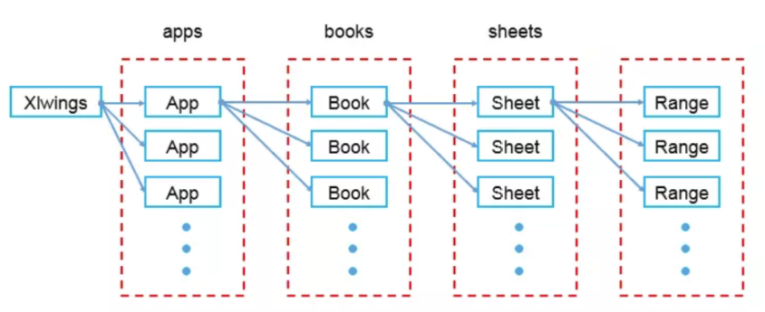

## Python操作Excel的第三方库技术对比
库名 | 支持平台 | 支持格式 | 能力
--- | --- | --- | ---
xlrd | Windows/macOS | .xls/.xlsx | 读
xlwt | Windows/macOS | .xls | 写/修改
xlutils | Windows/macOS | .xls | 修改
openpyxl | Windows/macOS | .xlsx | 读/写/修改
xlsxwriter | Windows/macOS | .xlsx | 写
pandas | Windows/macOS | .xls/.xlsx | 读/写
xlwings | Windows/macOS | .xls/.xlsx | 读/写/修改
win32com   | Windows/macOS | .xls/.xlsx | 读/写/修改

## win32com
安装：`pip install pypiwin32`
```
# 方法一 预加载对象属性和方法,对象可以使用索引，如worksheet.Columns[1]  
app = win32com.client.gencache.EnsureDispatch("Excel.Application")

# 方法二 延迟加载（若temp下不存在gen_py）,使用索引时 worksheet.Columns(1)
app = win32com.client.Dispatch(application)

# 方法三 总是延迟加载  
app = win32com.client.dynamic.Dispatch(application)

如果没有打开任何的excel文件，gencache会新建一个application；如果已经打开，就不会新开一个application。因此，使用结束后，如果释放了这个application，就会把之前打开的其他文件也关闭了，这个关闭的时候需要注意,需要判断excel中是否还有文件被打开 ：app.ActiveWorkbook

app打开方式的区别：https://stackoverflow.com/questions/50127959/win32-dispatch-vs-win32-gencache-in-python-what-are-the-pros-and-cons/53833740#53833740?newreg=0e69607c6e364894abde5a7be0fe5e29

win32com 文档:http://timgolden.me.uk/pywin32-docs/contents.html

使用win32com最苦恼的就是没有文档，如果你使用 win32.gencache.EnsureDispatch('Excel.Application')，然后找到Temp目录下的gen_py文件，所有COM对象可用的方法都在这里

word，ppt 一样一样的
注意：
    1. 不同的打开方式会影响，索引方式，api.方法名大小写
    2. wps 和 微软的office 同一个方法返回值可能不同
    3. 想看对象都有哪些可用的属性和方法，使用方法一打开
    4. 若当前已打开excel，则代码中设置Visible属性为False后，如果调用Add()新建book，Visible失效，需要重新设置，闪屏现象可以通过设置app.ScreenUpdating=False‘缓解’
```
```python
from win32com.client import Dispatch    
import win32com.client    
class easyExcel:    
      """A utility to make it easier to get at Excel. Remembering  
      to save the data is your problem, as is error handling.  
      Operates on one workbook at a time."""    
      def __init__(self, filename=None):  #打开文件或者新建文件（如果不存在的话）  
          self.xlApp = win32com.client.Dispatch('Excel.Application')    
          if filename:    
              self.filename = filename    
              self.xlBook = self.xlApp.Workbooks.Open(filename)    
          else:    
              self.xlBook = self.xlApp.Workbooks.Add()    
              self.filename = ''  
        
      def save(self, newfilename=None):  #保存文件  
          if newfilename:    
              self.filename = newfilename    
              self.xlBook.SaveAs(newfilename)    
          else:    
              self.xlBook.Save()        
      def close(self):  #关闭文件  
          self.xlBook.Close(SaveChanges=0)    
          del self.xlApp    
      def getCell(self, sheet, row, col):  #获取单元格的数据  
          "Get value of one cell"    
          sht = self.xlBook.Worksheets(sheet)    
          return sht.Cells(row, col).Value    
      def setCell(self, sheet, row, col, value):  #设置单元格的数据  
          "set value of one cell"    
          sht = self.xlBook.Worksheets(sheet)    
          sht.Cells(row, col).Value = value  
      def setCellformat(self, sheet, row, col):  #设置单元格的数据  
          "set value of one cell"    
          sht = self.xlBook.Worksheets(sheet)    
          sht.Cells(row, col).Font.Size = 15#字体大小  
          sht.Cells(row, col).Font.Bold = True#是否黑体  
          sht.Cells(row, col).Name = "Arial"#字体类型  
          sht.Cells(row, col).Interior.ColorIndex = 3#表格背景  
          #sht.Range("A1").Borders.LineStyle = xlDouble  
          sht.Cells(row, col).BorderAround(1,4)#表格边框  
          sht.Rows(3).RowHeight = 30#行高  
          sht.Cells(row, col).HorizontalAlignment = -4131 #水平居中xlCenter  
          sht.Cells(row, col).VerticalAlignment = -4160 #  
      def deleteRow(self, sheet, row):  
          sht = self.xlBook.Worksheets(sheet)  
          sht.Rows(row).Delete()#删除行  
          sht.Columns(row).Delete()#删除列
      def getRange(self, sheet, row1, col1, row2, col2):  #获得一块区域的数据，返回为一个二维元组  
          "return a 2d array (i.e. tuple of tuples)"    
          sht = self.xlBook.Worksheets(sheet)  
          return sht.Range(sht.Cells(row1, col1), sht.Cells(row2, col2)).Value    
      def addPicture(self, sheet, pictureName, Left, Top, Width, Height):  #插入图片  
          "Insert a picture in sheet"    
          sht = self.xlBook.Worksheets(sheet)    
          sht.Shapes.AddPicture(pictureName, 1, 1, Left, Top, Width, Height)    
      
      def cpSheet(self, before):  #复制工作表  
          "copy sheet"    
          shts = self.xlBook.Worksheets    
          shts(1).Copy(None,shts(1))
 
      def inserRow(self,sheet,row):
          sht = self.xlBook.Worksheets(sheet)
          sht.Rows(row).Insert(1)
 
      #下面是一些测试代码。
if __name__ == "__main__":    
      #PNFILE = r'c:/screenshot.bmp'  
      xls = easyExcel(r'E:\empty_book.xlsx')     
      #xls.addPicture('Sheet1', PNFILE, 20,20,1000,1000)    
      #xls.cpSheet('Sheet1')  
      xls.setCell('sheet1',2,'A',88)  
      row=1  
      col=1  
      print("*******beginsetCellformat********")  
      # while(row<5):
      #   while(col<5):
      #       xls.setCellformat('sheet1',row,col)
      #       col += 1
      #       print("row=%s,col=%s" %(row,col))
      #   row += 1
      #   col=1
      #   print("*******row********")
      # print("*******endsetCellformat********")
      # print("*******deleteRow********")
      # xls.deleteRow('sheet1',5)
      xls.inserRow('sheet1',7)
      xls.save()    
      xls.close()
```

```python
import win32com.client
import os
import sys
import shutil
 
def getScriptPath():
    return os.path.split(os.path.realpath(__file__))[0]
      #下面是一些测试代码。
if __name__ == "__main__":    
    newApp = win32com.client.DispatchEx('Excel.Application')
#    newWorkBook = newApp.WorkBooks.Add()#新建excel
#    newSheet = newWorkBook.Worksheets.Add()#新建sheet
    newWorkBook =newApp.Workbooks.Open(getScriptPath() + "\\004.xlsx")
    newSheet = newWorkBook.Worksheets('Sheet1')#打开已存在sheet
    newSheet.Cells(3,4).Value = "超算"
#    newWorkBook.SaveAs(getScriptPath() + "\\test2.xlsx")   
    newWorkBook.Save()
    newWorkBook.SaveAs(getScriptPath() + "\\test2.xlsx")#另存为实现复制功能
#    shutil.copyfile("004.xlsx","005.xlsx")#shutil实现复制功能
    newWorkBook.Close()
    newApp.Quit()
```

## xlwings
确保pywin32的配置，如果没有，可以通过以下链接找到对应python版本的安装包：https://github.com/mhammond/pywin32/releases  
官方文档： https://docs.xlwings.org/en/stable/quickstart.html  
安装：`pip install xlwings`  

```python
import time
import xlwings as xw

######################### 文件打开 #########################
path = '.\\a.xlsx'
# visible=True: 显示被操作的excel窗口
# add_book=False: 不新建工作簿
app = xw.App(visible=True, add_book=False)
# 打开excel或使用默认 wb = xw.Book(path)
wb = app.books.open(path)
# 打印当前的books
print(app.books)
# 打印当前活跃的books
print(app.books.active)

######################### sheet操作 #########################

# 新建sheet
wb.sheets.add("sheet2")
# 删除sheet
wb.sheets["sheet2"].delete()
# 查看sheet名
wb.sheets[1].name
# 重命名sheet
wb.sheets[1].name='abc'
# 清除单元格的内容
a1.clear_contents()
# 清空整张表格的内容和格式
wb.sheets[1].clear()
# 激活指定sheet
wb.sheets["sheet1"].activate()
# 查看当前活跃的sheet
wb.sheets.active

######################### data操作 #########################
## 获取单元格
# .value获取单元格内数据
wb.sheets["sheet1"].range("A1")
xw.Range("A1")
sht = wb.sheets["sheet1"]
rng_a4 = sht["A1"]

rng_a1_b3 = sht["A1:B3"]
rng_a1_b3_2 = sht.range("A1:B3")
xw.Range((1, 1), (3, 2))

rng_c1 = sht[0, 2]

## 单元格内容
# 修改1个
sht.range("A1").value="A1"
# 修改一行
sht.range("A2").value=[1,2]
# 修改一列
sht.range("A3").options(transpose=True).value = ["列", "列", "列"]
titles = [[1], [2], [3], [4]]
# 输入表格
sht.range('A4').options(expand='table').value = [[1, 2], [3, 4]]
sht.range("A4:B5").value = [[1, 2], [3, 4]]

#插入列
sht.range('a:a').api.Insert()
#插入行
sht.range('2:2').api.Insert()
#插入单元格
sht.range('b4').api.Insert()

# 加入超链接
a1 = xw.Range('A1')
a1.add_hyperlink(r'www.baidu.com', '百度', '提示：点击即链接到百度')
# 链接到Sheet2 的B3单元格
a1.add_hyperlink("#Sheet2!B3")
# 获取超链接
hyperlink = a1.hyperlink

# 取得单元格的背景色,以元组形式返回RGB值
color = a1.color
# 设置单元格的颜色
a1.color = (255, 255, 255)
# 清除单元格的背景色
a1.color = None
 
# 获取公式或者输入公式
formula = a1.formula
formula = a1.formula = '=SUM(B1:B9)'
 
# 获得单元格列宽
column_width = a1.column_width
######################### 保存/关闭 #########################
# 保存修改
wb.save()

# 关闭打开的工作薄 
# app.books[0].close()
wb.close()
# 退出
time.sleep(2)
app.quit()
```

## pandas
安装`pip install pandas`

```python

```

## xlrd与xlwt

```python

```

## Tips
1. 简单去重
```python
extra = [i for i in second if i not in first_str]
print(extra)
```
2. 数字前面加一个英文字符的单引号（'），数字就变成文本格式了，可以避免Excel乱改格式，或对数字使用Float和科学计数法
