# IPD(Integrated Product Development)集成产品开发
## 方法论
why：真正深刻和原创性的洞见只能在研究榜样的过程中发现，向榜样和标杆学习，采用业界成熟的管理体系，是企业提高创新和研发管理水平的重要方法
how：持之以恒的模仿、跟所、固化、优化一套经过验证的管理体系，结合企业特点不断向深度发展，超越，最终形成自己的管理体系。
what：华为价值观：”以客户为中心+艰苦奋斗+自我批判“

### 跨部门流程体系-”云，雨，沟“
降低全公司沟通成本，凝聚共识，形成统一工作方法，强化各项运营能力相互配合。
云：对外纸行业变化、技术变革、市场机会等，对内指企业核心价值观
雨：企业各部门的经营活动
沟：跨部门、跨领域的工作流程

理清流程之间的接口关系，才能端到端贯通，满足客户需求。
IPD流程：各层级和各领域战略规划、需求管理、产品规划、项目任务书开发、产品开发、上市、生命周期管理
LTC流程：包括机会点管理、客户关系维护、投标、商务、供应链、发货、安装、收款
ITR(issue to resolution，从问题到解决) 流程：包括从客户问题产生到最终得到解决的流程

### 产品包和产品包需求
* O产品包：产品是满足需求的交付物的总和，包括有形部分和无形部分。是对客户和下游环节所有交付的统称。
* OR产品包需求：对原始需求进行分析、判断和加工后，最终向客户(包括外部客户和内部客户)交付的需求，是对产品包的正式描述，完整且准确，是对产品包进行开发、验证、销售、交付的依据。它包括两个部分：
  1. 项目任务书中包含的经过澄清、分析、整理后的需求列表。	
  2. 在产品开发的概念和计划阶段，经过澄清、分析、整理，并通过团队讨论形成一致意见之后的其他需求

### IPD是什么
1. 开发(development)：开发是创新性活动，目的是在企业有盈余的前提下满足市场和客户需求。
2. 产品(product)：产品是满足客户所有需求($APPEALS)的提供物的总和，也就是前面定义的产品包(offerings)，包括有形部分和无形部分。
3. 集成(integrated)：通过思想，工具，方法流程，整合企业内各资源部门，共同完成成规划和研发工作，满足客户需求

IPD是基于市场和客户需求驱动的规划和开发管理体系。其核心是由来自市场、研发、制造、服务、采购等方面的人员组成的跨部门团队共同管理整个规划和开发过程，即从客户需求、产品规划、任务书开发、概念形成、产品开发、上市，直到生命周期的完整过程。通过 IPD管理体系，使产品开发更加关注客户需求，加快市场响应速度，缩短产品开发周期，减少报废项目，降低开发成本，提高产品的稳定性、可生产性、可服务性等。

### IPD核心思想
1. 研发是**投资**行为：只有实现了客户的投资回报，才会有公司的投资回报，才能实现公司自己的企业效益
2. 基于**需求**的研发：内部客户的需求来源于外部客户，以客户为中心，满足客户需求才是企业生存的基础
3. **平台**化开发：通过需求管理、产品和技术规划提前识别公共技术和关键技术，抽取现有产品共同使用的模块和技术形成基础平台并要探索和研究目标客户未来的共同需求，从而在快速响应客户需求、提高质量、降低成本上同时取得领先优势。
4. **跨部门**协作：汇集各个领域的专业智慧形成合力，共同满足客户需求，为产品的商业成功负责。
5. **结构化**流程：分阶段执行，设置评审点，按角色归集流程中的活动。评审点分为决策评审点和技术评审点，决策评审实现高层决策团队(投资方)和规划团队、研发团队(承诺方)等的互动，资源分批受控投入，既满足项目进展需要，又避免投资失控。技术评审，实现专家和项目团队的充分互动，各领域专家充分利用其专业经验为研发团队提供指导，确保产品最终满足客户需求。
6. 业务和能力**均衡**：业务发展和内部能力建设同等重要。在企业发展的不同阶段，可以有策略、有选择地把重心放在业务发展或内部能力的构建上。产品生命周期有限，但能力可以源源不断创造出新产品。
7. **灵活**发展，与时俱进：在不断吸取业界最佳实践和解决业务问题的过程中与时俱进

### IPD组成部分
1. 基于MM的规划：应当做什么 —— MM方法论：理解市场->细分市场->组合分析->制定业务计划->融合和优化业务计划->管理和评估业务计划
2. 基于IPD的创新：如何进行创新 —— IPD方法论(狭义IPD)：概念、计划、开发、验证、发布和生命周期
3. 以客户需求为中心：华为商业模式 —— 需求管理(RM)：需求探索和收集，需求分析，需求分配，需求实现，需求验证。需求管理是MM和IPD的支撑流程，为它们提供输入
4. 矩阵组织：职能部门支撑团队运作 —— 解决企业快速灵活响应市场和发挥规模优势之间的平衡问题
5. 研发项目管理：管理的“临门一脚” —— RDPM(R&D project management研发项目管理)框架，提高企业的创新水品
6. 绩效与激励：决不让雷锋吃亏 —— 透明有效的测量绩效，持续沟通保持组织目标与个人目标的“对齐”，实现目标的双达成
7. 管理变革与优化 ——IPD特色化，考虑公司实情动态调整，使之最适合指导当前公司发展

矩阵组合：产品技术创新管理体系(PTIM)框架  
框架.png)

## 如何制定可执行的业务计划——使用MM(market management)市场管理及产品规划对齐战略与规划
企业经营逻辑顺序：战略 -> 产品规划 -> 产品开发 -> 生产 -> 销售 -> 服务

战略就是定位、取舍和匹配
1. 定位：确定企业为哪些客户提供哪些区别于竞争对手的独特产品和服务。
2. 取舍：明确哪些事情是要做的和不做的，尤其明确哪些是不做的。
3. 匹配：各个领域的活动支撑战略定位，并且相互匹配和加强。

战略营销体系：聚焦怎么倾听客户需求，怎么理解客户需求，跟客户探讨他到底要什么，然后来定义我们的产品和产品的规格

以客户需求为中心的“四个对齐”：
1. 上下对齐：公司高层、中层和基层的对齐
2. 左右对齐：不同产品线和部门之间的对齐
3. 长中短期对齐：长期规划(3年以上)、中期规划(1~3年)和短期规划(年度/季度/月计划)的对齐
4. 外部对齐：整个公司的计划要能满足客户和市场需求，适应外部环境变化

### MM方法论
目标：运用严格、规范的方法**分析**市场走势、业务要求及**需求**，**创建**合理的**市场细分规则**，**对**要投资和取得领先地位的**细分市场进行选择和优先级排序**，从而制订可执行的业务计划，**驱动新产品的开发和各领域活动**，用产品和服务进行匹配，同时确保能力能够支撑，并**并闭环管理业务计划**。  
基本逻辑：
1. 在明确使命、愿景和目标的基础上，确定要服务的对象及其需求。
2. 确定用什么交付(产品/服务/解决方案)来满足这些需求。
3. 确定在采取哪些行动/构建哪些能力，准备哪些资源来提供这些交付。
4. 对规划过程进行闭环管理和评估

MM方法论围绕这些关键问题展开：	
1. 价值观、使命、愿景、目标分别是什么？	
2. 为谁服务，也就是选择哪些细分市场？	
3. 战略路径(业务设计)和业务计划是什么？	
4. 要满足细分市场客户的哪些需求？	
5. 为目标客户提供什么产品、服务或解决方案？	
6. 需要构建哪些能力？如何构建？	
7. 各领域策略和行动计划是什么？	
8. 如何实现业务计划的闭环管理？

MM指导下的ISOP(ntegrated strategy & operation process)集成战略与运营流：统一管理企业的战略规划和各种运营活动及其管理体系的流程框架，也是组织的绩效管理流程。
1. 战略规划(SP)：制定未来 3～5 年的战略规划
2. 战略展架(BP)：制订下一年度业务计划和预算
3. 战略执行和监控：持续进行，通过定期(季度或月度)对 SP 和 BP进行审视和更新
4. 战略评估：对战略执行情况进行评估和总结，包括组织和团队绩效、个人绩效、项目绩效、管理体系评估等

### MM方法论应用于产品线规划
#### MM的六个阶段
1. 理解市场 - 确定总体目标战略方向
2. 细分市场 - 单一变化条件，细分目标客户
3. 组合分析 - 认知自我，确定产品形态
4. 制定业务计划 - 总结归纳，承上启下
5. 融合和优化业务计划 - 形成各层级SP和BP
6. 管理与评估业务计划 - 常规性日常活动，定期审视适当调整(客户需求的不稳定性和多变性)

4P：产品(product)、价格(price)、渠道(place)、促销(promotion)+ 2：技术支持、订单履行。
TPM，transformation progress metrics，变革进展评估

当MM方法论应用于产品规划时，本质上就是用“主观”的产品与“客观”的市场和市场需求进行匹配的过程

#### 业务计划书与产品/技术路标
业务计划书是对业务如何运作的总体性说明文档，用于内部交流和向投资方汇报，根据需要可粗可细。业务计划书也叫商业计划书，要把商业逻辑介绍清楚。长期的业务计划书也叫战略规划或战略计划(SP)

根据规划对象，业务计划书分为：
1. 公司业务计划书(C-BP，corporation BP)	
2. 产品线业务计划书(PL-BP，product line BP)	
3. 产品包业务计划书(O/SBP，offering/solution BP)	
4. 细分市场业务计划书(SM-BP，segment market BP)	
5. 功能部门业务计划书(FD-BP，function department BP)

产品路标(product roadmap)是产品、服务或解决方案的发展方向和中长期规划，对内用于指导项目任务书(charter)开发和牵引技术规划，对外用于与客户互动以获取需求和支撑销售。产品路标也叫产品线路图，是 SP 和 BP 的重要内容。	与产品路标对应的有技术路标，也叫技术线路图。	

### MM方法论用于项目任务书开发
项目任务书开发流程(charter development process，CDP)，CDP的起点是产品路标规划或初步构想或者产品创意，终止于项目任务书的评审(DCP)和移交。
框架.png)

项目任务书(charter)必须回答6个关键问题：	
1. Why ：为什么要开发这个产品？	
2. What ：产品是什么？要满足客户什么需求？
3. Who ：谁来开发产品？	
4. How ：如何开发这个产品？	
5. When ：开发计划是什么，何时上市？	
6. How much ：需要多少投资，收益是多少？

### MM方法论应用于中长期战略规划和年度规划
公司：最高层级的指挥对象：总公司、集团等
业务单元：公司的各项业务有产品、服务、解决方案、产品系列、产品线、事业部、子公司、分公司等
功能部门：按专业划分包括但不限于：财务、质量、研发、售后服务、采购、制造、物流、市场、销售等部门。

规划向下细化，向上支撑

### MM方法论用于技术规划和各领域规划
**平台和技术规划要支撑产品规划**
所有达成目标的实现方式都是技术，技术分为核心技术、关键技术、通用技术和一般技术。
产品由组件(BB，buildingblock)构成，不同产品之间共用的组件为CBB(common building block，通用构建模块)不同产品间的共用部分构成产品平台，产品平台和所采纳的核心技术、关键技术相关，这些技术决定了产品平台及其相关产品的主要功能和性能。

平台化开发的核心是要在不同产品中尽可能做到零部件、组件、子系统和技术的共享，来同时提高项目的质量、成本和时间进度(QCT)。
技术&平台规划流程(TPP)，由TMT(technology management team，技术管理团队)或产品规划团队中的研发领域代表主导完成。

**平台规划必须面向未来客户的共同需求**
无论技术预研、技术开发还是平台开发，都必须以客户需求为导向。在进行产品开发前把核心技术、关键技术和共用部分进行识别并突破，以确保产品开发周期和产品质量，同时尽量做到在同一产品线和不同产品线之间做到共享

构建产品和技术平台有两种策略
1. 分析现有产品，抽取其共用部分形成平台。这是面向过去的产品平台策略。
2. 分析客户需求，尤其是中长期客户需求，在产品和技术规划过程中形成平台。这是面向未来的产品平台策略。

外部环境决定流程结构化程度：外部环境相对稳定偏向于优化现有业务和产品，外部新技术革新时则降低流程结构化，发散思路鼓励创新。

### 把所有规划纳入同一个大流程
结构化是为了同时保障进度，成本和质量，实现客户价值。

## 基于IPD管理研发和创新过程
企业内部创新包括：产品和技术创新、商业模式创新、各个功能领域创新、管理创新等。创新/变革本身也可使用IPD方法进行规范和管理，建立一致的创新方法论和流程

并行工程(concurrent engineering)
目标：为提高质量、降低成本、缩短产品开发周期和产品上市时间。
具体做法：在产品开发初期，组织多种职能协同工作的项目组，使有关人员从一开始就获得对新产品需求的要求和信息，积极研究涉及本部门的工作业务，并将需求提供给设计人员，使许多问题在开发早期就得到解决，从而保证了设计的质量，避免了大量的返工浪费。

产品开发流程的“6个阶段，9个角色，5个DCP，7个TR”

### 产品开发过程的结构化和规范化
1. 识别项目组成员、项目经理、部门经理、相关专家及决策层
2. 对研发过程进行合理的阶段划分，设置合理的评审点
3. 对流程中的活动和交付件模板进行定义，理清主流程和支撑流程之间的相互关系
4. PACE/IPC方法论指导研发和创新活动

#### 产品开发过程(狭义IPD)
在完成产品规划(MM)和项目任务书开发流程(CDP)并且项目任务书经过决策层评审通过后，才能启动产品开发过程。

产品开发的输出产品方案、产品数据和制造产品的能力，以及相关的过程记录，它们的载体是文档
生产制造最终输出的是产品本身

#### IPD流程与需求和商业目标实现的关系
产品是艺术、科学和商业的结合，艺术和科学就是满足客户需求，同时还要实现商业目标。

#### IPD流程的阶段划分(6阶段)
产品开发总体流程：项目任务书(chatrer) -> 概念 -> 计划 -> 开发 -> 验证 -> 发布 -> 生命周期
开发之前是需求的明确，以及分解、分配，开发是需求的实现和内部测试，开发之后是需求的验证和最终满足

#### IPD流程的重点是概念阶段和计划阶段
项目任务书回答的是4W2H(Why、What、When、Who、How、How much)尤其是(Why)为什么
项目任务书中没有完整的产品包需求，没有对实现方案的完整构思和选择，更没有完整的系统设计和子系统设计，也不会有市场和研发以外领域的需求参与，形成产品业务计划书

为什么说要磨刀不误砍柴工，想好了再做？
1. 概念阶段投入不足，会导致在没有明确客户需求之前就开始设计方案，并很快启动系统设计和概要设计工作。
2. 计划阶段投入不足，导致在没有明确系统设计和规格之前就启动具体开发工作，最终结果就是在开发过程中不断被需求和设计变更打断。
3. 开发阶段，研发以外的其他角色，如市场、销售、采购、制造等角色在概念和计划阶段基本没有参与，他们的需求没有纳入总体方案加以整体考虑，导致大量需求和设计变更的引入。并且由于前期没有深入分析需求、技术难点和模块重复利用等问题，导致在产品开发过程中解决技术难题，由此也加长了研发周期。
4. 到了验证和发布阶段，产品和技术问题纷纷暴露出来，不断进行修改，甚至导致产品在没有经过严格测试验证的情况下发给客户，客户现场成了实验室。

#### IPD流程涉及参与的角色(9角色)
高层决策、项目管理、财务、质量、研发、采购、制造、市场、售后
另一种说法：高层决策团队(IPMT)、产品开发团队经理(leader of PDT，LPDT)、财务代表、质量代表、市场代表、研发代表、采购代表、制造代表、技术服务代表

#### IPD流程中的决策评审与技术评审(5DCP，7TR)
技术评审：确保满足客户需求(一次TR最长周期为3个月内)收敛技术风险

决策评审：确保实现商业目标，收敛商业风险
满足客户需求，通过了产品级技术评审(TR，technical review)后，由高层介入进行决策评审。高层决策评审(DCP)关注的重点是产品包业务计划书。

1. 概念决策评审(CDCP)：在概念阶段结束前进行，关注已经满足需求的产品概念是否具有竞争力，产品包业务计划中各领域策略是否有效，承诺资源，判断项目是否继续。
2. 计划决策评审(PDCP)：在计划阶段结束前进行，关注最终的产品包业务计划是否可以达成商业目标，各领域计划是否考虑完整，具有可行性。评审赢利计划，与产品开发团队明确绩效考核指标，承诺资源，判断项目是否继续。
3. 可获得性/上市决策评审(ADCP)：在验证阶段结束前进行，关注产品包是否已经满足客户需求，产品包业务计划是否根据环境变化进行优化调整，是否具备上市条件，最终决定产品是否上市销售或提交给委托方。
4. (EDCP)
5. 产品开发过程中，当环境发生变化对产品包业务计划带来重大影响，或必须提前发货时，需要进行临时决策评审(temporary decision check point，TDCP)。

决策评审必须做出明确的结论，且只有三个结论：
1. 继续(Go)：同意，可以继续开展项目，承诺提供下一阶段资源。
2. 重视项目(No Go)：不同意，项目终止，释放资源。
3. 重新定向(Redirect)：重新定向，要求项目组根据高层评审意见对业务计划进行调整优化，重新进行决策评审。

技术/决策评审会议要求：
1. 会议质量决定了评审质量。
2. 评审会参与者会前必须仔细阅读相关材料，和项目组沟通，发现问题及时解决。
3. 评审会的目的主要是达成共识和识别潜在问题，尤其是跨部门问题，而不是在会上解决问题。
4. 会议一开始首先解决上次会议的遗留问题。
5. 无论是DCP还是TR，都必须使用评审要素表，以免遗漏检查项。
6. 主持人要注意控制时间，避免漫谈和跑题，会议必须有结论。
7. 会后贯彻会议结论，明确责任人，跟踪问题的解决。

#### IPD流程的分层结构化：阶段流程、子流程和交付件

每个阶段都有自己的目标、输入、输出和相关活动，可以成为一个完整的流程。

(1)高层决策：决策评审，资源管理，组合管理。
(2)项目管理：业务计划书，项目计划和管理。
(3)财务：目标成本管理，研发费用管理，项目赢利分析。
(4)质量：产品质量策划与控制，过程质量策划与控制。
(5)研发：研发领域的子流程最多，且不同行业和不同产品差别很大。比如通信/IT行业一般包括技术评审、SE(系统工程)、UCD(以客户为中心的设计)、软件、硬件、结构、工艺、测试、资料、包装等领域的子流程。
(6)采购：新物料认证，新供应商认证。
(7)制造：制造策略和计划，订单履行策略和计划，新产品试制和导入。
(8)售后：售后服务策略和计划，售后服务成本预测。
(9)市场营销：需求探索和管理，市场分析，市场营销策略和计划，早期发货管理，上市管理，生命周期管理。

不同行业产品开发流程差别主要集中在研发和供应链领域。例如:
解决方案IPD示例

技术/平台开发IPD，技术和产品开发流程(TPD)

## 如何做需求管理(RM)：以客户需求为中心
需求管理过程中的主要问题：
1. 缺乏完整的需求定义和描述框架：一致的概念理解是沟通的基础，客户的需求是一个完整的**产品包需求**(OR)，而不是单一的有形实体或软件和服务
2. 错误地认为需求是创造出来的：需求是采用各种方法不断探索、发掘和提炼，同时用技术手段来实现的。
3. “无节制、无底线”地满足客户需求：平台化，系列化的研发产品，满足细分市场的共同需求，产品设计之初就已经考虑到用户的潜在需求，持续盈利
4. 长中短期需求分布不合理：不仅仅需要满足客户提出的短期需求，尤其是针对现有产品提出的问题和改进建议，还需要关注客户中长期的需求和竞争对手的动向，以及周边领域发展对本行业的影响。
5. 以产品为中心而非以需求为中心经营企业：需求的生命周期往往比产品的生命周期更加稳定和长久

产品规划本质上是需求的规划，也就是要说要清楚何时满足客户的何种需求。产品规划的重要输出是产品路标规划，也就是在什么时间点针对哪些细分市场推出什么新产品。新产品站在企业角度往往是产品的性能、规格、售价等，站在客户角度就是需求。

构建完整的分层需求描述方法
需求的分层描述：需求 = 问题 + 解决方案 = 问题 + 特性 + 系统需求 + 跟踪关系
产品需求的第一层次-客户问题(problem)：能给企业带来商业利益的客户需求，即客户(需要有相应的支付能力)**要解决的问题**
产品需求的第二层次-系统特性(feature)：产品满足客户**需要的功能的实现程度**，也就是通常说的“卖点”。
产品需求的第三层次-系统要求(requirement)：是对产品本身的**系统需求**，分为功能性需求和非功能性需求。

  
需求的三个层次之间的跟踪关系：通过需求跟踪矩阵来完成，系统需求实现后必须能提供某种功能或能力，帮助形成产品的特性，也就是产品的卖点或客户的购买理由，并最终解决客户的问题。需求是产品的约束条件，即DFX(Design for xxx)，需求 = 问题 + 解决方案

描述客户需求的`$APPEALS`模型(蛛网图/雷达图)，从8个维度建立了完整描述客户需求的一致性框架。
  
维度 | 概要解释 | 举例：购买一辆新车 | 举例
--- | --- | --- | ---
$(价格/商务条件) | 客户付出的购买价格及商务条款 | 裸车价，税收，保险，付款/贷款条件，杂费 | 
A(可获得性) | 购买的便利性，包括渠道、到货周期、信息沟通等 | 4S店数量，各型号到货时间，上牌便利性 | 
P(外观/包装) | 产品的外观表现是客户的非功能需求之一，有时是决定性的 | 外观/内饰/颜色及其带来的含义和联想 | 
P(性能/功能) | 产品的功能、性能、可靠性如何 | 动力，百公里加速时间，重量，空间尺寸，内饰色彩，乘坐人数，材质，安全配置，导航，影音系统，等等 | 
E(易用性) | 产品是否容易使用 | 操控性，舒适性，视野，人机工程，气味 | 
A(保证) | 产品使用起来是让人放心 | 售后服务(索赔、维修、保养等)，保险，安全性 | 
L(生命周期成本) | 产品从购买到报废/停止使用所支出的所有费用 | 燃油费，保养费，保险费，过路费，停车费 | 
S(社会可接受程度) | 其他人如何看待你是用这个产品 | 品牌/厂家所属国，与“身份”(地位、性别、使用场合)的匹配度，环保程度 | 

产品包需求应从客户的商业问题分析开始，然后确定解决这些问题需要的系统特性，最后对系统特性做进一步细化，形成若干个系统需求。

建立需求管理体系要从4个方面入手：
建立需求管理流程
需求变更控制流程
需求管理组织
需求质量管理体系。

### 端到端的需求管理(延迟满足)————需求管理流程
规划好在什么时候，满足哪些客户的哪些需求
(1)满足哪些客户的需求：市场细分和定位。
(2)满足哪些需求：需求收集，需求分析。
(3)什么时候满足：需求分配、产品的路标规划。

需求生命周期  

需求管理流程，包括需求的收集、分析、分配、实现和验证等5个阶段。

需求管理不是一个独立的流程，而是其他业务流程的支撑流程，无论公司战略规划(SP)、业务计划(BP)、产品路标规划、平台和技术规划、产品/技术项目任务书开发(CDP/TCDP)，还是产品和技术的研发流程，都要“调用”需求管理流程，尤其是需求的收集和分析阶段的工具方法。

客户需要的不是产品，而是符合\$APPLES并满足用户需求的完整交付(offerings)。

#### 需求的探索和收集
1. 需求采集的对象：需求的收集贯穿MM的理解市场，细分市场，组合分析，制定业务计划阶段。客户调研流程是需求收集阶段的子流程，在需求调研之前首先需要分析调研对象，罗列干系人，明确“决策链”(采购中心)：包括使用者、采购者、投资者、影响者、最终决策者等，针对需求干系人设计调研提纲。客户除购买者(直销)还包括批发商，零售商，电商等渠道商
2. 需求采集的方式：调研访谈、客户满意度调查、现场客户支持、客户高层交流、招投标、专家交流、竞争对手产品研究等
3. 需求采集参与人员：是跨部门构成，包括公司高层、市场人员、销售人员、售后服务人员、研发人员、各领域专家等

标准需求收集表
(1)需求名称，需求编号和关键字，便于检索。
(2)需求类别，根据 $APPEALS进行分类。
(3)需求的详细描述，重点包括：背景和场景，需求原因，带来的好处。
(4)竞争对手情况，即：对手是否实现了需求？实现得如何？
(5)需求重要程度，可用**KANO模型**进行分析。KANO模型是一个用来做需求分析和分类的工具,它定义了三个层次的客户需求：**基本型需求、期望型需求和兴奋型需求**，能帮助企业找出提高客户满意度的切入点。
(6)客户反馈。
(7)需求如何验收？

#### 需求分析：对原始需求进行加工提炼
需求分析包括对需求进行解释、过滤、分类、排序和证实
(1)解释：用正式的语言对需求进行描述，并使需求可度量和可验证。
(2)过滤：包括“去粗取精”和“去伪存真”，前者是对各种需求信息进行归纳总结，后者是去掉虚假信息和个别客户需求，抓住细分市场的共同需求。
(3)分类：可按时间、类别和层次维度进行分类。根据时间维度可把需求分为长、中、短期需求。按类别维度(比如\$APPEALS的8个维度)可把需求进行分类。在类别的基础上，还可把需求更进一步分解为更多的层次。比如客户对汽车的需求可分为价格、性能、配置等，性能可分为安全性、操控性等，安全性又可进一步分为主动安全和被动安全。
(4)排序：不同细分市场客户对需求各维度的重视程度是不同的，比如中低端客户对价格更加敏感，中高端客户对品牌和产品性能更加看重。为了让产品的投入产出比更高，需要对需求的重要性和投入产出比进行排序。
(5)证实：在需求收集和分析过程中，信息可能被误读，传递过程也可能失真，所以需要对经过分析的需求进行验证，确保和客户的真实需求保持一致。需求验证是一个端到端的过程。

分析与收集往往相互交叉，收集的同时要进行分析，在分析的过程中如果发现需求不够完整，就要及时启动新的需求收集活动。

#### 需求分配：产品规划的核心工作
需求的分配有6种途径。
A. 纳入规划流程：对于长期和某些中期需求，在产品规划流程(MM)和技术和平台规划流程(TPP)中进行处理，进入新的产品和技术路标规划。
B. 纳入路标规划：对于中期需求，一般可以纳入现有产品和技术路标规划中，在某个或若干个已经通过评审的产品、技术中实现。
C. 纳入项目任务书流程：对于一些中短期需求，可纳入正在执行的项目任务书开发流程(CDP)中。
D. 纳入概念和计划阶段的研发项目：通过已经启动的处于概念和计划阶段的研发项目实现。如果要纳入处于计划阶段的项目，需要进行需求变更。
E. 纳入开发、验证和发布阶段的研发项目：该类需求是最紧急的需求，只有纳入已经处于开发或之后阶段的产品和技术研发项目才能满足客户需求。为了满足这类需求，必须执行设计或工程变更流程，而这类变更往往代价最大，要尽量避免。
F. 对已经上市(发布会以后)的产品的需求: 比如希望价格更低、购买更加方便、增加售后服务内容等这类需求围绕现有产品提出，一般通过价格调整、构建更多更好的销售渠道、改善客户沟通策略和提高售后服务水平等来满足。

#### 需求的实现和验证：与其他流程并行
在产品开发流程的概念阶段，来自各方面的需求形成产品包需求，同时来自各领域的系统工程师(sub-SE)在产品系统工程师(SE)的带领下探索产品包需求的实现方案，也就是产品概念。产品包需求和产品概念在概念阶段同步发展，最终形成产品包的系统需求(system requirement)。在概念阶段结束前，冻结产品包需求和系统需求，也就是基线化(TR1)。  
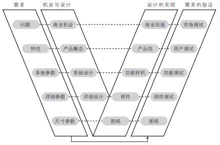

计划阶段的工作是通过系统设计把系统需求转化为设计需求，也就是对各个子系统的设计需求，形成规格参数。针对复杂系统，在计划阶段还要完成各个子系统的概要设计，甚至详细设计，最终形成产品的详细规格参数。在计划阶段，如果发生需求变更，需要执行需求变更流程，同时优化产品包需求、产品概念、系统需求、系统设计、概要设计等。在计划阶段要进行系统设计和概要设计评审(比如，华为IPD流程的TR2和TR3)，最终确定各种规则参数并基线化。基线化后的需求、设计方案和规格将作为对研发团队的绩效考核指标之一。

概念和计划阶段的工作方法论是系统工程，系统工程师是这两个阶段在技术上的主角，负责将产品包需求转化为产品包，最终满足客户需求。对于复杂产品，往往是一个系统工程师团队负责系统设计工作。系统工程的工作质量决定了产品开发过程的效率和效果，也决定了测试过程是否可以结构化地有效开展。

研发流程的开发和验证阶段是实现设计方案的过程，同时也是测试和验证的过程，通过零部件/单元测试、部件/子系统测试、系统设计验证、集成测试、客户验证、第三方认证等逐层进行测试验证，也叫“渐增测试”。逐层测试的目的是及时定位和解决局部问题，避免问题积累到系统层面。V模型的精妙之处在于，从水平线上，“V”左边的需求逐层分解过程和“V”右边的逐层测试验证过程相互对应。

为了确保产品开发团队(PDT)最终交付的产品满足客户需求，在需求验证上采取了4项措施:
需求早期确认：对于重要的产品和解决方案，要求产品开发团队(PDT)的关键成员在概念和计划阶段与客户面对面沟通，以确保正确理解客户需求。	
需求团队参与技术评审：需求分析团队(requirement analysis team，RAT)参与产品开发过程中的技术评审(TR)，跟踪需求实现过程，确保客户最初的“所需所想”最终在产品中得以实现。	
例行的需求确认：需求团队和地区部的营销部门定期(比如每月)与产品开发团队确认大量处于开发状态的需求的执行情况，而不仅仅是在TR 或产品交付时集中确认。	
需求的常规确认：产品开发团队通过实验局(Beta 测试)等活动，收集客户意见，完善产品，确保产品满足客户需求。	

#### 需求管理需要团队作战
企业所有工作都是围绕需求展开的，整个就是一部“需求加工机”，所以需求工作一定是跨部门的。为了防止需求在传递过程中失真，当面沟通和确认是必需的，而不仅仅依靠纸面文件进行交接，这种方法也简称“需求串讲”。

鉴于需求来源的广泛性、需求实现涉及各部门，企业有必要构建需求收集、管理和分析的跨部门组织(RMT/RAT)，为需求管理提供组织保障。

公司需求管理团队(corporate requirement management team，C-RMT)
负责公司层面的需求管理推动工作，管理公司级重大项目及跨产品线的需求，向 C-PMT的产品组合路标提交需求，以及进行跨产品线需求的协调、重大需求争议的仲裁。同时，公司级需求管理团队为公司级的MM流程提供相关输入材料，负责制订主动需求收集计划，通过地区部市场管理组织(MTKG)等渠道开展收集活动，并定期审视收集进展。	

产品线需求管理团队(product line requirement management team，PL-RMT)
是产品线需求管理业务的驱动者和日常管理的执行者，负责产品线需求管理流程、方法和工具的推行，产品线需求的分发和管理监控，以及需求管理人员的技能提升。PL-RMT代表本产品线负责跨产品线需求的协调。	

产品线需求分析团队(product line requirement analysis team，PL-RAT)
分别支撑对应领域的PL-RMT成员工作，可分领域或子产品线/产品族成立多个，在PL-RMT的组织下，负责本产品线需求的分析和评估，支持决策。大量的需求分析工作在PL-RAT进行：对需求进行批量专业分析，包括解释、过滤、分类、排序和证实；必要时进行市场调研，最终给出评估意见，包括收益程度、风险程度、工作量、是否采纳等；进行优先级排序，形成市场需求包或待定的需求列表，将市场需求包传递到PDT/TDT(technology development team，技术开发团队)等相关组织进行后续处理，将待定的需求列表提交 RMT(requirement management team，需求管理团队)考虑 ; 进行需求实现的任务跟踪监控 : 在PDT的TR1 对产品包需求进行内容验证，并作为技术专家参与TR2、TR3评审，以及在TR4A、TR5、TR6进行最终结果确认；负责监控客户需求早期确认工作。	

公司级和产品线级的跨部门团队成员由各相关功能部门代表构成，为确保相互“上下对齐”，相互之间有交叉，团队定期举行例会。	

质量从本质上讲是需求的实现程度，质量管理首先要确保需求本身的高质量，需求质量管理应当成为公司质量管理体系建设的核心内容之一。

## 项目管理——RDPM
项目管理的最终目的：满足商业目标。项目管理是产品和技术创新体系构建的支撑流程。

### 研发项目是分层的 
项目是为创造独特的产品、服务或其他成果(比如技术)而进行的临时性工作，包括一系列必须在特定时间完成的相互关联的活动，具有临时性和独特性的特征。
产品生命周期起始于产品规划和产品开发项目任务书(charter)，通过评审(charter DCP)后启动产品开发项目，项目终止于GA，然后进入生命周期管理阶段，其中很多工作以项目的方式开展。
从时间维度来看，有产品路标规划项目(roadmap planning，RP)、项目任务书开发流程(CDP)、产品开发项目(狭义的IPD)、补丁版本研发项目、器件替代项目、生命周期终止项目(EOX)；
从项目所属领域来看，产品开发项目由每个领域的子项目构成，其中研发领域子项目还包括很多“子子项目”  

项目组合是在资源约束条件下，为了达成战略目标而决定从事的一组项目，一般要根据项目优先级对它们进行排序，这些项目之间不一定有相互关联和依赖关系。确定项目组合是一个战略和产品规划过程，可在MM方法论指导下进行。
项目群是为了提高管理效率、促进资源共享而集中管理的一组项目。项目间一定有某种关联关系。

#### 研发项目管理框架
项目管理是将知识、技能、工具和技术应用于项目活动，以满足项目要求。项目管理需要在有限的资源约束条件下，通过项目经理及其团队成员的努力，在整个项目生命周期内，运用系统的理论方法，达成项目目标。

RDPM由8个部分构成，分别是商业目标、项目生命周期模型、项目组织模型、知识域、工具、模板、术语和项目文化
1. 与商业目标对齐  
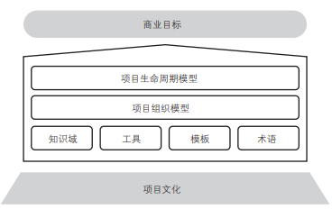  
产品管理、项目管理和职能部门管理的目标要对齐，最终实现客户满意和商业目标，它们有各自的衡量指标。
衡量指标：
   1. 产品管理的衡量指标针对产品全生命周期，包括产品的投资回报率、客户满意度、销售收入、利润率等。
   2. 各种研发项目的衡量指标针对项目生命周期，包括关键特性达成率、过程规范性、研发项目周期、各阶段进度偏差、成本达成率、毛利率、预算执行偏差率等。
   3. 职能部门负责资源能力建设和长期技术积累，对产品质量、人均效率和技术竞争力负责。
采取活动：(产品开发团队经理(LPDT)和相关联的子项目经理、技术/平台研发项目经理)
   1. 深度参与项目商业目标的制定。
   2. 与决策者或决策团队在商业目标上进行沟通。
   3. 与周边部门在商业目标上进行沟通。
   4. 与外部客户在商业目标上进行沟通。
   5. 与项目组成员在商业目标上进行沟通。

2. 项目生命周期模型
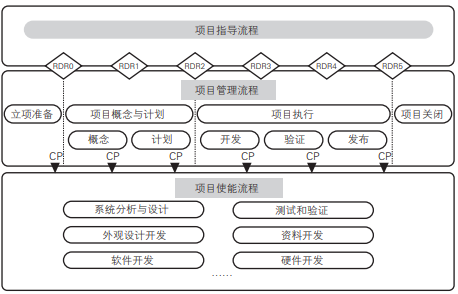  
分为项目立项准备阶段、概念、计划、开发、验证、发布、项目关闭阶段，其中项目立项准备阶段对应了产品开发项目任务书流程(CDP)，项目关闭阶段对应生命周期阶段GA前的部分。

项目生命周期模型分为**项目指导流程、项目管理流程和项目使能流程**
   1. 项目指导流程：RDR(R&D review)评审，只有通过评审才能把研发域项目结果提交给PDT，RDR 不能否决产品开发项目。
   RDR 评审结论：
   (1)Go ：通过评审。
   (2)Go with risk ：带风险通过。
   (3)Redirect ：不通过，项目组对评审问题提出解决方案后再次提交评审。
   RDR 评审内容：  
   的内容.png)
   2. 项目管理流程
   项目管理流程定义了项目从立项准备到关闭过程中各个阶段的所有项目管理活动和交付文档，指导项目经理聚焦项目目标，在限定的项目范围、时间、成本、资源内确保项目交付。
   项目管理流程按项目管理活动的逻辑，分为5个过程组：分析、计划、执行、控制、移交。
   3. 项目使能流程
   项目使能流程是项目执行团队在项目生命周期过程中所运用的各种工作模式，包括流程、方法、模板、工具等

3. 研发项目组织模型
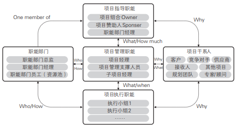  
与项目相关的所有组织、个人和其他项目构成项目干系人，包括客户、竞争对手、供应商、顾问和专家、项目接收人、产品和技术规划团队、职能部门、其他项目等。项目的临时特性决定了研发项目组也是临时的。

与研发项目相关的职能分为**项目指导职能、项目管理职能和项目执行职能**
   1. 项目指导职能：确定项目方向，对项目的重大事项进行决策，并对项目提供支持。减少项目失误，降低项目风险。
   (1)项目组合负责人：负责项目组合管理。项目组合负责人根据业务规划对项目进行优先级排序，制定多项目管理策略。
   (2)项目赞助人：以资金或其他方式为项目提供财务资源的个人、团队或组织，比如产品开发项目中的PDT经理和研发部门经理，项目赞助人对项目的最终财务结果承担责任，对于超出项目经理控制范围的事项，需要汇报给赞助人做决策。
   (3)职能部门经理：职能部门也叫资源部门。相对于项目组，职能部门一般是长期存在的组织，根据专业分工不同，负责某个领域的能力建设、为项目提供合格的资源，以及进行该领域的长期技术积累。比如项目管理部、研发部、软件部、硬件部等。
   (4)项目运作指导团队：对项目进行指导和监控的团队。
   1. 项目管理职能
   项目管理职能对项目的目标达成负责，负责选择适合的方法、技术和工具，根据项目管理流程执行项目管理活动，将议程情况报告给“项目上级”——项目指导职能。项目管理要通过权衡若干相互矛盾的领域，比如范围、质量、成本、进度等，达成项目目标，协调满足干系人不同的期望。项目管理通过项目内部的沟通，缩短组织内的沟通渠道，让决策更为高效。项目管理的权力是由项目指导职能授予的，其权力仅局限在项目周期内。项目管理职能包括组织制定项目执行策略和项目计划、分配职责和资源、控制项目活动，依赖于组织内各级管理者的支持，职能部门主管为项目提供资源，比如人力、设备、办公场地、方法和工具等。
   项目管理职能以项目经理为核心，包括下面4个角色：
   (1)项目经理：全面行使项目管理职能，管理整个项目组达成项目目标。项目目标由项目合同约定，项目合同可能是正式的合同、已经批准的项目计划。对于产品开发项目中的研发域项目，合同是指产品开发项目合同中研发部分的内容。
   (2)项目管理支撑人员：在复杂和大规模项目中，项目经理可以把部分项目管理职能授权给一个或者多个项目管理角色，比如项目助理(POP)、项目配置管理(CMO)、项目质量保证(QA)、项目财务人员等。
   (3)子项目经理：如果项目需要分为若干个子项目，项目经理可以将子项目的管理职能授权给子项目经理。比如一个包含结构、软件、硬件的项目，软件部分工作量大且复杂，可把软件部分作为一个子项目授权给软件项目经理。
   (4)项目管理团队：建立一个包括项目经理、子项目经理和项目管理支撑人员的项目管理团队负责管理和领导项目管理活动，可以加强项目内部的协作，充分利用项目管理支撑人员各种专业上的技能，将项目组内各个子项目、开发组的工作串起来，使整个项目团队以整体最优的方式开展项目活动。
   1. 项目执行职能
   项目执行职能负责根据项目管理团队制订的计划执行各种项目活动，保证高质量交付各种产出，通过逐一达成每项交付件的交付标准，最终达成子项目和项目目标，满足客户需求和内部需求。当项目执行人员遇到自身无法解决的风险和问题时，需要及时上报以获取支持。项目执行职能往往包括多个专业领域的执行小组

4. 知识域
的10个知识域.png)  
研发项目管理包括10个知识域，包括整体管理、范围管理、质量管理、时间管理、成本管理、干系人管理、沟通管理、人力资源管理、采购管理、风险管理。
(1)增加价值管理和目标成本管理，关注项目给客户/接收方带来的核心价值和研发对象的目标成本。
(2)成本管理拓展为财务管理，不仅要考虑项目费用，还要考虑收益，在此基础上进行财务和赢利分析。
(3)沟通管理和干系人管理纳入整体管理。沟通贯穿于项目始终，每个知识域都需要和相关干系人进行有效的沟通。
突出了价值管理、沟通管理、目标成本和项目的赢利分析，落地IPD的两个核心思想“研发是投资行为”和“基于需求的开发”，产品和技术研发要满足的需求很多，但**客户最关注的需求**往往并不多，这些**形成产品的卖点或者客户的买点**，也就**是产品最终给客户带来的价值，这是价值管理的核心。**项目管理过程中不仅要考虑完成项目需要的支出，也就是项目费用，还要考虑开发对象的目标成本和项目带来的收益，在这些基础上进行全面的财务和赢利分析。

5. 术语和项目文化
华为价值观：
  1. 成就客户：为客户服务是华为存在的唯一理由，客户需求是华为发展的原动力。我们坚持以客户为中心，快速响应客户需求，持续为客户创造长期价值进而成就客户。为客户提供有效服务，是我们工作的方向和价值评价的标尺，成就客户就是成就我们自己。
  2. 艰苦奋斗：我们没有任何稀缺的资源可以依赖，唯有艰苦奋斗才能赢得客户的尊重与信赖。奋斗体现在为客户创造价值的任何微小活动中，以及在劳动的准备过程中为充实提高自己而做的努力。我们坚持以奋斗者为本，使奋斗者得到合理的回报。
  3. 自我批判：自我批判的目的是不断进步，不断改进，而不是自我否定。只有坚持自我批判，才能倾听、扬弃和持续超越，才能更容易尊重他人和与他人合作，实现客户、公司、团队和个人的共同发展。
  4. 开放进取：为了更好地满足客户需求，我们积极进取、勇于开拓，坚持开放与创新。任何先进的技术、产品、解决方案和业务管理，只有转化为商业成功才能产生价值。我们坚持客户需求导向，并围绕客户需求持续创新。
  5. 至诚守信：我们只有内心坦荡诚恳，才能言出必行，信守承诺。诚信是我们最重要的无形资产，华为坚持以诚信赢得客户。
  6. 团队合作：胜则举杯相庆，败则拼死相救。团队合作不仅是跨文化的群体协作精神，也是打破部门墙、提升流程效率的有力保障。

## 组织结构管理——矩阵
角色：组织结构和流程之间的纽带

组织设计和业务流程变革相互促进

跨部门流程需要跨部门团队支撑

如何运作好强矩阵结构

打造跨部门规划团队PMT

## 绩效管理
如果不能衡量，就无法管理
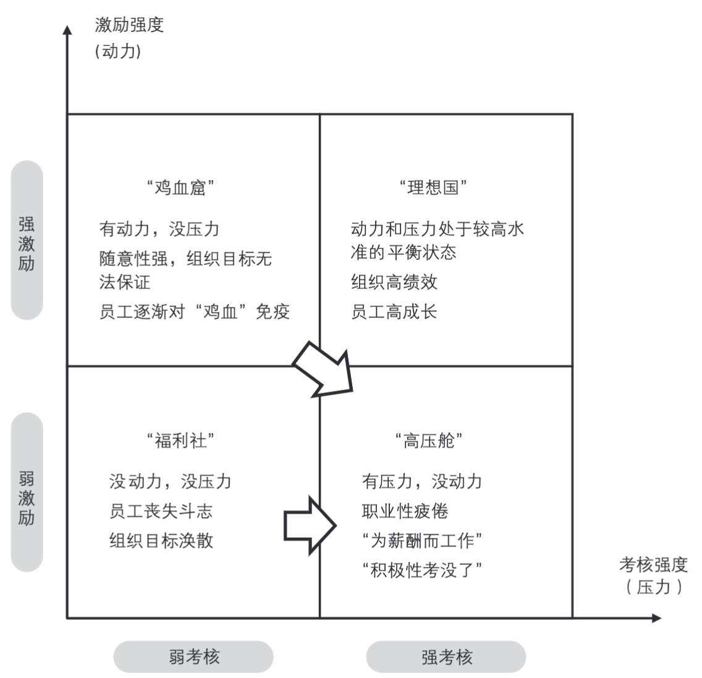
研发人员的主导需求是什么？个人成长、物质报酬、尊重与自我实现
完整的绩效管理过程包括绩效目标和计划、绩效执行和辅导、绩效沟通和评价以及考核结果应用4个阶段

绩效(performan)即使结果，也是过程
绩效管理的目的:员工愿意付出超越职责的努力，即回答员工为什么要拼命工作
（1）绩效管理是将公司的使命、愿景、目标、战略、业务、资源有机地结合起来所构成的一个完整的管理体系。
（2）绩效管理是管理者和员工双方就目标及如何达到目标形成共识，并促成员工成功达成目标的管理方法。

从宏观层面讲，绩效管理要构建目标和衡量指标管理体系，形成运营“仪表板”，随时反映企业和各个领域的运营状况，其中包括KPI（关键绩效指标）衡量指标。这些工作应与员工的绩效考核和管理独立进行。
从微观层面讲，绩效管理就是上下级之间的互动管理，通过绩效目标与计划、绩效辅导与执行、绩效考核与沟通、绩效结果应用等4个环节形成闭环，充分调动员工积极性，达成公司和个人目标。
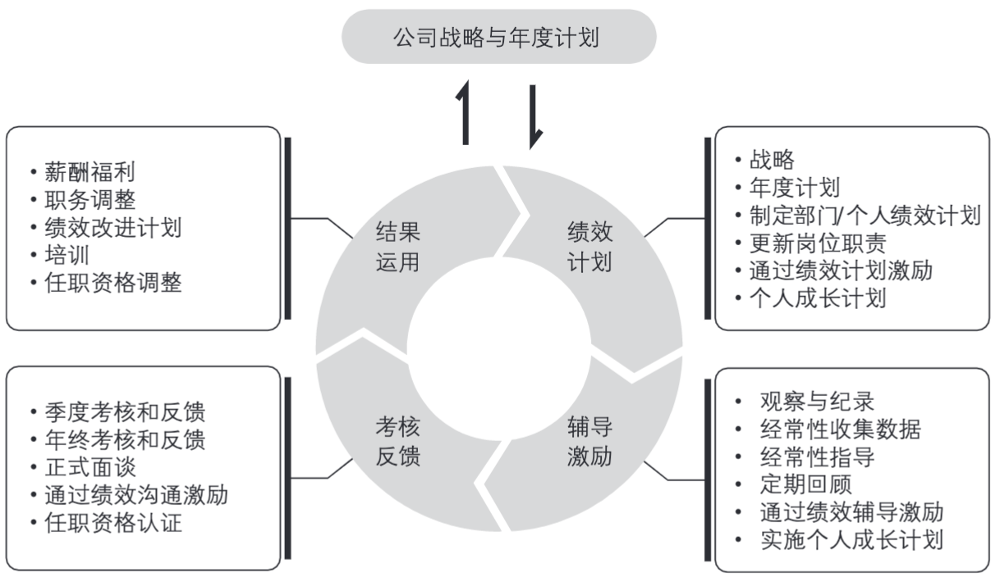

## IPD变革管理

## IPD管理体系总结
SMART，是指绩效管理必须是具体的(specific)、可衡量的(measurable)、可实现的(attainable)、可证明和观察的(realistic)、有期限的(time-bound)。
GROW 模型(goal，目标；reality，事实；option，方案的选择；wrap-up，总结与具体行动)：用于辅导员工，帮助员工成长，是围绕设定目标和寻找解决方案的有效工具。IBM经理辅导下属所使用的也是 GROW 模型。

IPD思想与管理体系相互渗透
|IPD思想\IPD组件 | MM | IPD | RM | RDPM | 矩阵组织 | 绩效管理 | IPD变革管理
| --- | --- | --- | --- | --- | --- | --- | --- 
| 研发是投资行为 | 为哪些客户投资？投资什么产品？在哪些资源上投资？这些都需要进行选择和规划工作，MM提供统一的方法论 | 通过业务计划的制订和闭环管理，对研发项目进行经济可行性和应力分析。高层团队在DCP点进行投资评审 | 对需求进行排序，重点投资能带来高回报的高价值需求。在正确的时间，把需求分配到正确的产品上 | 通过目标成本管理、研发费用管理和财务管理对项目进行成本、投资收益分析，为管理层提供决策依据 | 纵向(资源)组织能力和横向(业务和产品)组织能力都需要投资，主要是对人力资源和技术资源的投资 | 产品和技术的市场表现和商业结果是最重要的结果性指标。上级对下级的绩效管理和激励也是一种投资，是对人力资源的投资 | 对研发和创新管理体系的持续改进和优化是一种长期投资。管理创新是有组织的产品和技术创新的基础
| 基于需求的研发 | 产品规划本质上是对再合适、在何种产品上实现何种需求的规划。需求调研、收集和分析是MM的重要工作内容 | 概念阶段要最终完成需求收集、分析和确认工作，形成产品需求包(RM)，从技术层面讲，研发过程就是需求的实现和验证过程 | 通过需求的收集、分析、分配、实现和验证的端到端管理，最终让整个组织以客户需求为导向 | 项目经理和项目组要以核心需求(买点/卖点)和价值管理为管理重心，在此基础上进行完整的项目范围管理(项目需求管理) | 组员部门服务于产品线等业务部门，产品线要围绕客户需求进行产品管理。资源部门主管要满足产品线主管提出的需求。这些思想要体现在部门和岗位职责设计中 | 考核关系和绩效目标/指标的设计要体现客户需求导向。客户满意度是全员结果性指标。主管要关注和满足员工需求，才能有效激励员工 | 组织管理体系需要持续不断的变革和优化来满足变化莫测的市场环境和客户需求。组织的内部问题也是体系规划和实施的需求来源
| 平台化开发 | 平台主要是规划而非总结出来的。规划过程中就要考虑不同市场/客户和不同产品的共性需求，以此构建产品和技术平台，降低成本、缩短开发周期和提高产品质量 | 产品和技术研发过程中要以开放心态最大限度利用公司内、外部已有的成果，“不重新发明轮子”。同时在研发过程中尽可能形成CBB(基础组件) | 需求管理过程中要提取客户的共性需求，这些共性需求是形成产品和技术平台的基础。有共性需求的客户群越大，基于这些共性需求的平台的价值就越大 | 基于平台的开发是实现质量、进度和成本三大项目约束的重要手段。任何研发项目都要重视重用和形成CBB | 纵向资源部门要针对不同产品和产品线的共性需求形成平台和“货架技术”支撑跨部门研发团队，同时从研发团队吸取成果继续补充完善平台。平台工作成果是纵向和横向共同的KPI | 要从绩效考核角度杜绝“重新发明轮子”。鼓励研发人员重新利用外部和内部已有成果，不盲目创新，重用比率是重要考核指标。 | 管理体系要从整体上支持基于平台的开发，否则需要持续优化。逐步构建技术平台规划，开发和管理流程体系，支撑企业的平台工作。IPD体系本身就是企业创新的管理平台
| 结构化流程 | 基于MM方法论的公司和业务单元层级市场、产品和部门规划流程都需要多个角色参与，分阶段进行。结构化程度和规划对象的复杂度和不确定性程度相关。规划往往在迭代和循环往复中完成 | 通常的研发过程都需要多个角色参与，并严格按阶段进行，过程中进行DCP和TR。软件和需求不确定性较强的项目需要结合敏捷和迭代思想 | 需求管理过程按收集、分析、分配、实现和验证5个阶段进行，每个阶段重点参与角色不同，需要进行结构化设计和策划，尤其“需求信息神经末梢”的设计 | 完成一个研发项目需要若干活动，这些活动是有规律可循的，可纳入IPD方法论和流程 | 为完成业务目标，跨部门流程中的角色构成横向组织：高层决策团队、核心组/外围执行组、专家评审组等虚拟和临时组织，纵向专业部门为这些临时组织提供各种合格资源 | 需要为流程的执行过程和结果设置完善的绩效衡量指标。这些指标构成执行该流程的团队业绩衡量指标，同时也是纵向职能部门的最重要衡量指标。以此实现“上下对齐，左右对齐” | IPD体系的构建和持续优化也需要结构化流程支撑，基于MM的体系规划流程形成变革路标规划，基于IPD的变革实施流程驱动变革并固化变革成果 
| 跨部门协作 | 战略与规划的同时就要考虑可实现性，将涉及的部门组成跨部门团队(PMT等)，以项目方式开展规划活动，充分互动。各业务层级之间、各部门之间的规划和预算要相互匹配，做到“上下对齐，左右对齐”。 | 研发绝不仅是技术部门的事，各领域都需要创新和研发。产品和技术研发需要跨部门团队运作(PDT/TDT)，资源部门为跨部门团队提供支撑 | 内外部需求的收集和分析需要跨部门协同(RMT/RAT)。 外部需求最终分解为各部门的内部需求，需求的分解、实现和验证过程是各部门充分沟通、协调、意见折中的过程 | 项目组织模型的三层职能都是跨部门的。研发团队由来自不同部门甚至组织外的成员构成，团队内部的沟通管理、人力资源管理和文化管理是研发项目管理的重要内容。各部门要全力支持项目组运作 | 跨部门协作是创新的灵魂。矩阵组织通过专业分工和跨部门团队方式构建部门和业务间的协同作战机制，在确保业务团队对市场快速灵活响应的同时，发挥资源共享的规模优势 | 绩效管理和激励机制要通过奖惩机制为跨部门协作保驾护航，激励员工进行跨部门协作。跨部门团队负责人对团队成员拥有相当的管理权和考核权，部门经理的业绩与跨部门团队绩效挂钩 | IPD体系的引入和优化不仅需要最高层和各部门支持，还需要跨部门协作。无论是否引入外部顾问，管理变革都必须构建跨部门团队，把变革过程按项目进行管理。只有在跨部门间达成共识的体系，才能有效实施
| 业务和能力均衡 | 无论何种层级的规划，都必须考虑外部业务(市场、产品)和内部资源是否匹配，不同发展阶段侧重点有所不同。业务规划中要考虑资源的重用。MM为各类规划提供了统一方法论 | 创新和研发过程是通过各类资源重新组合满足客户需求的过程，同时通过构建 CBB 等进一步加强各种能力。产品都有生命周期，而在此过程中积累的创新能力能让企业不断延长其“寿命” | 能力建设要有节奏地围绕长、中、短期需求进行。需求库中的长、中、短期需求比例要适当。正确区分市场公共需求和个别客户需求，同一和不同细分市场的公共需求为产品和技术平台的构建提供了输入 | 研发项目带来的价值要兼顾外部价值(业务)和内部价值(能力建设)，同时满足外部质量和内部质量要求，在项目进行过程中构建能力 | 企业可根据战略需要配置内部资源，调节向横向业务或纵向能力建设的倾斜程度。对业务的投资形成中短期收益，对资源的投资形成中长期收益。同时，纵向资源部门通过对横向业务的支撑提高能力 | 绩效管理制度要有效牵引纵向和横向各司其职：横向团队满足业务需求，纵向资源部门通过能力建设支撑业务。目标和指标设置要结合战略要求有所侧重，并考虑外部环境 | IPD要强化对外的业务管理体系建设，比如客户需求管理和产品创新体系，同时也要兼顾内部能力体系建设，比如技术创新体系和各个部门的能力建设 
| 灵活发展，与时俱进 | 有步骤地把MM作为规划方法论推广到公司战略规划、业务单元的市场和产品规划、职能部门规划等，使整个组织围绕企业愿景、客户需求进行运作。MM要不断吸取新的方法论，比如蓝海战略、长尾理论等 | 所有创新工作都可吸取IPD过程精华：围绕需求先进行概念和总体设计，然后细化并构筑为产品/技术/方案等 , 再经过验证后进行推广，过程中设置若干评审点。IPD过程要融入敏捷、质量管理、迭代开发、开放式创新等元素，不断发展 | 围绕需求生命周期展开的需求管理流程同时支撑MM、IPD和RDPM，使它们保持一致和连贯。外部需求终将转化为对各部门/团队的(内部)需求，对这些(内部)需求的管理也遵循RM。以客户需求为中心的组织构建要以RM作为载体 | 基于IPD方法的RDPM架构增加了价值管理和目标成本管理知识域，强化了商业目标、沟通管理、团队文化的作用，是对通用PMBOK的“客户化”发展。在实践中要不断扩大 RDPM在研发领域的应用范围，并对其做进一步发展 | 精心设计的矩阵组织是最具灵活性的组织，其魅力就在于可以根据战略和业务需要对其进行调整，权力向向绝对倾斜就是事业部制，相反，向纵向倾斜就是传统的职能组织，现实组织无不是居于其间的“矩阵” | 如何让身处IPD流程和矩阵组织的员工充满激情是管理的终极难题。可灵活使用战略解码、SMART、平衡计分卡等工具，绩效和激励体系要不断吸收各种管理和领导艺术，比如教练技术、GROW 等，关注员工个人需求，让员工在实现组织目标的同时实现个人目标 | IPD体系是灵活发展的，推动变革的方法也是灵活发展的，两者相互促进。让各层级管理者和员工掌握变革管理方法，将大大降低变革成本

## 可持续性发展
从时间角度，客户可分为以下三个，因此也对应三个企业流程：
现有的客户：已经购买产品的客户 -> 当产品出现问题和故障时，如何得到服务 -> ITR(问题到解决)
明天的客户：已经有现实需求的客户 -> 需求能否得到迅速满足 ->LTC(机会点到回款)
后天的客户：未来客户的需求 -> 提前准备对应的产品和技术 -> IPD(集成产品开发)
MTL(市场到线索)：如何通过市场营销工作(marketing)取得机会点(lead)的流程。

“端到端”，一端是客户需求，另一端是满足客户需求，端到端(E2E)概念指的就是从需求的提出到需求的满足。
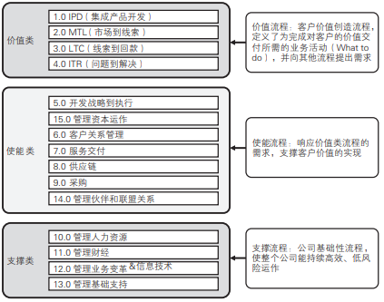

IPD体系构建在两个最基本的核心思想之上：(1)市场需求是产品开发的驱动力。(2)产品开发要作为投资来管理。

IPD能为我们带来什么：(不仅仅适用于企业管理，这是一套通用的理论)
(1)做正确的事：市场管理、业务策略。
(2)正确地做事：需求管理、结构化流程、跨部门团队、技术开发、项目管理、系统工程、管道管理。
(3)支撑基础：IT使能器/工具、技能、衡量标准。

IPD体系的精髓是：
1. 研发是投资行为：IPD是商业(business)流程，关注商业结果，将产品开发作为一项投资进行审慎管理。	
2. 跨部门团队：IPD管理体系广泛采用跨部门团队，汇集各功能代表及其所属领域的专业智慧和资源形成合力，共同承担项目成功的责任。	
3. 结构化流程：IPD流程分为不同阶段，通过DCP决策实现 IPMT(投资方)和PDT(承诺方)的互动，资源分批受控投入，既满足项目进展需要，又避免投资失控风险。	
4. 灵活发展，与时俱进：IPD是灵活的、发展的，在不断吸取业界最佳实践和解决业务问题的过程中，与时俱进。	

### 市场管理流程
市场管理(MM)流程是确保“做正确的事”的核心方法论和流程，是IPD产品开发流程的上游流程。
MM流程的输入是：市场信息、客户反馈、竞争对手信息、技术趋势、现有产品组合等，通过理解市场、市场细分、组合分析、制定/融合业务战略和计划，形成组合策略和路标规划。在管理业务计划和评估绩效阶段，通过项目任务书(charter)启动IPD流程。
MM为公司战略规划(SP)、业务计划(BP)、产品路标规划、技术和平台规划、项目任务书开发、职能部门规划等提供了一致的方法论。
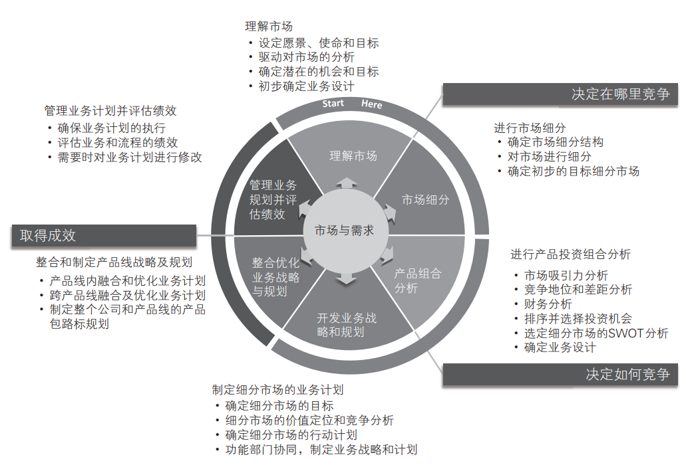

### 需求管理流程
需求管理流程(RM)作为支撑流程为MM和IPD提供输入，让市场管理流程、产品路标规划和产品开发“瞄准靶心”，实现以客户为中心
需求管理流程分为收集、分析、分配、实现和验证5个阶段，其中需求收集、分析、分配主要在产品规划、项目任务书(charter)
开发(很多企业也叫产品定义)、IPD流程的概念阶段进行，实现和验证阶段流程主要在IPD产品开发流程中实现，所以，需求管理流程和MM流程、IPD产品开发流程是并行的。
实际上，无论是否有公司层面的独立需求管理流程，MM和IPD流程都需要进行需求的收集、分析等工作，从这个意义上说需求管理流程是MM和IPD的支撑流程。
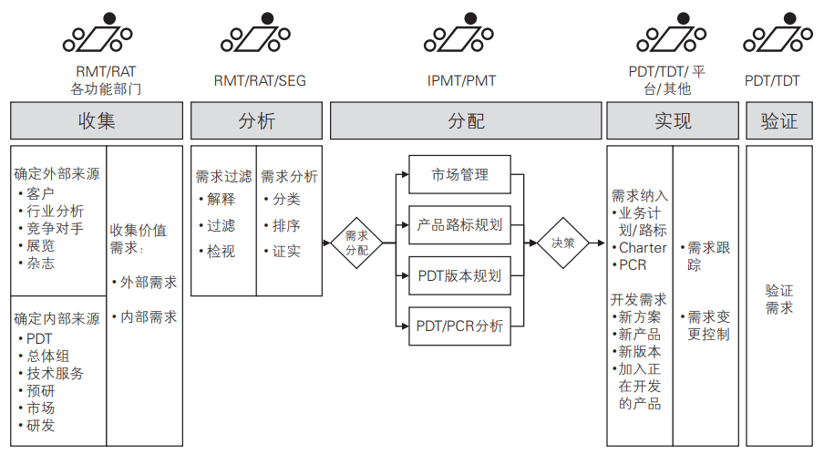

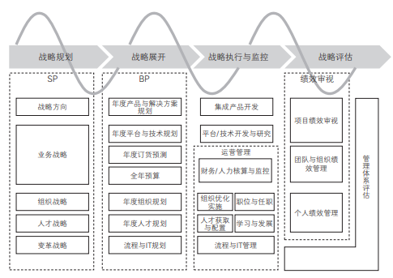

### IPD产品开发流程
IPD流程的起点是项目任务书(charter)，终点是产品上市结束(GA)。相对MM流程，IPD流程结构化程度更高。华为的IPD流程分为概念、计划、开发、验证、发布和生命周期管理6个阶段，IPD流程强调按投资决策标准对产品开发进行分阶段评审。
为了规避风险共设置5个决策评审点(DCP)：
(1)项目任务书(charter)DCP，简称 charter DCP。
(2)概念(concept)DCP，简称 CDCP。
(3)计划(plan)DCP，简称PDCP。
(4)可获得性(available)DCP，简称ADCP。
(5)生命周期终止(life end)DCP，简称LDCP
为了确保产品交付质量符合客户需求设置了7个TR
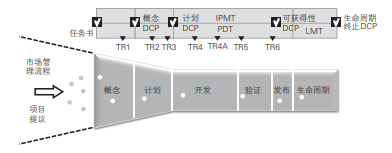
IPMT和PDT两个团队是产品开发流程的“主角”，IPMT负责对产品投资进行决策，PDT负责具体的产品开发。

的融合.png)

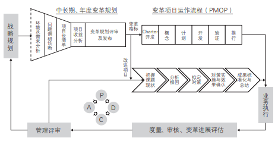

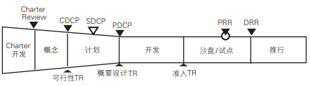
SDCP: selection DCP，决策评审点，当涉及IT系统时进行该项决策
PRR:pilot readiness review，试点准备度评审点，类似IPD流程Beta测试前的评审
DRR:deployment readiness review，推行准备都评审点，类似IPD流程的ADCP，变革项目通过DRR后，才能进行大范围推行。

## 术语表
缩写 | 全称 | 翻译
--- | --- | ---
BB | building block | 组件。
BG | business group | 业务群。
BLM | business leadership model | 业务领先模型。
BMT | business management team | 业务管理团队。
BP | business planning | 业务计划。(C-BP或PL-BP)公司或产品线业务计划书
CB | capability baseline | 能力基线。
CBB | common building block | 通用构建模块。
CDP | charter development process | 项目任务书开发流程。
charter | | 项目任务书。
checklist | | 评审要素表。
CDT | charter development team | 项目任务书开发团队。
CRM | customer relationship management | 客户关系管理。
CP | check point | 检查点。
C-PMT | corporate portfolio management team | 公司组合管理团队。
C-RMT | corporate requirement management team  | 公司需求管理团队。
C-TMT | corporate technology management team | 公司技术管理团队。
DCP | decision check point | 决策评审点。
DRR | deployment readiness review | 推行准备度评审点。
E2E | end to end | 端到端。
EOL | end of life | 生命周期结束。
ESP | early support plan | 早期客户支持计划。
GA | general available | 通用可获得性。产品上市
IFS | integrated financial system | 集成财务转型。
IPD | integrated product development | 集成产品开发。
IPMT | integrated portfolio management team | 高层决策团队。
IRB | investment review board | 投资评审委员会。
ISC | integrated supply chain | 集成供应链。
ISOP | integrated strategy & operation process | 集成战略与运营流。
ITMT | integrated technology management team | 集成技术管理团队。
ITR | issue to resolution | 从问题到解决。
ITS&P | | IT战略与规划
JIT | just in time | 准时制。
LMT | life-cycle management team | 生命周期管理团队。
LPDT | leader of PDT | 产品开发团队经理。
LPMT | leader of PMT | PMT 经理
LTC | lead to cash | 从销售线索到回款。
MM | market management | 市场管理。
MOT | moment of truth | 关键时刻。
MP | marketing planning | 市场规划。
ODM | original design manufacture | 原始设计制造商。
OEM | original equipment manufacture | 原始设备生产商。
O/S | offerings/solutions | 交付物/解决方案。
OR | offerings requirement | 产品包需求。
PACE | product and cycle-time excellent | 产品及周期优化法。
PBC | personal business commitment | 个人绩效承诺。
PDM | product data management | 产品数据管理。
PDT | product development team | 产品开发团队。
PLM | product life-cycle management | 产品生命周期管理。
PL-IPMT | product line integrated portfolio management team | 产品线集成组合管理团队。
PL-LMT | product line life-cycle management team | 产品线生命周期管理团队。
PL-PMT | product line portfolio management team | 产品线组合管理团队。
PL-RAT | product line requirement analysis team | 产品线需求分析团队。
PL-RMT | product line requirement management team | 产品线需求管理团队。
PL-TMT | product line technology management team | 产品线技术管理团队。
PMBOK | project management body of knowledge | 项目管理知识体系。
PMI | Project Management Institute | 美国项目管理协会。
PMOP | program management operation process | 变革项目管理运作流程。
PMT | portfolio management team | 组合管理团队。
PR | product roadmap | 产品路标。
PROPS | the project for project steering | 指导项目运作的项目。
PRR | pilot readiness review | 试点准备度评审点。
PRT | product research team | 产品预研团队。
PSST | products and solutions staff team | 产品和解决方案体系。
PTIM | product & technology innovation management | 产品技术创新管理。
QMS | quality management system | 质量管理体系。
RAT | requirement analysis team | 需求分析团队。
RDPM | R&D project management | 研发项目管理。
RM | requirement management | 需求管理。
RMT | requirement management team  | 需求管理团队。
RP | roadmap planning  | 产品路标规划。
O/SBP | | 产品包业务计划
SDCP | selection DCP | 决策选择评审点。
SDT | solution devolopment team | 解决方案开发团队。
SE | system engineer | 系统工程师。
SP | strategy planning | 战略规划。
SPDT | super product development team | 超级产品开发团队。
S-PMT | solution portfolio management team | 解决方案组合管理团队。
system requirement | | 系统需求。
TDCP | temporary decision check point | 临时决策评审。
TDT | technology development team | 技术开发团队。
TMG | technology management group | 技术管理组。
TMS | technology management system | 技术管理体系。
TMT | technology management team | 技术管理团队。
TPD | technology & platform development | 技术开发。
TPM | transformation progress metrics | 变革进展评估。
TPP | technology & platform planning | 技术和平台规划。
TR | technology review | 技术评审。
TRT | technology research team | 技术研究团队。
WWPMM | world wide project management methods | 全球项目管理方法。
X-TMG | | 跨产品线TMG。

## QA
如何构建企业产品和技术创新管理体系？
核心思想和基本原则是什么？
方法论是什么？
管理体系架构是什么？
如何开展相关的管理变革？

研发项目管理案例
本案例中的研发项目，是产品开发项目中研发域负责的研发子项目。研发域项目经理在向产品开发项目经理汇报的同时，还向研发部门相关责任人汇报。
● 背景 ●
作为职业化的项目经理，杰克有过硬的技术背景和十年项目管理经验，被总公司委派到子公司，掌管一项投资额超过 8000 万元的重大项目A，公司希望通过此项目培养一批项目管理人才。
刘强是子公司自己培养的项目经理，从硬件经理转岗项目经理2年，表现不错，刚被晋升为中级项目经理。刘强对公司的组织结构和A项目非常了解，本次作为杰克的助理共同承接A项目。
● 项目立项阶段 ●
干系人沟通
在项目立项准备阶段，刘强按照惯例，等产品规划部门给他下发项目任务书。而杰克刚一进入项目，就主动安排一系列的会议和沟通，刘强看着这个外来和尚的日程，每天都被会晤占满，不是被叫去开会，就是叫别人开会。没过多久，杰克和产品规划部门的人混得很熟，对产品的市场情况和商业目标非常了解。同时，对研发资源情况，尤其是研发人力资源状况及其他相关项目的情况也了如指掌。在项目任务书评审会上，杰克的发言，无论从质量上还是数量上都已盖过刘强，让刘强内心有些不爽。
识别关键路径
按着初步计划，只能保证产品在第二年2月上市，营销一线对此提出强烈抗议，认为错过了 12 月的销售机会窗。杰克立即与市场代表沟通，看看是否能把一些不太紧急的需求放到后面的产品版本中实现，同时让刘强再看看项目的时间瓶颈在哪里。刘强分析下来，了解到Y平台是A项目的关键技术和关键路径，如果Y平台可以提前，整体计划就有可能满足 12 月上市的要求。事不宜迟，刘强找来Y平台的项目经理小张进行沟通，与小张强调了A项目及时上市的重要性，软磨硬泡让小张将Y平台提前。小张晃着脑袋苦笑说，最多可以提前1个月，提前2个月无论如何都做不到。这个消息传到项目任务书开发团队(CDT)后，大家都很泄气。
深度介入周边项目
杰克重新找到小张，把Y项目的项目计划、项目风险清单从头到尾和他沟通了一整天，最后小张面带悦色地从杰克办公室出来，明确表示Y平台项目进度可以压缩2个月，支持A项目的市场进度。刘强狠踹了小张一脚，抱怨说前几天怎么死活不答应，是不是得到杰克什么好处。小张只是笑笑，闭口不谈。杰克看着刘强疑惑的眼神，离开办公室前给刘强留下一句话：“立项准备阶段，一定要关注项目技术准备度。对于关键平台和技术项目，要与相关项目经理仔细沟通，再细也不为过。”
小张后来和刘强说，杰克把Y项目计划的关键路径从活动时间和顺序、资源安排、技术风险都问了一遍，最后提出一个大量活动并行的方案，将关键路径缩短了1个月。小张再根据关键路径，重新调整了资源安排，又压缩了1个月，就这样轻松地达成了将工期压缩2个月的目标。
刘强这下明白了，作为项目经理，不仅要关注本项目的计划，还要密切关注周边项目，必要时深度介入这些项目的计划。
● 项目概念阶段 ●
专家坐镇，防患于未然
在杰克的影响下，刘强也开始重视以前忽略的细节工作。根据双方的特长，杰克在需求、关键技术、平台配合等方面投入较多，刘强则重点关注项目资源的可获得性和在各职能部门间的协调，两人逐步建立起了默契。杰克非常认可刘强在对项目资源进行安排时，能考虑员工任职资格等级的做法，尤其对刘强能邀请到一位架构设计专家参与项目的概念阶段大加赞赏。这位专家对项目概念阶段的工作发挥了重要作用，能请到这位专家，与刘强之前和系统架构部建立的良好人际关系密不可分。
有了架构专家坐镇，具体设计工作的重担便放在了系统设计师身上。在概念阶段，杰克把握项目整体管理，刘强则把精力放在项目概要计划和项目团队资源的获取方面。刘强费了九牛二虎之力，从各个职能部门经理那里协调到所需项目成员，由于项目预算的限制，并不是每个成员的专业程度都符合项目要求。概念阶段开工会后，杰克拍拍刘强的肩膀，交给他一份方案评审会的名单，上面有技术服务专家、制造专家、采购专家、测试专家、维护专家，让刘强按名单组织会议。评审会上，杰克引导大家，对架构专家提出的方案从技术可行性、可服务要求、可制造要求、以往测试易重犯的问题、器件采购资源等因素多方面考虑，提出风险与预防建议。会上，各个领域专家获得空前的尊重，大家讨论非常激烈，针对产品需求包，对不同的方案进行了分析比较。项目团队成员在这个会上受益良多，刘强也感觉到以前项目中常出现的问题在这个会上基本都提到了，一下子明白杰克如此安排会议的意义。在概念阶段发挥专家的集体智慧，防患于未然，是弥补团队能力不足的最有效方法。
计划不是用于汇报的，而是用来指导工作
概念阶段评审前，刘强把精心制订的项目整体计划和概念阶段详细计划交给杰克，第二天却收到一封来自杰克的批评邮件，说计划中没有全部体现专家们提出的建议。刘强很委屈，打电话给杰克，强调这份计划是他自己凭着多年的项目管理经验做出来的，绝对能够通过评审。杰克严肃地说：“计划不是用来给领导汇报的，而是为了指导项目的具体工作。前期专家的建议如果没有转化为计划，所有的准备都是浪费。你的计划虽然能忽悠别人，但不可能通过我的评审，赶紧修改，修改后我请你吃饭。”
刘强针对前期研讨会的会议纪要，一面回顾，一面修订计划。2 天后，杰克拿着刘强修订的计划，露出了笑容。按照新的计划，各项工作有序地开展，概念阶段以针对实现设计方案相匹配的各类问题讨论为主，整个过程中，跨部门会议、沟通成了主题曲。刘强充分认识到，概念阶段对方案讨论的充分性和完整性是管理控制的关键。
● 项目计划阶段 ●
计划要抓住重点，分层分级
项目通过概念阶段评审后进入计划阶段，这个阶段会议非常多，会议主题从方案的讨论转变为系统设计、概要设计及各种计划的讨论，经历了概念阶段计划不到位的教训，刘强对计划的工作投入了十二分的精力。
杰克在刘强计划的基础上，更关注项目涉及的端到端(end to end，E2E)环节配合问题。看着杰克对计划的专注，刘强对自己之前做项目经理时对待计划的态度非常感慨，也领会到计划管理是项目经理的首要职责。
经过充分的讨论和策划，项目的整体计划大功告成，准备提交评审团队进行计划阶段评审。就在这时，市场部客户经理提交了一个客户要求，针对这个要求，有必要在方案中调整部分规格。客户是上帝，何况还是非常重要的价值客户！事不宜迟，杰克安排相关专家针对变更进行研讨。会后，杰克让刘强根据新的情况尽快调整计划，不要影响原定于2天后的计划评审。刘强看着 400 多条任务的任务书，一下傻眼了。
杰克拿过刘强的计划，笑着说：“费了不少工夫啊！但研发项目有个最大的特点——计划没有变化快，你之前也领教过吧。把计划调整到 150 个任务以内，确保前期讨论的方案和建议能在计划中体现就可以了。你这 400 条任务，不要说改，就是按着执行和跟踪，别说我俩，再多几个项目经理也搞不定！”刘强点点头准备离开办公室，杰克回头强调了一句：“涉及相关部门的计划，一定要和他们沟通清楚！”刘强立即调整计划，把整体计划和阶段计划分开，开发阶段的计划相对详细，其他相对概括。三天过去了，刘强终于确保在计划阶段评审前将计划调整和沟通完毕。评审顺利通过，刘强松了口气。
在此之前，刘强还认为自己是做项目管理，尤其是做项目计划的高手，但和杰克比起来，还是有很大差距，他做了反思和总结：
(1)计划要经过充分讨论和沟通。做计划时，要充分考虑每项工作涉及的项目组成员和部门，一定要让这些人一起参与，才能减少变化和反复。
(2)计划要分层分级。虽说每个阶段都要做计划，但计划的颗粒度(详细程度)和侧重点在各个阶段是不同的。
(3)计划要基线化。刘强发现，杰克每次做完计划，一定要发给相关人员，要求严格遵照执行。在项目会议上，计划涉及的人员必须按照计划详细汇报进展状态，计划会根据讨论情况修订后再发布。在项目进展过程中，实施跟踪的总是同一份计划。
(4)拥抱变化。计划和变化是双重奏，变化源于外部环境的不可控、企业自身技术能力、资源管控能力等各种因素。每次遇到市场需求变动，杰克都不会抱怨，而是重新理解客户真正的要求，再和系统设计师、相关采购、技术服务人员、制造人员等利益相干人沟通变更的事项，将变更融入到新的计划中。对他而言，变化似乎是一种乐趣。
(5)计划要方便管理。做计划的目的是为了指导具体工作，要便于使用。杰克的计划，无论用于查询还是用于资源分配，都一目了然，计划中还会对风险较大的任务用特殊的颜色标出来，便于后期重点关注。最主要的，杰克的计划粗细有致，任务间关系明确，调整起来非常方便。
● 项目开发阶段 ●
做好风险和问题管理
进入开发阶段后，项目团队成员逐步增加，在阶段开工会上，刘强给大家介绍了项目的核心价值、明确了项目目标，团队成员积极讨论了项目过程中可能遇到的困难及解决方案。团队成员士气高昂，刘强感到不再只是主管和骨干，而是一个团队在共同努力。
在刘强的经验中，这个阶段是可以歇歇的，因为具体事情由开发和测试人员去做，自己的任务就是管控进度。
而杰克却丝毫没有放松，在项目例会上，采用项目管理软件跟踪项目进度，时刻关注风险和问题。一开始大家觉得东西都还没做出来，有什么风险？杰克于是召开了一个会议，会上他分享了自己以前收集的成功、失败的案例，通过讨论，他让大家感受到如果风险不在前期提出来，到了最后就是问题，而风险可以主动管理，问题就只有被动接受；风险管理有助于项目成功，问题总是把项目往失败上引。通过真实的案例，大家意识到，风险不仅存在于开发环节，在制造导入、采购、结构等环节中也存在风险，而这些风险也必须被纳入管理范围。从这些角度出发，风险跟踪表很快就被填满了。为提升大家对风险和问题管理的意识，杰克强调，今后每次例会，每人至少提出3条风险和问题。
在每周一的例会上，主要就围绕进度和风险两个议题进行分析和讨论。例会后相关人收到的就是更新后的项目计划和风险、问题跟踪表，其中有明确的工作安排和责任人，大家也逐步习惯了没有会议纪要的模式。一开始，大家还不习惯经常看计划和跟踪表，后来发生了一件事，大家才认识到计划和跟踪表的重要性。
做好自我管理
有块印制电路板(PCB)下周就要返回，杰克要求大家核查单板PCB 返回后立即贴片有什么风险。硬件经理突然提出，供应商无法提供样片，采购翻查了关键器件采购清单，发现是之前疏漏了。通过与供应商交涉，厂家最快3周以后才能提供5块芯片，这意味着项目整体进度将延迟3周。杰克让刘强、硬件经理、采购经理留下，其他人先散会。散会前，他再次强调：“项目团队的每一个成员，都应对照计划，检查自己工作的准备和完成情况，要做好自我管理，这是对一个职业人士的基本要求。这个问题由会后留下来的人处理，其他成员回去后再次确认计划和风险。”在散会后的小会上，杰克严厉批评了硬件经理和采购经理，要求他们针对公司核心价值观进行深刻的自我反省，并拿出解决方案。
这个项目因为无谓的等待要拖延3周，12 月上市的目标难以达成，大家都有些失落，回去后对照计划分别检查各自负责的部分。从此，团队成员对计划和风险、问题等异常警觉，逐渐形成了每天对照计划和跟踪表的习惯。
不拘一格，特事特办
为了挽回3周的延误，杰克亲自跑了趟香港，想办法将5片芯片带了回来，节省了物流时间，算是省回一周。在大家的共同努力下，整个项目还是有1周的延误。
在进度压力下，刘强也跟着大家每周都为风险规避、问题解决、计划变更而协调奔波。在开发阶段的后半段，杰克又协调了售后维护团队的 2个成员参与到产品开发过程中，以便维护人员早期熟悉产品，顺利进行后期的移交。
● 项目验证阶段 ●
早期充分策划，后期“坐享其成”
在刘强的经验中，验证阶段将会出现大量问题。这时大部分人力资源已被释放，协调人力解决问题会将占用大量时间和精力。
A 项目以延迟1周的偏差通过开发阶段评审，项目计划同步刷新，大部分人员被释放出来，只留下几位开发工程师和测试认证人员一起工作。另外，杰克还特地把售后维护团队的两名员工也安排到测试验证工作中，在实战中提高他们的业务能力。杰克在项目计划中早已把测试的各项工作罗列得非常仔细，且每周都会监控相关工作的进展，尤其是寻找验证客户的工作，需要不断和营销人员确认。
优势互补，艰苦奋斗是一种幸福
虽然前期和客户已经进行了多次交流，规避了大部分风险，但客户验证是否最终成功，还有赖于很多因素。为此，杰克让一线客户经理和产品经理参加例会。因为是海外客户，语言交流成了大问题。团队一般工程师的英文水平还没有达到顺畅交流的程度，大部分是中国式英语。在很多会议上，杰克除了管理项目，还充当翻译。大家很佩服杰克流利的英语，杰克很谦虚，认为优秀的项目团队就是要优势互补，每个人都有自己的所长。作为项目成员之一，他能在项目中发挥自己的作用，就是一种幸福。
由于时差原因，和客户的会议经常在凌晨召开，没多久，项目团队成员就被大家戏称为“功夫熊猫”。其他项目组对熬出黑眼圈的A项目成员纷纷表示敬佩。
策划在先，风险不再可怕
虽然大家都很努力，但刘强最担心的意外还是出现了。客户经理突然反馈，客户运营策略有所调整，取消了对T特性的验证。T特性虽然重要，但使用概率不高，很难在短期内找到其他测试客户。刘强在风险预测中已经考虑到这个问题，当时的风险规避措施是在某单板上预留验证接口，以便转为内部验证。得知客户运营政策调整后，杰克和刘强立即召集市场人员、系统工程师(SE)、软/硬件经理、测试经理、售后、工程代表，按照预定的风险响应规避措施，调整了验证计划。
T特性在售后、维护人员的参与下，完成了所有的内部验证工作，整个验证阶段没有任何延误。外局验证也顺利拿下了客户出具的《验证通过证书》，项目团队成员看着通过的验证报告，心情都非常激动。按照转维护计划，转维护工作也有条不紊地进行着，杰克定期与维护团队成员沟通，一起检查转维护标准的达成情况，针对问题，及时采取措施解决，到验证阶段结束时，大部分转维护标准都已达成，只剩下几个遗留问题，准备在发布阶段彻底解决。
● 项目发布/移交阶段 ●
关怀项目组成员
验证阶段结束后，大部分项目成员将回到职能部门，承接新的任务。在这离别之际，大家都有些依依不舍，离开前大家纷纷表示希望有机会再与杰克和刘强合作，这种心情，刘强很能理解，他的确感受到包括自己在内的项目成员在杰克的带领下成长了不少。在杰克指导下，大家对项目管理也有了更深的认识。
剩下的项目成员主要负责解决遗留问题和移交资料，以及总结经验教训等工作，同时也开始考虑自己下一步的去向。杰克特别强调了后续移交阶段的重要性，并让刘强和大家再次确认具体计划，明确具体工作内容。杰克认为，移交工作就是把接口部门的兄弟们扶上马、送一程，只要有一项工作没有做好移交，团队就不能解散。
杰克非常关心团队解散后成员的去向。针对每一个团队成员，杰克都会亲自和他们的职能部门主管沟通，反馈其在团队的绩效表现，商讨下一步工作安排。随后，他将这些信息和团队成员沟通，让大家吃定心丸。
每一步安排都是有远见的
在发布阶段，工作重心从工程技术转向了移交，具体就是与供应链、制造、采购、售后等的顺利交接。在移交过程中，交付给客户的产品出现了一个软件问题，维护人员无法解决，而与此相关的软件工程师已被释放，目前在国外出差。杰克立即想起在研发阶段就参与进来的那位维护工程师，立即将问题现象和数据传递给他。维护工程师仔细查看了数据和软件程序，发现是接口参数不适配，随后修改代码并升级软件，问题得到圆满解决。刘强想，幸好在开发阶段有维护人员的参与，否则此问题不可能在1天之内解决。看来，杰克的每一步安排都是有远见的。
● 项目关闭阶段 ●
不断总结，持续改进
在项目结项评审会上，评委们全面审视了整个项目：目标是否上下对齐，执行的偏差，在多项目组合中的价值，资源的承诺和到位情况。委员们对A项目的交付和项目管理过程非常认可，项目绩效评分为4.5分(满分为5分)。评审团队就项目管理中的一些问题(主要是项目延期1周)给杰克提出了改进建议：改变项目管理模式时，要考虑团队的转变需要一个过程，不要操之过急。对于项目中出现的临时困难和问题，要学会及时求助，善于利用组织的平台力量，包括相关领域专家资源、项目群中其他项目的资源等。
刘强作为项目助理，也将与杰克合作8个月的项目管理经验进行了总结：
(1)项目经理最核心的工作就是计划，计划的好坏，直接影响执行力，这也是项目经理管理能力的体现。
(2)沟通应贯穿整个项目过程。沟通方式有多种：面对面、邮件、电话，每种方式有不同的特点，要善于在不同场合使用不同的沟通方式，比如批评，可以先通过邮件，给被批评者一些情绪调整的空间。
(3)在项目最危急关头，项目经理要挺身而出，为项目力挽狂澜。比如，杰克为了让芯片及时到位，动用老关系，并“铤而走险”。
(4)对依赖关系采取更加积极主动的策略。对于关键依赖，可以直接介入具体项目计划的管理，而不是被动等待。比如，杰克主动介入小张负责的Y 平台项目，使该项目工期压缩2个月，对两个项目来说都是双赢。
(5)风险和问题管理，一定要激发群体智慧。任何个人都不是圣人，总有疏漏之处，缺陷要靠大家一起弥补。
(6)不要害怕项目中的变化。提前预防、及早部署是根本的解决办法。
(7)巧用项目各阶段开工会，抓住成员的心，确保每一个项目成员都完全领会项目目标及要求，确保项目的所有细节工作都能完全到位，保证项目成功。
