# IPD(Integrated Product Development)集成产品开发
## 方法论
why：真正深刻和原创性的洞见只能在研究榜样的过程中发现，向榜样和标杆学习，采用业界成熟的管理体系，是企业提高创新和研发管理水平的重要方法
how：持之以恒的模仿、跟所、固化、优化一套经过验证的管理体系，结合企业特点不断向深度发展，超越，最终形成自己的管理体系。
what：华为价值观：”以客户为中心+艰苦奋斗+自我批判“

### 跨部门流程体系-”云，雨，沟“
降低全公司沟通成本，凝聚共识，形成统一工作方法，强化各项运营能力相互配合。
云：对外纸行业变化、技术变革、市场机会等，对内指企业核心价值观
雨：企业各部门的经营活动
沟：跨部门、跨领域的工作流程

理清流程之间的接口关系，才能端到端贯通，满足客户需求。
IPD流程：各层级和各领域战略规划、需求管理、产品规划、项目任务书开发、产品开发、上市、生命周期管理
LTC流程：包括机会点管理、客户关系维护、投标、商务、供应链、发货、安装、收款
ITR(issue to resolution，从问题到解决) 流程：包括从客户问题产生到最终得到解决的流程
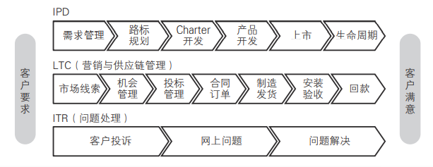

### 产品包和产品包需求
* O产品包：产品是满足需求的交付物的总和，包括有形部分和无形部分。是对客户和下游环节所有交付的统称。
* OR产品包需求：对原始需求进行分析、判断和加工后，最终向客户(包括外部客户和内部客户)交付的需求，是对产品包的正式描述，完整且准确，是对产品包进行开发、验证、销售、交付的依据。它包括两个部分：
  1. 项目任务书中包含的经过澄清、分析、整理后的需求列表。	
  2. 在产品开发的概念和计划阶段，经过澄清、分析、整理，并通过团队讨论形成一致意见之后的其他需求

### IPD是什么
1. 开发(development)：开发是创新性活动，目的是在企业有盈余的前提下满足市场和客户需求。
2. 产品(product)：产品是满足客户所有需求($APPEALS)的提供物的总和，也就是前面定义的产品包(offerings)，包括有形部分和无形部分。
3. 集成(integrated)：通过思想，工具，方法流程，整合企业内各资源部门，共同完成成规划和研发工作，满足客户需求

IPD 是基于市场和客户需求驱动的规划和开发管理体系。其核心是由来自市场、研发、制造、服务、采购等方面的人员组成的跨部门团队共同管理整个规划和开发过程，即从客户需求、产品规划、任务书开发、概念形成、产品开发、上市，直到生命周期的完整过程。通过 IPD 管理体系，使产品开发更加关注客户需求，加快市场响应速度，缩短产品开发周期，减少报废项目，降低开发成本，提高产品的稳定性、可生产性、可服务性等。

### IPD核心思想
1. 研发是**投资**行为：只有实现了客户的投资回报，才会有公司的投资回报，才能实现公司自己的企业效益
2. 基于**需求**的研发：内部客户的需求来源于外部客户，以客户为中心，满足客户需求才是企业生存的基础
3. **平台**化开发：通过需求管理、产品和技术规划提前识别公共技术和关键技术，抽取现有产品共同使用的模块和技术形成基础平台并要探索和研究目标客户未来的共同需求，从而在快速响应客户需求、提高质量、降低成本上同时取得领先优势。
4. **跨部门**协作：汇集各个领域的专业智慧形成合力，共同满足客户需求，为产品的商业成功负责。
5. **结构化**流程：分阶段执行，设置评审点，按角色归集流程中的活动。评审点分为决策评审点和技术评审点，决策评审实现高层决策团队(投资方)和规划团队、研发团队(承诺方)等的互动，资源分批受控投入，既满足项目进展需要，又避免投资失控。技术评审，实现专家和项目团队的充分互动，各领域专家充分利用其专业经验为研发团队提供指导，确保产品最终满足客户需求。
6. 业务和能力**均衡**：业务发展和内部能力建设同等重要。在企业发展的不同阶段，可以有策略、有选择地把重心放在业务发展或内部能力的构建上。产品生命周期有限，但能力可以源源不断创造出新产品。
7. **灵活**发展，与时俱进：在不断吸取业界最佳实践和解决业务问题的过程中与时俱进

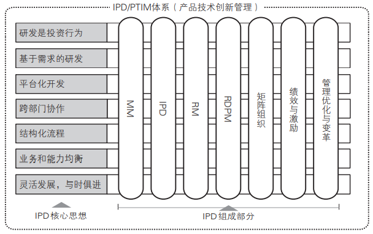

### IPD组成部分
1. 基于MM的规划：应当做什么 —— MM方法论：理解市场->细分市场->组合分析->制定业务计划->融合和优化业务计划->管理和评估业务计划
2. 基于IPD的创新：如何进行创新 —— IPD方法论(狭义IPD)：概念、计划、开发、验证、发布和生命周期
3. 以客户需求为中心：华为商业模式 —— 需求管理(RM)：需求探索和收集，需求分析，需求分配，需求实现，需求验证。需求管理是MM和IPD的支撑流程，为它们提供输入
4. 矩阵组织：职能部门支撑团队运作 —— 解决企业快速灵活响应市场和发挥规模优势之间的平衡问题
5. 研发项目管理：管理的“临门一脚” —— RDPM(R&D project management研发项目管理)框架，提高企业的创新水品
6. 绩效与激励：决不让雷锋吃亏 —— 透明有效的测量绩效，持续沟通保持组织目标与个人目标的“对齐”，实现目标的双达成
7. 管理变革与优化 —— IPD特色化，考虑公司实情动态调整，使之最适合指导当前公司发展

矩阵组合：产品技术创新管理体系(PTIM)框架
框架.png)
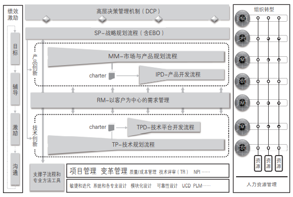

## 如何制定可执行的业务计划——使用MM(market management)市场管理及产品规划对齐战略与规划
企业经营逻辑顺序：战略 -> 产品规划 -> 产品开发 -> 生产 -> 销售 -> 服务

战略就是定位、取舍和匹配
1. 定位：确定企业为哪些客户提供哪些区别于竞争对手的独特产品和服务。
2. 取舍：明确哪些事情是要做的和不做的，尤其明确哪些是不做的。
3. 匹配：各个领域的活动支撑战略定位，并且相互匹配和加强。

战略营销体系：聚焦怎么倾听客户需求，怎么理解客户需求，跟客户探讨他到底要什么，然后来定义我们的产品和产品的规格

以客户需求为中心的“四个对齐”：
1. 上下对齐：公司高层、中层和基层的对齐
2. 左右对齐：不同产品线和部门之间的对齐
3. 长中短期对齐：长期规划(3年以上)、中期规划(1~3年)和短期规划(年度/季度/月计划)的对齐
4. 外部对齐：整个公司的计划要能满足客户和市场需求，适应外部环境变化

### MM方法论
目标：运用严格、规范的方法**分析**市场走势、业务要求及**需求**，**创建**合理的**市场细分规则**，**对**要投资和取得领先地位的**细分市场进行选择和优先级排序**，从而制订可执行的业务计划，**驱动新产品的开发和各领域活动**，用产品和服务进行匹配，同时确保能力能够支撑，并**并闭环管理业务计划**。  
基本逻辑：
1. 在明确使命、愿景和目标的基础上，确定要服务的对象及其需求。
2. 确定用什么交付(产品/服务/解决方案)来满足这些需求。
3. 确定在采取哪些行动/构建哪些能力，准备哪些资源来提供这些交付。
4. 对规划过程进行闭环管理和评估

MM方法论围绕这些关键问题展开：	
1. 价值观、使命、愿景、目标分别是什么？	
2. 为谁服务，也就是选择哪些细分市场？	
3. 战略路径(业务设计)和业务计划是什么？	
4. 要满足细分市场客户的哪些需求？	
5. 为目标客户提供什么产品、服务或解决方案？	
6. 需要构建哪些能力？如何构建？	
7. 各领域策略和行动计划是什么？	
8. 如何实现业务计划的闭环管理？

MM指导下的ISOP(ntegrated strategy & operation process)集成战略与运营流：统一管理企业的战略规划和各种运营活动及其管理体系的流程框架，也是组织的绩效管理流程。
1. 战略规划(SP)：制定未来 3～5 年的战略规划
2. 战略展架(BP)：制订下一年度业务计划和预算
3. 战略执行和监控：持续进行，通过定期(季度或月度)对 SP 和 BP进行审视和更新
4. 战略评估：对战略执行情况进行评估和总结，包括组织和团队绩效、个人绩效、项目绩效、管理体系评估等

### MM方法论应用于产品线规划
#### MM的六个阶段
1. 理解市场 - 确定总体目标战略方向
2. 细分市场 - 单一变化条件，细分目标客户
3. 组合分析 - 认知自我，确定产品形态
4. 制定业务计划 - 总结归纳，承上启下
5. 融合和优化业务计划 - 形成各层级SP和BP
6. 管理与评估业务计划 - 常规性日常活动，定期审视适当调整(客户需求的不稳定性和多变性)

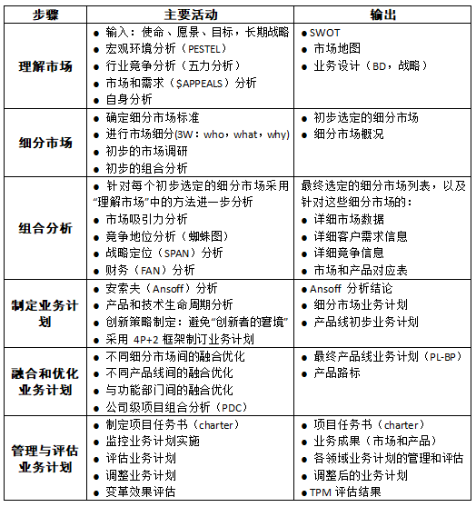
4P：产品(product)、价格(price)、渠道(place)、促销(promotion)+ 2：技术支持、订单履行。
TPM，transformation progress metrics，变革进展评估

当MM方法论应用于产品规划时，本质上就是用“主观”的产品与“客观”的市场和市场需求进行匹配的过程

#### 业务计划书与产品/技术路标
业务计划书是对业务如何运作的总体性说明文档，用于内部交流和向投资方汇报，根据需要可粗可细。业务计划书也叫商业计划书，要把商业逻辑介绍清楚。长期的业务计划书也叫战略规划或战略计划(SP)

根据规划对象，业务计划书分为：
1. 公司业务计划书(C-BP，corporation BP)	
2. 产品线业务计划书(PL-BP，product line BP)	
3. 产品包业务计划书(O/SBP，offering/solution BP)	
4. 细分市场业务计划书(SM-BP，segment market BP)	
5. 功能部门业务计划书(FD-BP，function department BP)

产品路标(product roadmap)是产品、服务或解决方案的发展方向和中长期规划，对内用于指导项目任务书(charter)开发和牵引技术规划，对外用于与客户互动以获取需求和支撑销售。产品路标也叫产品线路图，是 SP 和 BP 的重要内容。	与产品路标对应的有技术路标，也叫技术线路图。	

### MM方法论用于项目任务书开发
项目任务书开发流程(charter development process，CDP)，CDP的起点是产品路标规划或初步构想或者产品创意，终止于项目任务书的评审(DCP)和移交。
框架.png)

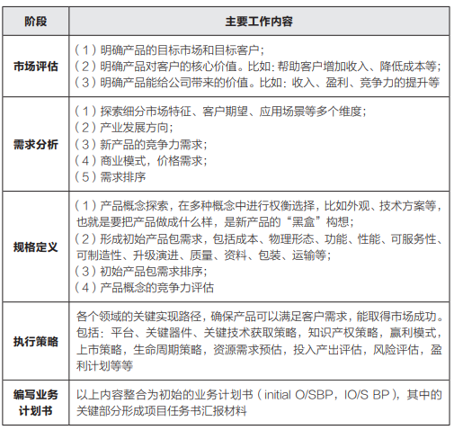
项目任务书(charter)必须回答 6 个关键问题：	
1. Why ：为什么要开发这个产品？	
2. What ：产品是什么？要满足客户什么需求？
3. Who ：谁来开发产品？	
4. How ：如何开发这个产品？	
5. When ：开发计划是什么，何时上市？	
6. How much ：需要多少投资，收益是多少？

### MM方法论应用于中长期战略规划和年度规划
公司：最高层级的指挥对象：总公司、集团等
业务单元：公司的各项业务有产品、服务、解决方案、产品系列、产品线、事业部、子公司、分公司等
功能部门：按专业划分包括但不限于：财务、质量、研发、售后服务、采购、制造、物流、市场、销售等部门。

规划向下细化，向上支撑

### MM方法论用于技术规划和各领域规划
**平台和技术规划要支撑产品规划**
所有达成目标的实现方式都是技术，技术分为核心技术、关键技术、通用技术和一般技术。
产品由组件(BB，buildingblock)构成，不同产品之间共用的组件为CBB(common building block，通用构建模块)不同产品间的共用部分构成产品平台，产品平台和所采纳的核心技术、关键技术相关，这些技术决定了产品平台及其相关产品的主要功能和性能。

平台化开发的核心是要在不同产品中尽可能做到零部件、组件、子系统和技术的共享，来同时提高项目的质量、成本和时间进度(QCT)。
技术&平台规划流程(TPP)，由TMT(technology management team，技术管理团队)或产品规划团队中的研发领域代表主导完成。

**平台规划必须面向未来客户的共同需求**
无论技术预研、技术开发还是平台开发，都必须以客户需求为导向。在进行产品开发前把核心技术、关键技术和共用部分进行识别并突破，以确保产品开发周期和产品质量，同时尽量做到在同一产品线和不同产品线之间做到共享

构建产品和技术平台有两种策略
1. 分析现有产品，抽取其共用部分形成平台。这是面向过去的产品平台策略。
2. 分析客户需求，尤其是中长期客户需求，在产品和技术规划过程中形成平台。这是面向未来的产品平台策略。

外部环境决定流程结构化程度：外部环境相对稳定偏向于优化现有业务和产品，外部新技术革新时则降低流程结构化，发散思路鼓励创新。

### 把所有规划纳入同一个大流程
结构化是为了同时保障进度，成本和质量，实现客户价值。

## 基于IPD管理研发和创新过程
企业内部创新包括：产品和技术创新、商业模式创新、各个功能领域创新、管理创新等。创新/变革本身也可使用IPD方法进行规范和管理，建立一致的创新方法论和流程

并行工程(concurrent engineering)
目标：为提高质量、降低成本、缩短产品开发周期和产品上市时间。
具体做法：在产品开发初期，组织多种职能协同工作的项目组，使有关人员从一开始就获得对新产品需求的要求和信息，积极研究涉及本部门的工作业务，并将需求提供给设计人员，使许多问题在开发早期就得到解决，从而保证了设计的质量，避免了大量的返工浪费。

产品开发流程的“6个阶段，9个角色，5个DCP，7个TR”

### 产品开发过程的结构化和规范化
1. 识别项目组成员、项目经理、部门经理、相关专家及决策层
2. 对研发过程进行合理的阶段划分，设置合理的评审点
3. 对流程中的活动和交付件模板进行定义，理清主流程和支撑流程之间的相互关系
4. PACE/IPC方法论指导研发和创新活动

#### 产品开发过程(狭义IPD)
在完成产品规划(MM)和项目任务书开发流程(CDP)并且项目任务书经过决策层评审通过后，才能启动产品开发过程。
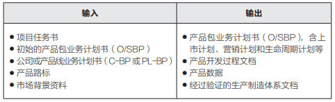

产品开发的输出产品方案、产品数据和制造产品的能力，以及相关的过程记录，它们的载体是文档
生产制造最终输出的是产品本身

#### IPD流程与需求和商业目标实现的关系
产品是艺术、科学和商业的结合，艺术和科学就是满足客户需求，同时还要实现商业目标。
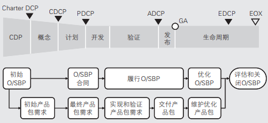

#### IPD流程的阶段划分(6阶段)
产品开发总体流程：项目任务书(chatrer) -> 概念 -> 计划 -> 开发 -> 验证 -> 发布 -> 生命周期
开发之前是需求的明确，以及分解、分配，开发是需求的实现和内部测试，开发之后是需求的验证和最终满足
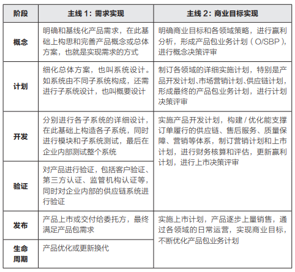

#### IPD流程的重点是概念阶段和计划阶段
项目任务书回答的是4W2H(Why、What、When、Who、How、How much)尤其是(Why)为什么
项目任务书中没有完整的产品包需求，没有对实现方案的完整构思和选择，更没有完整的系统设计和子系统设计，也不会有市场和研发以外领域的需求参与，形成产品业务计划书

为什么说要磨刀不误砍柴工，想好了再做？
1. 概念阶段投入不足，会导致在没有明确客户需求之前就开始设计方案，并很快启动系统设计和概要设计工作。
2. 计划阶段投入不足，导致在没有明确系统设计和规格之前就启动具体开发工作，最终结果就是在开发过程中不断被需求和设计变更打断。
3. 开发阶段，研发以外的其他角色，如市场、销售、采购、制造等角色在概念和计划阶段基本没有参与，他们的需求没有纳入总体方案加以整体考虑，导致大量需求和设计变更的引入。并且由于前期没有深入分析需求、技术难点和模块重复利用等问题，导致在产品开发过程中解决技术难题，由此也加长了研发周期。
4. 到了验证和发布阶段，产品和技术问题纷纷暴露出来，不断进行修改，甚至导致产品在没有经过严格测试验证的情况下发给客户，客户现场成了实验室。

#### IPD流程涉及参与的角色(9角色)
高层决策、项目管理、财务、质量、研发、采购、制造、市场、售后
另一种说法：高层决策团队(IPMT)、产品开发团队经理(leader of PDT，LPDT)、财务代表、质量代表、市场代表、研发代表、采购代表、制造代表、技术服务代表
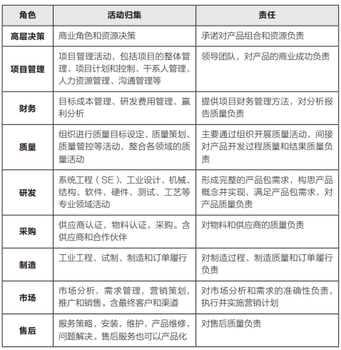

#### IPD流程中的决策评审与技术评审(5DCP，7TR)
技术评审：确保满足客户需求(一次TR最长周期为3个月内)收敛技术风险
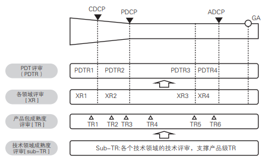

决策评审：确保实现商业目标，收敛商业风险
满足客户需求，通过了产品级技术评审(TR，technical review)后，由高层介入进行决策评审。高层决策评审(DCP)关注的重点是产品包业务计划书。

1. 概念决策评审(CDCP)：在概念阶段结束前进行，关注已经满足需求的产品概念是否具有竞争力，产品包业务计划中各领域策略是否有效，承诺资源，判断项目是否继续。
2. 计划决策评审(PDCP)：在计划阶段结束前进行，关注最终的产品包业务计划是否可以达成商业目标，各领域计划是否考虑完整，具有可行性。评审赢利计划，与产品开发团队明确绩效考核指标，承诺资源，判断项目是否继续。
3. 可获得性/上市决策评审(ADCP)：在验证阶段结束前进行，关注产品包是否已经满足客户需求，产品包业务计划是否根据环境变化进行优化调整，是否具备上市条件，最终决定产品是否上市销售或提交给委托方。
4. (EDCP)
5. 产品开发过程中，当环境发生变化对产品包业务计划带来重大影响，或必须提前发货时，需要进行临时决策评审(temporary decision check point，TDCP)。

决策评审必须做出明确的结论，且只有三个结论：
1. 继续(Go)：同意，可以继续开展项目，承诺提供下一阶段资源。
2. 重视项目(No Go)：不同意，项目终止，释放资源。
3. 重新定向(Redirect)：重新定向，要求项目组根据高层评审意见对业务计划进行调整优化，重新进行决策评审。

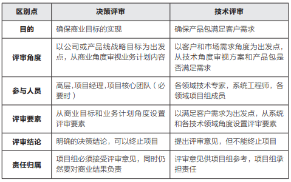

技术/决策评审会议要求：
1. 会议质量决定了评审质量。
2. 评审会参与者会前必须仔细阅读相关材料，和项目组沟通，发现问题及时解决。
3. 评审会的目的主要是达成共识和识别潜在问题，尤其是跨部门问题，而不是在会上解决问题。
4. 会议一开始首先解决上次会议的遗留问题。
5. 无论是 DCP 还是 TR，都必须使用评审要素表，以免遗漏检查项。
6. 主持人要注意控制时间，避免漫谈和跑题，会议必须有结论。
7. 会后贯彻会议结论，明确责任人，跟踪问题的解决。

#### IPD流程的分层结构化：阶段流程、子流程和交付件
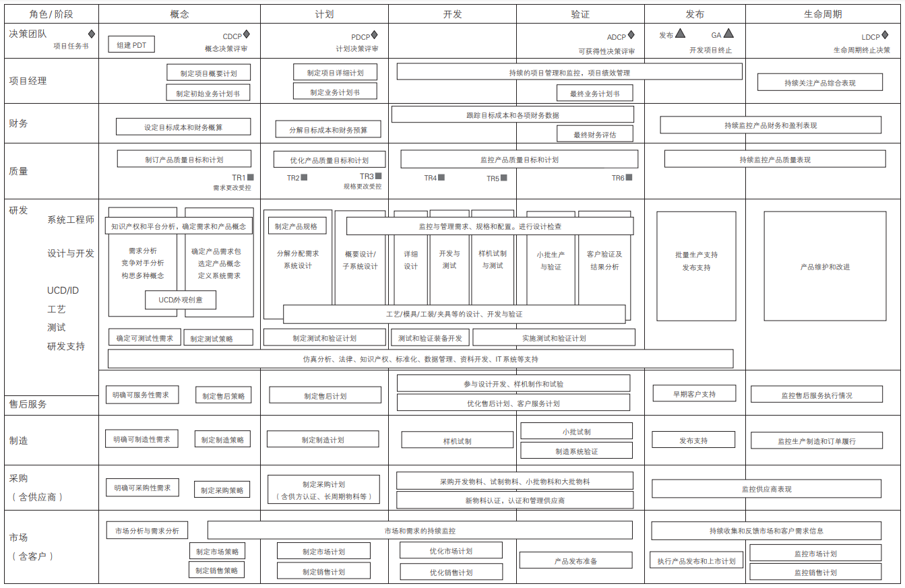
每个阶段都有自己的目标、输入、输出和相关活动，可以成为一个完整的流程。

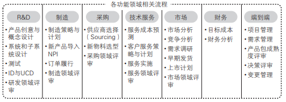
(1)高层决策：决策评审，资源管理，组合管理。
(2)项目管理：业务计划书，项目计划和管理。
(3)财务：目标成本管理，研发费用管理，项目赢利分析。
(4)质量：产品质量策划与控制，过程质量策划与控制。
(5)研发：研发领域的子流程最多，且不同行业和不同产品差别很大。比如通信 /IT 行业一般包括技术评审、SE(系统工程)、UCD(以客户为中心的设计)、软件、硬件、结构、工艺、测试、资料、包装等领域的子流程。
(6)采购：新物料认证，新供应商认证。
(7)制造：制造策略和计划，订单履行策略和计划，新产品试制和导入。
(8)售后：售后服务策略和计划，售后服务成本预测。
(9)市场营销：需求探索和管理，市场分析，市场营销策略和计划，早期发货管理，上市管理，生命周期管理。

不同行业产品开发流程差别主要集中在研发和供应链领域。例如:
解决方案IPD示例
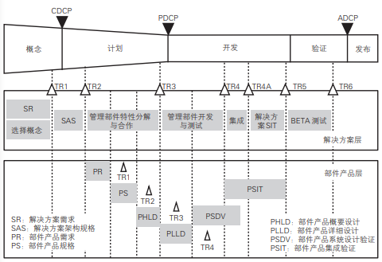
技术/平台开发IPD，技术和产品开发流程(TPD)

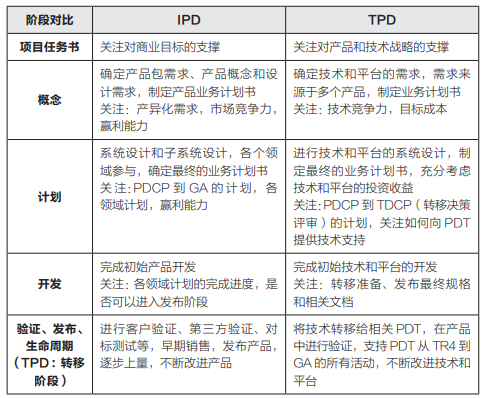

## 如何做需求管理：以客户需求为中心
需求管理过程中的主要问题：
1. 缺乏完整的需求定义和描述框架：一致的概念理解是沟通的基础，客户的需求是一个完整的**产品包需求**(OR)，而不是单一的有形实体或软件和服务
2. 错误地认为需求是创造出来的：需求是采用各种方法不断探索、发掘和提炼，同时用技术手段来实现的。
3. “无节制、无底线”地满足客户需求：平台化，系列化的研发产品，满足细分市场的共同需求，产品设计之初就已经考虑到用户的潜在需求，持续盈利
4. 长中短期需求分布不合理：不仅仅需要满足客户提出的短期需求，尤其是针对现有产品提出的问题和改进建议，还需要关注客户中长期的需求和竞争对手的动向，以及周边领域发展对本行业的影响。
5. 以产品为中心而非以需求为中心经营企业：需求的生命周期往往比产品的生命周期更加稳定和长久

产品规划本质上是需求的规划，也就是要说要清楚何时满足客户的何种需求。产品规划的重要输出是产品路标规划，也就是在什么时间点针对哪些细分市场推出什么新产品。新产品站在企业角度往往是产品的性能、规格、售价等，站在客户角度就是需求。

构建完整的分层需求描述方法
需求的分层描述：需求＝问题＋解决方案 
产品需求的第一层次-客户问题(problem)：能给企业带来商业利益的客户需求，即客户(需要有相应的支付能力)**要解决的问题**
产品需求的第二层次-系统特性(feature)：产品满足客户**需要的功能的实现程度**，也就是通常说的“卖点”。
产品需求的第三层次-系统要求(requirement)：是对产品本身的**系统需求**，分为功能性需求和非功能性需求。

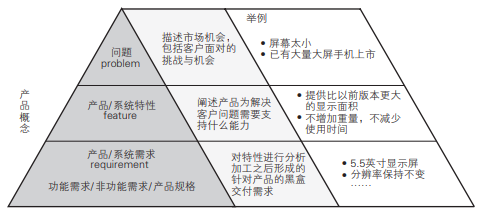
需求的三个层次之间的跟踪关系：通过需求跟踪矩阵来完成，系统需求实现后必须能提供某种功能或能力，帮助形成产品的特性，也就是产品的卖点或客户的购买理由，并最终解决客户的问题。需求是产品的约束条件，即DFX(Design for xxx)，需求 = 问题 + 解决方案

描述客户需求的`$APPEALS`模型(蛛网图/雷达图)，从8个维度建立了完整描述客户需求的一致性框架。
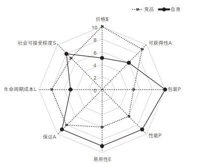  
维度 | 概要解释 | 举例：购买一辆新车 | 举例
--- | --- | --- | ---
$(价格/商务条件) | 客户付出的购买价格及商务条款 | 裸车价，税收，保险，付款/贷款条件，杂费 | 
A(可获得性) | 购买的便利性，包括渠道、到货周期、信息沟通等 | 4S 店数量，各型号到货时间，上牌便利性 | 
P(外观/包装) | 产品的外观表现是客户的非功能需求之一，有时是决定性的 | 外观/内饰/颜色及其带来的含义和联想 | 
P(性能/功能) | 产品的功能、性能、可靠性如何 | 动力，百公里加速时间，重量，空间尺寸，内饰色彩，乘坐人数，材质，安全配置，导航，影音系统，等等 | 
E(易用性) | 产品是否容易使用 | 操控性，舒适性，视野，人机工程，气味 | 
A(保证) | 产品使用起来是让人放心 | 售后服务(索赔、维修、保养等)，保险，安全性 | 
L(生命周期成本) | 产品从购买到报废/停止使用所支出的所有费用 | 燃油费，保养费，保险费，过路费，停车费 | 
S(社会可接受程度) | 其他人如何看待你是用这个产品 | 品牌/厂家所属国，与“身份”(地位、性别、使用场合)的匹配度，环保程度 | 

产品包需求应从客户的商业问题分析开始，然后确定解决这些问题需要的系统特性，最后对系统特性做进一步细化，形成若干个系统需求。
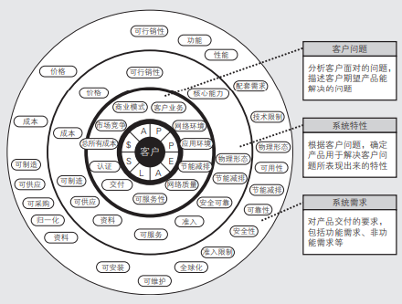

### 端到端的需求管理(延迟满足)
规划好在什么时候，满足哪些客户的哪些需求
(1)满足哪些客户的需求：市场细分和定位。
(2)满足哪些需求：需求收集，需求分析。
(3)什么时候满足：需求分配、产品的路标规划。

需求生命周期
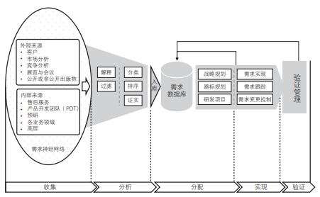

需求管理流程，包括需求的收集、分析、分配、实现和验证等 5 个阶段。

需求管理不是一个独立的流程，而是其他业务流程的支撑流程，无论公司战略规划(SP)、业务计划(BP)、产品路标规划、平台和技术规划、产品 / 技术项目任务书开发(CDP/TCDP)，还是产品和技术的研发流程，都要“调用”需求管理流程，尤其是需求的收集和分析阶段的工具方法。

客户需要的不是产品，而是符合\$APPLES并满足用户需求的完整交付(offerings)。

#### 需求的探索和收集
1. 需求采集的对象：需求的收集贯穿MM的理解市场，细分市场，组合分析，制定业务计划阶段。客户调研流程是需求收集阶段的子流程，在需求调研之前首先需要分析调研对象，罗列干系人，明确“决策链”(采购中心)：包括使用者、采购者、投资者、影响者、最终决策者等，针对需求干系人设计调研提纲。客户除购买者(直销)还包括批发商，零售商，电商等渠道商
2. 需求采集的方式：调研访谈、客户满意度调查、现场客户支持、客户高层交流、招投标、专家交流、竞争对手产品研究等
3. 需求采集参与人员：是跨部门构成，包括公司高层、市场人员、销售人员、售后服务人员、研发人员、各领域专家等

标准需求收集表
(1)需求名称，需求编号和关键字，便于检索。
(2)需求类别，根据 $APPEALS 进行分类。
(3)需求的详细描述，重点包括：背景和场景，需求原因，带来的好处。
(4)竞争对手情况，即：对手是否实现了需求？实现得如何？
(5)需求重要程度，可用 KANO 模型进行分析。KANO 模型是一个用来做需求分析和分类的工具,它定义了三个层次的客户需求：**基本型需求、期望型需求和兴奋型需求**，能帮助企业找出提高客户满意度的切入点。
(6)客户反馈。
(7)需求如何验收？

#### 需求分析：对原始需求进行加工提炼
需求分析包括对需求进行解释、过滤、分类、排序和证实
（1）解释：用正式的语言对需求进行描述，并使需求可度量和可验证。
（2）过滤：包括“去粗取精”和“去伪存真”，前者是对各种需求信息进行归纳总结，后者是去掉虚假信息和个别客户需求，抓住细分市场的共同需求。
（3）分类：可按时间、类别和层次维度进行分类。根据时间维度可把需求分为长、中、短期需求。按类别维度（比如\$APPEALS 的 8 个维度）可把需求进行分类。在类别的基础上，还可把需求更进一步分解为更多的层次。比如客户对汽车的需求可分为价格、性能、配置等，性能可分为安全性、操控性等，安全性又可进一步分为主动安全和被动安全。
（4）排序：不同细分市场客户对需求各维度的重视程度是不同的，比如中低端客户对价格更加敏感，中高端客户对品牌和产品性能更加看重。为了让产品的投入产出比更高，需要对需求的重要性和投入产出比进行排序。
（5）证实：在需求收集和分析过程中，信息可能被误读，传递过程也可能失真，所以需要对经过分析的需求进行验证，确保和客户的真实需求保持一致。需求验证是一个端到端的过程。

分析与收集往往相互交叉，收集的同时要进行分析，在分析的过程中如果发现需求不够完整，就要及时启动新的需求收集活动。

#### 需求分配：产品规划的核心工作
需求的分配有 6 种途径。
A. 纳入规划流程：对于长期和某些中期需求，在产品规划流程（MM）和技术和平台规划流程（TPP）中进行处理，进入新的产品和技术路标规划。
B. 纳入路标规划：对于中期需求，一般可以纳入现有产品和技术路标规划中，在某个或若干个已经通过评审的产品、技术中实现。
C. 纳入项目任务书流程：对于一些中短期需求，可纳入正在执行的项目任务书开发流程（CDP）中。
D. 纳入概念和计划阶段的研发项目：通过已经启动的处于概念和计划阶段的研发项目实现。如果要纳入处于计划阶段的项目，需要进行需求变更。
E. 纳入开发、验证和发布阶段的研发项目：该类需求是最紧急的需求，只有纳入已经处于开发或之后阶段的产品和技术研发项目才能满足客户需求。为了满足这类需求，必须执行设计或工程变更流程，而这类变更往往代价最大，要尽量避免。
F. 对已经上市（发布会以后）的产品的需求: 比如希望价格更低、购买更加方便、增加售后服务内容等这类需求围绕现有产品提出，一般通过价格调整、构建更多更好的销售渠道、改善客户沟通策略和提高售后服务水平等来满足。
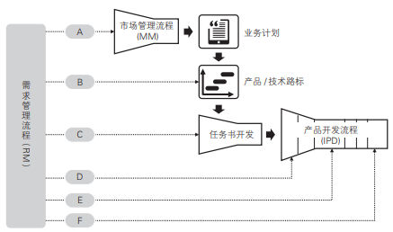

## 组织结构管理——矩阵

## 项目管理——RDPM

## 结合实践环节

## 可持续性发展

如何构建企业产品和技术创新管理体系？
核心思想和基本原则是什么？
方法论是什么？
管理体系架构是什么？
如何开展相关的管理变革？

ITS&P(IT战略与规划)
IFS(integrated financial system， 集成财务转型)
ISC(integrated supply chain，集成供应链)
LTC(lead to cash，从销售线索到回款)
CRM(customer relationship management，客户关系管理)
MM(market management，市场管理及产品规划)
RM(requirement menagement，需求管理)
OEM(original equipment manufacture，原始设备生产商)
ODM(original design manufacture，原始设计制造商)
MP(marketing planning，市场规划)
BLM(business leadership model，业务领先模型)
ISOP(integrated strategy & operation process，集成战略与运营流)
决策评审(decision check point，DCP)
GA(general available，通用可获得性)产品上市
产品包业务计划书(O/SBP)
公司或产品线业务计划书(C-BP 或 PL-BP)
IPMT(integrated portfolio management	team，高层决策团队)
BMT(business	management	team，业务管理团队)
SPDT(super	product	development	team，超级产品开发团队)
LMT(life-cycle	management	team，生命周期管理团队)
PDT(product	development	team，产品开发团队)
决策评审点(decision check point，DCP)
技术评审(technical review，TR)