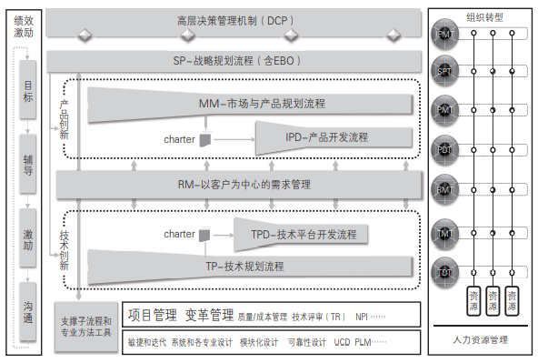
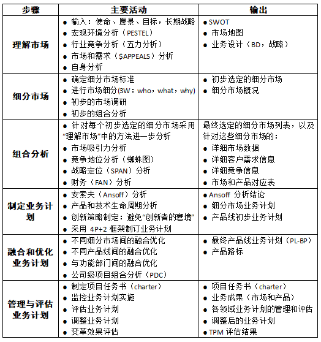
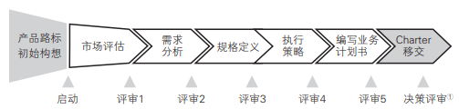

# IPD(Integrated Product Development)集成产品开发
## 方法论
why：真正深刻和原创性的洞见只能在研究榜样的过程中发现，向榜样和标杆学习，采用业界成熟的管理体系，是企业提高创新和研发管理水平的重要方法
how：持之以恒的模仿、跟所、固化、优化一套经过验证的管理体系，结合企业特点不断向深度发展，超越，最终形成自己的管理体系。
what：华为价值观：”以客户为中心+艰苦奋斗+自我批判“

### 跨部门流程体系-”云，雨，沟“
降低全公司沟通成本，凝聚共识，形成统一工作方法，强化各项运营能力相互配合。
云：对外纸行业变化、技术变革、市场机会等，对内指企业核心价值观
雨：企业各部门的经营活动
沟：跨部门、跨领域的工作流程

理清流程之间的接口关系，才能端到端贯通，满足客户需求。
IPD流程：各层级和各领域战略规划、需求管理、产品规划、项目任务书开发、产品开发、上市、生命周期管理
LTC流程：包括机会点管理、客户关系维护、投标、商务、供应链、发货、安装、收款
ITR(issue to resolution，从问题到解决) 流程：包括从客户问题产生到最终得到解决的流程

### 产品包和产品包需求
* O产品包：产品是满足需求的交付物的总和，包括有形部分和无形部分。是对客户和下游环节所有交付的统称。
* OR产品包需求：对原始需求进行分析、判断和加工后，最终向客户（包括外部客户和内部客户）交付的需求，是对产品包的正式描述，完整且准确，是对产品包进行开发、验证、销售、交付的依据。它包括两个部分：
  1. 项目任务书中包含的经过澄清、分析、整理后的需求列表。	
  2. 在产品开发的概念和计划阶段，经过澄清、分析、整理，并通过团队讨论形成一致意见之后的其他需求

### IPD是什么
1. 开发（development）：开发是创新性活动，目的是在企业有盈余的前提下满足市场和客户需求。
2. 产品（product）：产品是满足客户所有需求（$APPEALS）的提供物的总和，也就是前面定义的产品包（offerings），包括有形部分和无形部分。
3. 集成（integrated）：通过思想，工具，方法流程，整合企业内各资源部门，共同完成成规划和研发工作，满足客户需求

IPD 是基于市场和客户需求驱动的规划和开发管理体系。其核心是由来自市场、研发、制造、服务、采购等方面的人员组成的跨部门团队共同管理整个规划和开发过程，即从客户需求、产品规划、任务书开发、概念形成、产品开发、上市，直到生命周期的完整过程。通过 IPD 管理体系，使产品开发更加关注客户需求，加快市场响应速度，缩短产品开发周期，减少报废项目，降低开发成本，提高产品的稳定性、可生产性、可服务性等。

### IPD核心思想
1. 研发是**投资**行为：只有实现了客户的投资回报，才会有公司的投资回报，才能实现公司自己的企业效益
2. 基于**需求**的研发：内部客户的需求来源于外部客户，以客户为中心，满足客户需求才是企业生存的基础
3. **平台**化开发：通过需求管理、产品和技术规划提前识别公共技术和关键技术，抽取现有产品共同使用的模块和技术形成基础平台并要探索和研究目标客户未来的共同需求，从而在快速响应客户需求、提高质量、降低成本上同时取得领先优势。
4. **跨部门**协作：汇集各个领域的专业智慧形成合力，共同满足客户需求，为产品的商业成功负责。
5. **结构化**流程：分阶段执行，设置评审点，按角色归集流程中的活动。评审点分为决策评审点和技术评审点，决策评审实现高层决策团队（投资方）和规划团队、研发团队（承诺方）等的互动，资源分批受控投入，既满足项目进展需要，又避免投资失控。技术评审，实现专家和项目团队的充分互动，各领域专家充分利用其专业经验为研发团队提供指导，确保产品最终满足客户需求。
6. 业务和能力**均衡**：业务发展和内部能力建设同等重要。在企业发展的不同阶段，可以有策略、有选择地把重心放在业务发展或内部能力的构建上。产品生命周期有限，但能力可以源源不断创造出新产品。
7. **灵活**发展，与时俱进：在不断吸取业界最佳实践和解决业务问题的过程中与时俱进

### IPD组成部分
1. 基于MM的规划：应当做什么 —— MM方法论：理解市场->细分市场->组合分析->制定业务计划->融合和优化业务计划->管理和评估业务计划
2. 基于IPD的创新：如何进行创新 —— IPD方法论：概念、计划、开发、验证、发布和生命周期
3. 以客户需求为中心：华为商业模式 —— RM需求管理：需求探索和收集，需求分析，需求分配，需求实现，需求验证
4. 矩阵组织：职能部门支撑团队运作 —— 解决企业快速灵活响应市场和发挥规模优势之间的平衡问题
5. 研发项目管理：管理的“临门一脚” —— RDPM（研发项目管理）框架，提高企业的创新水品
6. 绩效与激励：决不让雷锋吃亏 —— 透明有效的测量绩效，持续沟通保持组织目标与个人目标的“对齐”，实现目标的双达成
7. 管理变革与优化 —— IPD特色化，考虑公司实情动态调整，使之最适合指导当前公司发展

矩阵组合：产品技术创新管理体系(PTIM)框架
框架.png)

## 如何制定可执行的业务计划——使用MM(market management)市场管理及产品规划对齐战略与规划
企业经营逻辑顺序：战略 -> 产品规划 -> 产品开发 -> 生产 -> 销售 -> 服务

战略就是定位、取舍和匹配
1. 定位：确定企业为哪些客户提供哪些区别于竞争对手的独特产品和服务。
2. 取舍：明确哪些事情是要做的和不做的，尤其明确哪些是不做的。
3. 匹配：各个领域的活动支撑战略定位，并且相互匹配和加强。

战略营销体系：聚焦怎么倾听客户需求，怎么理解客户需求，跟客户探讨他到底要什么，然后来定义我们的产品和产品的规格

以客户需求为中心的“四个对齐”：
1. 上下对齐：公司高层、中层和基层的对齐
2. 左右对齐：不同产品线和部门之间的对齐
3. 长中短期对齐：长期规划（3年以上）、中期规划（1~3年）和短期规划（年度/季度/月计划）的对齐
4. 外部对齐：整个公司的计划要能满足客户和市场需求，适应外部环境变化

### MM方法论
目标：运用严格、规范的方法**分析**市场走势、业务要求及**需求**，**创建**合理的**市场细分规则**，**对**要投资和取得领先地位的**细分市场进行选择和优先级排序**，从而制订可执行的业务计划，**驱动新产品的开发和各领域活动**，用产品和服务进行匹配，同时确保能力能够支撑，并**并闭环管理业务计划**。  
基本逻辑：
1. 在明确使命、愿景和目标的基础上，确定要服务的对象及其需求。
2. 确定用什么交付（产品 / 服务 / 解决方案）来满足这些需求。
3. 确定在采取哪些行动 / 构建哪些能力，准备哪些资源来提供这些交付。
4. 对规划过程进行闭环管理和评估

MM方法论围绕这些关键问题展开：	
1. 价值观、使命、愿景、目标分别是什么？	
2. 为谁服务，也就是选择哪些细分市场？	
3. 战略路径（业务设计）和业务计划是什么？	
4. 要满足细分市场客户的哪些需求？	
5. 为目标客户提供什么产品、服务或解决方案？	
6. 需要构建哪些能力？如何构建？	
7. 各领域策略和行动计划是什么？	
8. 如何实现业务计划的闭环管理？

MM指导下的ISOP(ntegrated strategy & operation process)集成战略与运营流：统一管理企业的战略规划和各种运营活动及其管理体系的流程框架，也是组织的绩效管理流程。
1. 战略规划（SP）：制定未来 3～5 年的战略规划
2. 战略展架（BP）：制订下一年度业务计划和预算
3. 战略执行和监控：持续进行，通过定期（季度或月度）对 SP 和 BP进行审视和更新
4. 战略评估：对战略执行情况进行评估和总结，包括组织和团队绩效、个人绩效、项目绩效、管理体系评估等

### MM方法论应用于产品线规划
#### MM的六个阶段

4P：产品（product）、价格（price）、渠道（place）、促销（promotion）+ 2：技术支持、订单履行。
TPM，transformation progress metrics，变革进展评估

当MM方法论应用于产品规划时，本质上就是用“主观”的产品与“客观”的市场和市场需求进行匹配的过程

#### 业务计划书与产品/技术路标
业务计划书是对业务如何运作的总体性说明文档，用于内部交流和向投资方汇报，根据需要可粗可细。业务计划书也叫商业计划书，要把商业逻辑介绍清楚。长期的业务计划书也叫战略规划或战略计划（SP）

根据规划对象，业务计划书分为：
1. 公司业务计划书（C-BP，corporation BP）	
2. 产品线业务计划书（PL-BP，product line BP）	
3. 产品包业务计划书（O/SBP，offering/solution BP）	
4. 细分市场业务计划书（SM-BP，segment market BP）	
5. 功能部门业务计划书（FD-BP，function department BP）

产品路标（product roadmap）是产品、服务或解决方案的发展方向和中长期规划，对内用于指导项目任务书（charter）开发和牵引技术规划，对外用于与客户互动以获取需求和支撑销售。产品路标也叫产品线路图，是 SP 和 BP 的重要内容。	与产品路标对应的有技术路标，也叫技术线路图。	

### MM方法论用于项目任务书开发
项目任务书开发流程（charter development process，CDP），CDP的起点是产品路标规划或初步构想或者产品创意，终止于项目任务书的评审（DCP）和移交。

项目任务书（charter）必须回答 6 个关键问题：	
1. Why ：为什么要开发这个产品？	
2. What ：产品是什么？要满足客户什么需求？
3. Who ：谁来开发产品？	
4. How ：如何开发这个产品？	
5. When ：开发计划是什么，何时上市？	
6. How much ：需要多少投资，收益是多少？

### MM方法论应用于中长期战略规划和年度规划

## 如何进行研发和创新

## 如何做需求管理：以客户需求为中心

## 组织结构管理——矩阵

## 项目管理——RDPM

## 结合实践环节

## 可持续性发展

如何构建企业产品和技术创新管理体系？
核心思想和基本原则是什么？
方法论是什么？
管理体系架构是什么？
如何开展相关的管理变革？

ITS&P(IT战略与规划)
IFS(integrated financial system， 集成财务转型)
ISC(integrated supply chain，集成供应链)
LTC(lead to cash，从销售线索到回款)
CRM(customer relationship management，客户关系管理）
MM(market management，市场管理及产品规划)
RM(requirement menagement，需求管理)
OEM（original equipment manufacture，原始设备生产商）
ODM（original design manufacture，原始设计制造商）
MP（marketing planning， 市 场 规 划 ）
BLM（business leadership model，业务领先模型）
ISOP（integrated strategy & operation process，集成战略与运营流）
决策评审（decision check point，DCP）