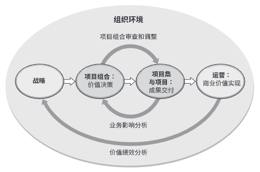

# 项目管理知识体系指南
全球项目管理业界定义的最重要的价值观是**责任，尊重，公正和诚实**

## 基本要素
组织项目管理
| | 项目 | 项目集 | 项目组合
--- | --- | --- | ---
定义 | 项目是为创造独特的产品、服务或成果而进行的临时性工作。 | 项目集是一组相互关联且被协调管理的项目、子项目集和项目集活动，以便获得分别管理所无法获得的效益。 | 项目组合是为实现战略目标而组合在一起管理的项目、项目集、子项目组合和运营工作的集合。
范围 | 项目具有明确的目标。范围在整个项目生命周期中是渐进明细的。| 项目集的范围包括器项目集组件的范围。项目集通过确保个项目组件的输出和成果协调互补为组织带来效益。 | 项目组合的范围随着组织战略目标的变化而变化。
变更 | 项目经理对变更和实施过程做出预期，实现对变更的管理和控制。 | 项目集的管理方法是，随着项目集各组件成果和/或输出的交付，在必要时接受和适应变更，优化效益实现。 | 项目组合经理持续监督更广泛内外部环境的变更。
规划 | 在整个项目生命周期总，项目经理监禁名字高层级信息，将其转化为详细的计划。 | 项目集的管理利用高层级计划，跟踪项目集组件的依赖关系和进展。项目集计划也用于在组件层级指导规划。 | 项目组合经理建立并维护与总体项目组合有关的必要过程和沟通。
管理 | 项目经理为实现项目目标而管理项目团队。 | 项目集有项目经理管理，其通过协调项目集组件的活动，确保项目集效益按预期实现。 | 项目组合经理可管理或协调项目组合管理人员或对总体项目组合负有报告主责的项目集和项目人员。
监督 | 项目经理监控项目开找你各种生产产品、提供服务或成果的工作。 | 项目集经理监督项目集组件的进展，确保整理目标、进度计划、预算和项目集效益的实现。 | 项目组合经理监督战略变更以及总体资源分布配、绩效成果和项目组合风险。
成功 | 项目的成功通过产品和项目的质量、时间表、预算的依从性以及客户满意度水平进行衡量。 | 项目集的成功通过项目集向组织交付预期效益的能力以及项目集所交付所述效益的效率和效果进行衡量。 | 项目组合的成功通过项目组合的总体投资效果和实现的效益进行衡量。

### 项目
基本要素：
项目是**为了创造独特性的产品、服务或成果而进行的临时性工作**

项目管理是将知识、技能、工具与技术应用于项目活动，以满足项目的要求。通过合理运用与整合特定项目所需的项目管理过程得以实现。

### 项目集
项目集管理注重作为组成部分的项目与项目集之间的依赖关系，以确定管理这些项目的最佳做法

依赖关系
1. 调整项目/项目集的战略方向，对目的/目标产生影响
2. 将项目集范围分配到项目集组成部分
3. 管理项目集组成部分之间的依赖关系
4. 管理可能影响项目集内多个项目的项目集风险
5. 解决项目集中项目与项目集之间的问题
6. 同一治理框架内管理变更请求
7. 预算分配
8. 确保项目集及其包含的项目能够实现效益

### 项目组合
项目组合中的项目集或项目不一定彼此依赖或直接相关

项目组合管理目的：
1. 指导组织的投资决策
2. 选择项目集与项目的最佳组合方式，以达成战略目标
3. 提供决策透明度
4. 提供团队和实物资源分配的优先顺序
5. 提高实现预期投资回报的可能性
6. 实现对所有组成部分的综合风险预测的集中式管理
7. 确定项目组合是否符合组织战略

### 运营管理
运营管理关注产品的持续生产和（或）服务的持续运作。运营管理使用最优资源满足客户要求，摆正业务运作的持续高效。

运营管理重点管理把各种输入（如材料、零件、能源和劳力）转变为输出（如产品、商品和（或）服务）的过程

## 组织级项目管理和战略
项目组合、项目集和项目均需要符合组织战略或由组织战略驱动，一不用的方式服务于战略目标实现
* 项目组合管理通过选择适当的项目集或项目，对工作进行优先级排序，以及提供所需资源，来与组织战略保持一致
* 项目集管理对其组成部分进行协调，对他们之间的依赖关系进行控制，从而实现既定的收益
* 项目管理使组织的农用地和目标得以实现

组织环境

战略 => 项目组合：价值决策 => 项目集与项目：成果交付 => 运营：商业价值实现
运营 -> 价值绩效分析 -> 战略
项目集与项目 -> 业务影响分析 -> 项目组合
项目组合 -> 项目组合审查和调整 -> 项目集与项目

## 项目运行环境

### 事业环境因素
### 组织过程资产
### 组织系统

## 项目经理的角色

### 项目经理定义
### 项目经理影响范围
### 项目经理的能力
### 执行整合

## 项目整合管理

### 制定项目章程
### 制定项目管理计划
### 指导与管理项目工程
### 管理项目知识
### 监控项目工作
### 实施整体变更控制
### 结束项目或阶段

## 项目范围管理

### 规划范围管理
### 收集需求
### 定义范围
### 创建WBS
### 确认范围
### 控制范围

## 项目进度管理

### 规划进度管理
### 定义活动
### 排列活动顺序
### 估算活动持续时间
### 制定进度计划
### 控制进度

## 项目成本管理

### 规划成本管理
### 估算成本
### 制定预算
### 控制成本 

## 项目质量管理

### 规划质量管理
### 管理质量
### 控制质量

## 项目资源管理

### 规划资源管理
### 获取资源
### 建设团队
### 管理团队
### 控制资源

## 项目沟通管理

### 规划沟通管理
### 管理沟通
### 监督沟通

## 项目风险管理

### 规划风险管理
### 识别风险
### 实施定性风险分析
### 实施定量风险分析
### 规划风险应对
### 实施风险应对
### 监督风险

## 项目采购管理

### 规划采购管理
### 实施采购
### 控制采购

## 项目相关方管理

### 识别相关方
### 规划相关方参与
### 管理相关方参与
### 监督相关方参与

# 项目管理标准

## 启动过程组
## 规划过程子
## 执行过程组
## 监控过程组
## 收尾过程组