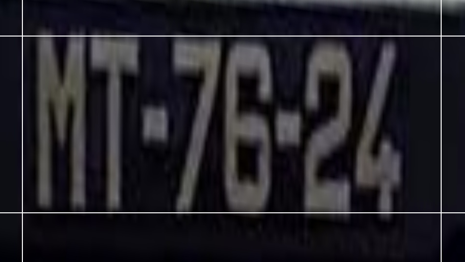
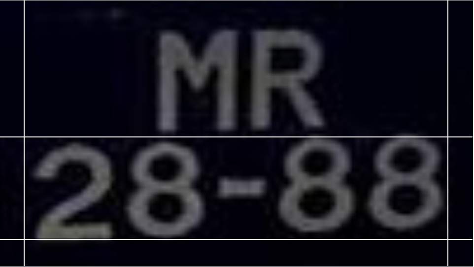
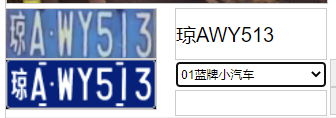
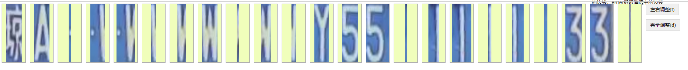

1. 原图标记车牌位置后，产生一个车牌车牌放大图和辅助线位置信息并返回，如：  
单行车牌辅助线信息
  
多行车牌辅助线信息

辅助线信息不用绘制在车牌图上，返回相对的位置信息即可  
>**所需算法支持：软件传入车牌坐标信息，算法截图并处理（各种变换，姿态纠正），并生成辅助线坐标，返回处理后的车牌图和辅助线坐标**

2. 车牌信息填写区域填写并选择车牌信息后，左下角生成的车牌图需要生成并返回  
  
右边车牌信息需手动填写，如需识别需要算法返回对应的识别结果  
>**所需算法支持：根据软件传入的车牌信息，算法生成标准车牌图，返回标准车牌图，如果需要自动识别车牌信息，需要算法提供对应的识别结果**

3. 预标记功能（放弃该功能）

