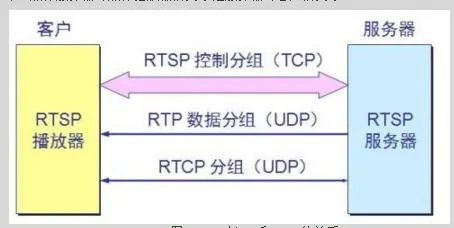
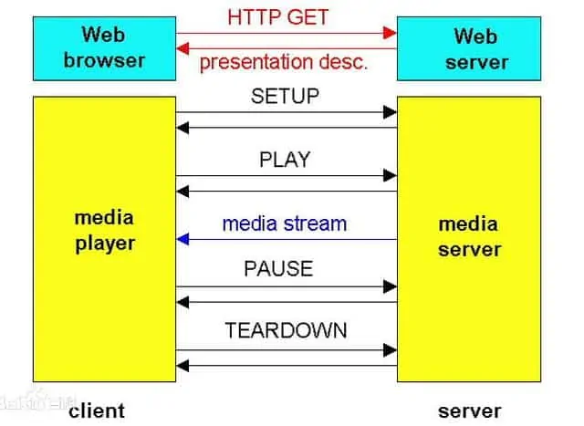
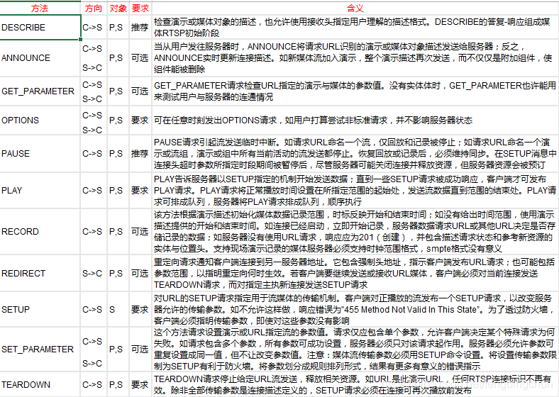

# 流媒体传输协议

## rtp、rtcp、rtsp、rsvp、rtmp、mms、hls
**RTP**(Real-time Transport Protovol)实时传输协议: 一种多媒体数据流传输协议，传送具有实时属性的数据。RTP协议是建立在UDP协议上的。RTP协议详细说明了在互联网上传递音频和视频的标准数据包格式。RTP协议常用于流媒体系统（配合RTCP协议）、视频会议和视频电话系统（配合H.263或SIP）。RTP本身并没有提供按时发送机制或其他服务质量（QoS）保证，它依赖于底层服务去实现这一过程。RTP并不保证传送或防止无序传送，也不确定底层网络的可靠性。RTP实行有序传送，RTP中的序列号允许接收方重组发送方的包序列，同时序列号也能用于决定适当的包位置，例如：在视频解码中，就不需要顺序解码。

**RTCP**(Real-time Transport Control Protocol)实时传输控制协议: 监控服务质量并传送正在进行的会话参与者的相关信息。RTCP为RTP媒体流提供信道外控制。RTCP定期在流多媒体会话参加者之间传输控制数据。RTCP的主要功能是为RTP所提供的服务质量提供反馈。RTCP收集相关媒体连接的统计信息，例如：传输字节数，传输分组数，丢失分组数，时延抖动，单向和双向网络延迟等等。网络应用程序可以利用RTCP所提供的信息试图提高服务质量，比如限制信息流量或改用压缩比较小的编解码器。RTCP本身不提供数据加密或身份认证，其伴生协议SRTCP（安全实时传输控制协议）则可用于此类用途。

**RTSP**(Real Time Streaming Protocol)实时流传输协议：RTSP实时流传输协议，TCP/IP协议体系中的一个应用层协议。该协议定义了一对多应用程序如何有效通过IP网络传送多媒体数据。流数据本身的传输不是RTSP的任务。RTSP在体系结构上位于RTP和RTCP之上，它使用TCP或UDP完成数据传输。 RTSP协议是双向支持，请求既可以从客户机发出也可以通过服务器发出。同时RTSP是用来控制声音或影像的多媒体串流协议，并允许同时多个串流需求控制，传输时所用的网络通讯协定并不在其定义的范围内，服务器端可以自行选择使用TCP或UDP来传送串流内容，它的语法和运作跟HTTP 1.1类似，但并不特别强调时间同步，所以比较能容忍网络延迟。 同时多个串流需求控制（Multicast），除了可以降低服务器端的网络用量，更进而支持多方视讯会议（Video Conference）。因为与HTTP1.1的运作方式相似，所以代理服务器〈Proxy〉的快取功能〈Cache〉也同样适用于RTSP，并因RTSP具有重新导向功能，可视实际负载情况来转换提供服务的服务器，以避免过大的负载集中于同一服务器而造成延迟。常见使用的有RFC2326。

**RSVP**资源预定义协议：使用RSVP预留一部分网络资源（即带宽），能在一定程度上为流媒体的传输提供QoS。

**RTMP**(Real Time Messaging Protocol)实时消息传输协议: 1. 工作在TCP上的明文协议，使用端口1935 2. RTMPT封装在HTTP请求之中，可穿越防火墙 3. RTMPS类似RTMPT，但使用HTTPS连接  
RTMP视频播放特点：
1. RTMP协议是采用实时的流式传输，所以不会缓存文件到客户端，这种特性说明用户想下载RTMP协议下的视频是比较难的；
2. 视频流可以随便拖动，既可以从任意时间点向服务器发送请求进行播放，并不需要视频有关键帧。相比而言，HTTP协议下视频需要有关键帧才可以随意拖动。
3. RTMP协议支持点播/回放（通俗点将就是支持把flv,f4v,mp4文件放在RTMP服务器，客户端可以直接播放），直播（边录制视频边播放）。

**MMS**(Microsoft Media Server Protocol)微软媒体服务器协议: 用来访问并流式接收Window Media服务器中.asf文件的一种协议。MMS的预设端口是1755.

**HLS**(HTTP Live Streaming)基于HTTP的流媒体传输协议: 基于HTTP协议传输MPEG-TS格式片段，客户端可以很快的选择和切换码率，以适应不同带宽条件下的播放，但延迟一般总是会高于普通的流媒体直播协议。

## 为什么是RTSP协议
RTSP与RTP相比，RTSP是一种双向实时数据传输协议，它允许客户端向服务器端发送请求，如回放、快进、倒退等操作。当然RTSP可基于RTP来传送数据，还可以选择TCP、UDP、组播UDP等通道来发送数据，具有很好的扩展性。它是一种类似于HTTP协议的网络应用协议。

HTTP与RTSP相比，HTTP传送HTML，而RTP传送的是多媒体数据。HTTP请求由客户机发出，服务器做出响应；RTSP可以是双向的，即客户机和服务器都可以发出请求。

RTSP协议参数
1. RTSP版本
2. RTSP Url
3. 会议标识
4. 连接标识
5. SMPTE相关时标
6. 正常播放时间
7. 绝对时间
8. 可选标签

RTSP协议特点：
1. 可扩展性：新方法和参数很容易加入RTSP。
2. 易解析：RTSP可由标准HTTP或MIME解析器解析。
3. 安全：RTSP使用网页安全机制。
4. 独立于传输：RTSP可使用不可靠数据报协议（EDP）、可靠数据报协议（RDP）；如要实现应用级可靠，可使用可靠流协议。
5. 多服务器支持：每个流可放在不同服务器上，用户端自动与不同服务器建立几个并发控制连接，媒体同步在传输层执行。
6. 记录设备控制：协议可控制记录和回放设备。
7. 流控与会议开始分离：仅要求会议初始化协议提供，或可用来创建惟一会议标识号。特殊情况下，可用SIP或H.323来邀请服务器入会。
8. 适合专业应用：通过SMPTE时标，RTSP支持帧级精度，允许远程数字编辑。
9. 演示描述中立：协议没强加特殊演示或元文件，可传送所用格式类型；然而，演示描述至少必须包括一个RTSP URL。
10. 代理与防火墙友好：协议可由应用和传输层防火墙处理。防火墙需要理解SETUP方法，为UDP媒体流打开一个“缺口”。
11. HTTP友好：此处，RTSP明智地采用HTTP观念，使现在结构都可重用。结构包括Internet内容选择平台（PICS）。由于在大多数情况下控制连续媒体需要服务器状态，RTSP不仅仅向HTFP添加方法。
12. 适当的服务器控制：如用户启动一个流，必须也可以停止一个流。
13. 传输协调：实际处理连续媒体流前，用户可协调传输方法。
14. 性能协调：如基本特征无效，必须有一些清理机制让用户决定哪种方法没生效。这允许用户提出适合的用户界面。

RTSP操作模式
1. 单播：用户选择的端口号将媒体发送到RTSP请求源。
2. 服务器地址多播：媒体服务器选择多播地址和端口，这是现场直播或准点播常用的方式。
3. 用户选择地址多播：如服务器加入正在进行的多播会议，多播地址、端口和密钥由会议描述给出。

RTSP状态（RTSP控制通过单独协议发送的数据流，与控制通道无关。）
1. SETUP：让服务器给流分配资源，启动RTSP连接。
2. PLAY与RECORD：启动SETUP分配流的数据传输。
3. PAUSE：临时停止流，而不释放服务器资源。
4. TEARDOWN：释放流的资源，RTSP连接停止。 

一次基本的RTSP操作过程是：
1. 客户端连接到流服务器并发送一个RTSP描述命令(DESCRIBE)。
2. 流服务器通过一个SDP描述来进行反馈，反馈信息包括流数量、媒体类型等信息。
3. 客户端再分析该SDP描述，并为会话中的每一个流发送一个RTSP建立命令(SETUP)，RTSP建立命令告诉服务器客户端用于接收媒体数据的端口。
4. 流媒体连接建立完成后，客户端发送一个播放命令(PLAY)，服务器就开始在UDP上传送媒体流(RTP包)到客户端。在播放过程中客户端还可以向服务器发送命令来控制快进、快退和暂停等。
5. 客户端可发送一个终止命令(TERADOWN)来结束流媒体会话。

RTSP方法定义：方向（C - 用户端，S - 服务器端），对象（P - 演示，S - 流）

## 

https://blog.csdn.net/weixin_42462202/article/details/98986535?utm_medium=distribute.pc_relevant.none-task-blog-2%7Edefault%7EBlogCommendFromBaidu%7Edefault-5.no_search_link&depth_1-utm_source=distribute.pc_relevant.none-task-blog-2%7Edefault%7EBlogCommendFromBaidu%7Edefault-5.no_search_link

https://zhuanlan.zhihu.com/p/27442401
https://www.mr-wu.cn/rtsp-shi-shi-liu-chuan-shu-xie-yi-jie-shao/  