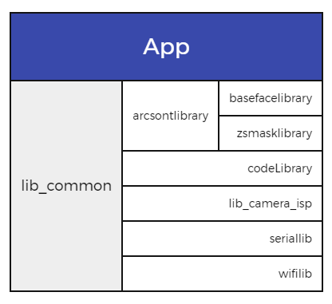

## 项目架构
### Model依赖
  
项目整体结构较为清晰，app模块下依赖五个功能模块，分别提供主要的功能交互（app），人脸检测识别（arcsontlibrary），（codeLibrary），外部摄像头/摄像头升级（lib_camera_isp），额外硬件信息获取与控制（seriallib）和网络状态（wifilib）
### Model细节
#### app
##### libs
高德地图SDK相关

中控身份证SDK相关，[开发文档](zbx_qjy_doc/doc/ZKIDR%20SDK%20for%20Android-Ver2.0.2-cn.pdf)

##### src/main
所有渠道的公共逻辑，基石。
##### src/meetingLandscape（会议通用版-横屏渠道）

##### src/meibainian（美白年-门禁）

##### src/meibainianMeeting（美白年-会议）

##### src/qiaojiangyun（马克巴渠道）

##### src/temperature（通用FX6渠道）

##### src/dayilib（未使用/已废弃）

##### src/test（未使用）
#### arcsontlibrary
人脸识别虹软算法相关
##### basefacelibrary

##### zsmasklibrary
自研口罩检测

#### arcsontviplibrary(未使用)
人脸识别虹软付费算法相关

#### Klibrary
人脸识别旷世算法

#### codelibrary

#### lib_camera_isp

#### seriallib

#### wifilib

## 技术选型
### 开发语言
Kotlin + Java + C

### 人脸识别算法
#### 虹软

#### 旷世

### Google套件
#### 依赖注入
[dagger]

#### 数据持久化
[Room]

#### 生命周期管理
[lifecycle]()

#### 数据绑定
[databinding]

#### UI组件
[material]

### 网络框架
#### OkHttp + Retrofit
[OkHttp]
[Retrofit]

### 第三方服务
#### 轮播图
[banner]

#### 二维码
[zxing]

#### 推送服务
[MQTT]

#### 本地服务
[AndServer]()

#### 地图定位
[高德地图](https://lbs.amap.com/api/android-sdk/guide/create-project/android-studio-create-project)

#### Bugly
崩溃信息收集平台

#### 数据库调试
[amitshekhar]

#### excal支持
[jexcelapi]

### 外设
#### 输入
##### 温度传感器

##### 身份证模块

##### 二维码模块

#### 输出
##### 闸机/门禁控制

